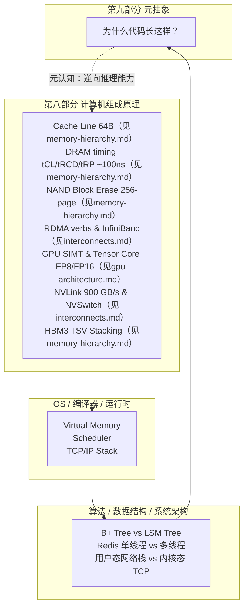

# 第十二部分 元抽象：硬件层如何决定软件设计

## TL;DR

这是全书最后一条、也是最长的一条推理链——"元抽象"（Meta-Abstraction）的终极追问：**为什么你的代码长这样？** 不是因为你喜欢这种写法，不是因为教科书告诉你 O(log n) 比 O(n) 好，而是因为 64 字节的 cache line、100 纳秒的 DRAM 延迟、4KB 的页大小、NAND flash 的块擦除机制、SIMT 的 warp 调度——这些物理属性穿过了 4-5 层抽象，最终钉死在你的数据结构和算法选择上。本节横跨第八部分（计算机组成原理）的完整知识体系，将 10 条推理链从硅片层一路拉到应用层，为全书闭合最后一环。读完之后你拿到新硬件（CXL 内存池、RDMA 网卡、FP8 Tensor Core），可以照搬推理框架预测软件该长成什么样子。

---

## 不是"讲硬件"，是"把硬件当成约束系统来读"

大多数系统设计的课程把这部分内容倒过来讲：给你一个需求 → 选型（B+ 树还是 LSM？）→ 做 benchmark → 定方案。这是工程师的日常，但不是工程师的洞察力。

洞察力是从反方向读的：**硬件先于软件存在。硬件的物理约束是底层公理。算法的每一次"选择"其实是公理推导出的必然结论。** 当你能从硬件层顺向推到软件选型，你就不再需要 benchmark 来"试"最优方案——你知道答案。



---

## 推理链清单

### 7.1 Cache Line 64 字节 → B+ 树的页大小

```
cache line = 64 字节 (SRAM 协调 + MESI 一致性协议需要，见第八部分 memory-hierarchy.md)
    ↓
    节点页大小对齐 OS page ≈ 4KB-16KB（见第八部分 mmu-dma.md: 页面大小 4KB/2MB/1GB）
    ↓
    B+ 树扇出 ≈ 100-1000 / 节点（节点大小 = cache line × n，足够让树高 h=3-4）
    ↓
    数据库索引普遍采用 B+ 树（page-aligned node，一次 I/O 命中多条 cache line）
    ↓
    LSM-tree 用大 SSTable block（块仍按 page 对齐，适配 SSD I/O 粒度）
    ↓
    关键结论：树的高度不是由数据量决定的——是由 page / cache line 比值决定的。
```

**两条隐蔽链路**：
- MESI 协议（见第八部分 memory-hierarchy.md 六节）要求 cache line 在核间以 64B 为单位传输；数据库的 buffer pool page 锁粒度天然与 MESI coherence unit 对齐，否则 false sharing 会在 NUMA 下摧毁性能。
- MMU 的 TLB（见第八部分 mmu-dma.md 三节）覆盖能力有限；B+ 树节点若选 16KB 而非 64KB，是因为 4 个 4KB page 的 TLB entry 比一个 64KB 大页（2MB alignment）更容易被硬件 prefetcher 命中 TLB。

---

### 7.2 DRAM ≈ 100ns Latency → 大 O 实际常数因子

```
DRAM latency ≈ 100ns（见第八部分 memory-hierarchy.md 二节: tCL + tRCD + tRP ≈ 15+15+15=45ns + burst ≈ 50ns）
    ↓
    Cache hit ≈ 1ns (L1) / 8ns (L2) / 30ns (L3)
    ↓
    跨 cache miss 的算法操作实测差 20-80 倍（不是常数倍，是数量级）
    ↓
    OoO CPU 通过 MLP（memory-level parallelism）部分隐藏延迟
    （见第八部分 cpu-superscalar.md 十一节: MLP=10-16 时 DRAM 访问被并行化）
    ↓
    工程常数 = cache locality + SIMD + MLP 三轴上能跨两个数量级
    ↓
    教科书 O(1) vs O(log n) 在 n 小时常常反向（O(1) hash table probe 一次 DRAM 随机访问 ≈ 100ns，
    O(log n) 二分查找可能全在 L2 cache 内 ≈ 30ns × 3=90ns → 反而更快）
    ↓
    工程反推：看 cache-friendly 而不是算法大 O。
```

**关键数量级（来自第八部分）**：
- L1 cache hit: 4 cycle @ 4GHz = 1ns（见 memory-hierarchy.md 一节的延迟对比表）
- L3 cache hit: 120 cycle @ 4GHz = 30ns（见 memory-hierarchy.md 一节的延迟对比表）
- DRAM random access: 400 cycle @ 4GHz = 100ns（见 memory-hierarchy.md 一节的延迟对比表）
- OoO ROB 窗口: 512 entries, ~64 cycle 的时间窗口来找 ILP（见 cpu-superscalar.md 六节）

---

### 7.3 SSD 写放大 → LSM-Tree 的胜出

```
NAND flash 物理特性：erase-on-block (4KB page × 256 pages/block，见第八部分 memory-hierarchy.md)
    ↓
    原地写 → read-modify-write 4KB ⇒ 写放大 32-100×
    ↓
    LSM-tree append + merge 后台压缩：顺序少量 rewrite ⇒ 写放大 10-20×
    ↓
    RocksDB / Cassandra / BigTable / LevelDB 全部采用 LSM
    ↓
    B+ 树仍用于 OLTP 读多场景：读代价 LSM 比 B+ 高 20-50%（多层 SSTable 查找 vs 单次 B+ 遍历）
    ↓
    工程实践：LSM-tree 的 compaction 策略（leveled vs tiered vs universal）直接对应 NAND block 的 erase 预算管理
```

**深层连接**：NAND 的 block erase 延迟 ~ms 级（见第八部分 memory-hierarchy.md 一节：NVMe SSD ~100µs 是"读"，erase 是"写前擦除"——比读慢一个数量级）。LSM 的思想本质上是**把随机小块擦除聚合成顺序大块擦除**——这与 GPU 上把 scatter/gather 聚合为 GEMM 是同构的思想：硬件喜欢顺序，软件必须制造顺序。

---

### 7.4 RDMA + Zero Copy → 用户态网络栈

```
NIC DMA → 内存直接配 frame + RDMA verbs API（见第八部分 interconnects.md 五节: RDMA Write/Read 操作）
    ↓
    绕过 TCP/IP 内核栈, latency 10× ↓ (5 μs vs 50 μs)
    ↓
    libibverbs + DPDK 在 HFT / HPC / 分布式存储上重新设计网络层
    ↓
    应用层架构变形：把多 node 看成 shared memory pool
    ↓
    CXL.mem 进一步把"远端内存"做成 cache coherent（见第八部分 interconnects.md 三节: CXL 协议栈）
    ↓
    分布式共识协议（Raft/Paxos）的 log replication 在 RDMA 上可获得 ~5µs 的 append 延迟
```

**推理延伸：RDMA 与 MESI 的同构**。MESI（见第八部分 memory-hierarchy.md 六节）是 CPU 核间 cache line 一致性协议；RDMA（见第八部分 interconnects.md 五节）是跨机架的内存一致性——两者本质上在做同一件事：**让多个计算单元看到同一个地址空间的最新值**。区别只在延迟量级：MESI 在 ~100ns，RDMA 在 ~5µs。分布式系统的 quorum 机制（majority ack）本质上是把 MESI 的 bus snooping 替换为应用层消息广播——同样的思想在不同的 latency budget 下以不同形态出现。

---

### 7.5 FPGA 流水线可重配 → SmartNIC / DPU Offload

```
FPGA dynamic reconfiguration: 加载 bitstream 切换逻辑块
（见第八部分 ai-accelerators.md 十节: FPGA 在 ML 推理中的角色）
    ↓
    SmartNIC / DPU（NVIDIA BlueField / Intel IPU）把网络功能放到 FPGA/SoC 上
    （见第八部分 interconnects.md 一、二节: PCIe 拓扑和 DPU 位置）
    ↓
    Open vSwitch / TLS termination / VXLAN / firewall 在硬件管线跑
    ↓
    Server CPU 释放给业务逻辑, 网络处理不占核心周期
    ↓
    软件架构变形："网络"变成"可加载的服务在硬件近端"
```

**DPU 与 CPU 的分工边界**：DPU 的本质是把网络数据平面的"快路径"（fast path）从 x86 CPU 移到专用处理单元。CPU 处理控制平面（路由表更新、TLS 握手协商），DPU 处理数据平面（包分类、加密、转发）。这与 GPU 中 CPU 做 launch / dispatch、GPU 做 kernel 计算的异构模型是同构的——**硬件多样性迫使软件做异构切分**。

---

### 7.6 GPU SIMT → ML 矩阵乘爆发

```
CUDA SIMT model: 32 threads warp + lock-step 同步 + global mem access coalescing
（见第八部分 gpu-architecture.md 二节: SIMT 模型与 warp 调度）
    ↓
    float16/bf16 矩阵乘天然 cache-friendly + SIMD-friendly
    ↓
    Tensor Core MMA 指令: 单时钟 4×4×4 = 128 FLOPs（见第八部分 gpu-architecture.md 五节）
    ↓
    cuBLAS / CUTLASS 优化到接近峰值 TFLOPs
    ↓
    TPU 用脉动阵列（Systolic Array）将 MAC 单元串成流水线，零控制开销
    （见第八部分 ai-accelerators.md 二节: 256×256 MAC @ 700MHz = 92 TFLOPS INT8）
    ↓
    Transformer attention = 大量矩阵乘 = GPU/TPU 胜场
    ↓
    AI 工程师变成"GPU-friendly 算法工程师" = 又一种抽象层转换
```

**Tensor Core 与 Systolic Array 的内在同构**：Tensor Core 的 4×4×4 MMA 本质上是小规模的 Systolic Array——两者都在做同一件事：**让数据流过一个固定的 MAC 阵列，避免寄存器回写和控制流指令**。区别在于粒度：NVIDIA 把 MMA 作为一条指令嵌入 SIMT 模型（复用 warp scheduler 的零开销线程切换），Google 把整个阵列做成独立芯片（放弃 warp 调度，换得更低的控制开销 ~5% vs GPU 的 ~30%）。

---

### 7.7 多核 NUMA → Redis 单线程 → 分布式协调

```
8 / 16 / 32 核 NUMA, cross-socket memory access ~200ns
（见第八部分 memory-hierarchy.md 六节: 目录协议与 NUMA 延迟）
    ↓
    单机 hash table lock contention 跨 NUMA node 难突破
    ↓
    Redis 单线程 hash = 100% 单 core 独占（避免了跨 socket 的 MESI RFO 风暴）
    ↓
    扩展到 Redis Cluster / KeyDB：shard + per-node linearizable + cross-node eventual
    ↓
    现代内存数据库（Tair, Dragonfly）的架构都是 NUMA-aware 的 per-core hash shard
    ↓
    工程兼容路线：单线程核心 + 多实例 + 异步复制
```

**Redis 单线程不是"偷懒"——是 MESI 教会的**：如果你的核心数据结构是一个全局 hash table，多线程并发写必然触发 MESI 的 RFO（Read For Ownership）广播——从 Shared 到 Modified 的所有权转移，每次跨 socket 耗费 ~200ns。对于 Redis 这种微秒级延迟的服务，200ns 的 coherence 税在 p99 延迟上直接爆炸。单线程方案把 MESI 问题从"8 个 core 的混乱"简化成"1 个 core 的干净"。

---

### 7.8 Tensor Core FP8 → Transformer 训练吞吐 → H100 的设计哲学

```
FP8 = 1 字节（4-bit 指数 + 3-bit 尾数），FP16 = 2 字节
    ↓
    FP8 数据量 = FP16 的 1/2 → 同样 HBM 带宽下，FP8 每周期搬运数据量翻倍
    ↓
    H100 FP16: 989 TFLOPS, FP8: 1979 TFLOPS（见第八部分 gpu-architecture.md 五节的精度算力表）
    ↓
    FP8 的动态范围（E4M3 约 2^-6 ~ 448）刚好覆盖 Transformer 训练中激活和梯度的实际分布
    ↓
    NVIDIA Transformer Engine 在训练中逐层动态选择 FP8 vs FP16（见第八部分 gpu-architecture.md 五节的 TF32 原理）
    ↓
    为什么 H100 设计目标是 "FP8 吞吐翻倍" 而非 "加更多 CUDA Core"？
        答：HBM3 带宽 = 3.35 TB/s（见第八部分 memory-hierarchy.md 九节），
            GPT-3 训练中 99% 的时间在等权重从 HBM 搬进 Tensor Core。
            加计算单元 = 加空闲单元。翻倍精度效率 = 翻倍实际吞吐。
    ↓
    推理框架（vLLM / TensorRT-LLM）的 FP8 量化本质上是在"偷"H100 的硬件红利——
    硬件设计者花 5 年 HBM 堆叠和 Tensor Core 迭代才把 FP8 通路做宽，
    编译器一个量化 pass 就能端走。
```

**精度选择的工程本质**：FP8 不是"损失精度换速度"——H100 的 FP8 Tensor Core 输出累加器是 FP32，意味着 FP8 × FP8 → FP32 accumulate → FP8 round。这个路径的误差来源是每次 round-trip 的尾数截断，而非累加过程的信息丢失。对于 Transformer 训练中的矩阵乘法（Q×K^T 和 W×X），E4M3 的 3-bit 尾数对应 ~0.1% 的相对精度——而 SGD 的随机梯度噪声本身在 ~1-10% 量级。**FP8 的精度损失被优化噪声淹没了，但带宽减半带来的 2× 吞吐是实打实的。**

---

### 7.9 NVLink 900 GB/s → 多 GPU 模型并行 → NVSwitch 的必要性

```
单 GPU HBM3 带宽 = 3.35 TB/s（见第八部分 memory-hierarchy.md 九节: HBM3 规格）
PCIe 5.0 ×16 = 64 GB/s（见第八部分 interconnects.md 一节: PCIe 代数对比表）
    ↓
    跨 GPU 通信如果走 PCIe，带宽只有片内 HBM 的 1/50
    ↓
    NVLink 4: 每条 50 GB/s × 18 links = 900 GB/s per GPU（见第八部分 interconnects.md 四节: NVLink 代际表）
    ↓
    NVSwitch: all-to-all 全互联，任意两 GPU 之间同时有 450 GB/s 带宽（见第八部分 interconnects.md 四节: NVSwitch crossbar）
    ↓
    模型并行（Tensor Parallelism, TP）只能在 NVLink 互联范围内部署——TP 每层计算后需 all-reduce，通信量 = 2×(N-1)/N× 层参数
    ↓
    为什么 DGX H100 正好 8 卡？
        答：18 NVLink / 8 GPU + NVSwitch = 每 GPU 对每 GPU 有 2-3 条 NVLink。
            如果 16 卡全互联，需要 15×18=270 条 NVLink → NVSwitch 端口数爆炸，成本不可控。
            DGX 的 8 卡设计是因为物理链路 + 交换芯片面积达到最优拼点。
    ↓
    训练 GPT-4 级模型时，TP=8 (DGX 内 NVLink) + PP=16 (DGX 间 InfiniBand) + DP=64 (全局)
    = 硬件拓扑直接决定训练并行的三层切分策略。
```

**推理链核心**：软件中的 "Tensor Parallelism Size = 8" 不是超参——是硬件拓扑的必然。互联层次决定并行策略的分界：

| 并行策略 | 通信量 | 带宽要求 | 典型范围 |
|---------|--------|---------|---------|
| Tensor Parallelism | 每层 all-reduce | NVLink 级 (450-900 GB/s) | DGX 内 8 GPU |
| Pipeline Parallelism | 层间激活传递 | InfiniBand 级 (50 GB/s) | 跨节点 16-64 GPU |
| Data Parallelism | 梯度 all-reduce | InfiniBand 级 (50 GB/s) | 全局 64-数千 GPU |

**这条表本身就是硬件层穿到软件层的最佳证明**。如果 CXL.mem 把跨节点延迟降到 ~300ns（见第八部分 interconnects.md 三节），TP 就可以扩展到跨节点——届时软件并行策略的边界会被重新改写。

---

### 7.10 HBM3 TSV 堆叠 → 内存带宽墙 → Cerebras WSE-3 的激进方案

```
DRAM 带宽增速 ~1.5×/2 年，模型规模增速 ~10×/2 年（见第八部分 ai-accelerators.md 十一节: 存储墙）
    ↓
    DDR5 DIMM 宽度: 64-bit（见第八部分 memory-hierarchy.md 八节: DIMM 组织）
    HBM3 宽度: 1024-bit per stack, 6 stacks = 3.35 TB/s（见第八部分 memory-hierarchy.md 九节: HBM3 规格）
    ↓
    TSV（Through-Silicon Via）竖穿 8-12 层 DRAM die → 信号走 μm 级而非 cm 级 → 带宽最大化、延迟最小化
    （见第八部分 memory-hierarchy.md 九节: HBM vs DDR 物理距离短）
    ↓
    但 HBM3 仍有物理极限：每 stack 容量上限 ~36GB (HBM3e)，再多堆叠良率崩塌
    ↓
    GPT-4 ~1.7T 参数 × 2 bytes (FP16) = 3.4 TB → 需要 ~100 颗 H100 (80GB × 100 = 8 TB) 来存放
    → 99% 的时间在跨 GPU 搬运权重 = 内存带宽墙
    ↓
    Cerebras WSE-3 的答案：整张 300mm 晶圆做芯片，44GB 片上 SRAM, 21 PB/s 带宽
    （见第八部分 ai-accelerators.md 五节: WSE-3 规格）
    零片外 DRAM → 零带宽墙 → 但代价是模型必须装进 44GB
    ↓
    两种对抗内存墙的路线：
    A. HBM3 + NVLink + 分布式并行（NVIDIA 路线）—— 用更多芯片分摊带宽压力
    B. 片上海量 SRAM + 数据流计算（Cerebras / Groq 路线）—— 数据不动，算力动
```

**"数据不动 vs 算力不动"——AI 芯片的两种设计哲学**：

| 维度 | NVIDIA/TPU 路线 | Cerebras/Groq 路线 |
|------|----------------|---------------------|
| 核心思想 | 算力固定，数据搬进搬出 | 数据固定，算力流过数据 |
| 片上内存 | HBM (3.35 TB/s) | 片上 SRAM (21 PB/s) |
| 容量上限 | 80 GB (HBM) | 44 GB (WSE-3) |
| 扩展方式 | 加卡 + 互联 | 模型切分到多芯片 |
| 软件代价 | NCCL 通信库 + 并行策略 | 编译器做时空映射 |
| 最佳场景 | 千亿参数大模型训练 | 中规模模型极高吞吐 |

这两种路线的分歧**直接来源于存储器物理特性的根本差异**：SRAM 比 DRAM 快 100×（1ns vs 100ns），但 SRAM 密度比 DRAM 低 6×（6T per bit vs 1T1C per bit）。NVIDIA 接受 DRAM 的慢，用更多并行隐藏它；Cerebras 选择 SRAM 的快，接受容量受限。

---

## 硬件 → 软件的四种推理层次

把 7.1-7.10 综合，硬件决定软件的层次比之前认为的更深——有四层：

1. **物理层**（cache line / DRAM timing / NAND block / HBM TSV / NVLink lane）：决定数据通道的**块大小、延迟量级、带宽上限**。这是所有上层优化的硬天花板。见第八部分 memory-hierarchy.md、mmu-dma.md、interconnects.md。

2. **事务层**（MESI / RDMA / CXL.cache coherence / NVSwitch crossbar）：决定多个计算单元之间的**一致性和通信模型**。MESI 的四个状态是分布式一致性协议的微缩版；RDMA 的 one-sided 操作是 MESI 在 µs 级别的重演。见第八部分 memory-hierarchy.md 六节、interconnects.md 五节。

3. **结构层**（B+ tree / LSM-tree / warp scheduler / Systolic Array / Tensor Core MMA）：决定**数据结构和执行模型**。B+ tree 的 page 大小对齐 cache line；LSM 的 compaction 策略对齐 NAND block erase；Tensor Core 的 4×4×4 MMA 对齐 FP16 的矩阵分块；warp scheduler 的零开销切换对齐 HBM 的 300-cycle gap。见第八部分 gpu-architecture.md、ai-accelerators.md。

4. **抽象层**（SQL optimizer / NCCL all-reduce / PyTorch autograd / vLLM PagedAttention）：决定**应用层接口和系统分界**。SQL 优化器的 cost model 隐含了对 DRAM 延迟和 SSD 带宽的假设；NCCL 的 ring all-reduce 隐含了对 NVLink 拓扑和 InfiniBand 流控的假设；PyTorch 的 eager mode 隐含了对 CUDA kernel launch 开销的假设。

**关键认知**：每一层给出的结论被下一层提升为透明前提。应用层工程师不需要理解 HBM3 的 TSV 堆叠工艺，但理解 TSV 堆叠 → HBM 带宽 → GPU 互联 → `all_reduce` 延迟 → 训练 step time 这条链的人，写分布式训练代码时的决策质量与"只调 `world_size` 的人"不在一个维度上。

---

## 新硬件的推理模板：CXL 内存池化

用这四层框架来推演 CXL 内存池化（见第八部分 interconnects.md 三节）对软件的影响：

```
CXL.mem: Host CPU 可以 load/store 远端内存，延迟 ~300ns (vs 本地 DRAM ~100ns)
    ↓
    物理层: 延迟 ×3, 带宽 ≈ 本地 DRAM / N (共享池)
    ↓
    事务层: CXL.cache 提供 MESI 缓存一致性（远端内存可以被本地 L3 缓存）
    ↓
    结构层: Redis / Memcached 的 hash table 会把 "远端 CXL 内存" 视为新 NUMA node
             → 数据结构不变（仍是 hash table），但迁移策略变：热点 key 应往本地 DRAM 迁移
    ↓
    抽象层: Linux kernel 通过 ACPI SRAT/HMAT 将 CXL 内存暴露为新的 NUMA node
             → 应用层可以用 `move_pages()` / `mbind()` 做显式迁移
             → 或者靠 auto-tiering（如 Intel Optane 时代的内存分层）
    ↓
    你的代码需要改什么？
        1. 不再假定所有内存的延迟相同（`numa_node` 的性能差异从 20% 变成 200%）
        2. B+ 树的 buffer pool 需要区分远端 page 和本地 page（淘汰策略先淘汰远端）
        3. LSM-tree 的 SSTable 可以选择性地放在远端大容量 CXL 内存上
```

---

## 工程师的反射框架（升级版）

给定新硬件或新负载，从第八部分出发的推理框架：

```
步骤 1: 看延迟预算
    μs? 100μs? 10ms?
    → 第八部分 memory-hierarchy.md 延迟对比表（L1=1ns → HBM=300ns → DRAM=100ns → SSD=100µs）

步骤 2: 看带宽体和并发窗口
    字节/周期? 64B/cache line? 4KB/page? 1MB/SSD block? 1024-bit/HBM?
    → 第八部分 memory-hierarchy.md: cache line 64B; mmu-dma.md: page 4KB;
       interconnects.md: NVLink link 50 GB/s; gpu-architecture.md: HBM3 3.35 TB/s

步骤 3: 看一致性情模型
    单机 shared? 多核 NUMA? 分布式 quorum? RDMA one-sided?
    → 第八部分 memory-hierarchy.md 六节: MESI 协议; interconnects.md 五节: RDMA verbs;
       cpu-superscalar.md 八节: LSQ 内存消歧

步骤 4: 看并行粒度
    指令级 ILP? 数据级 SIMD/SIMT? 核级 OoO? 设备级 GPU/TPU? 集群级分布式?
    → 第八部分 cpu-superscalar.md: ROB 窗口; gpu-architecture.md: warp scheduler;
       ai-accelerators.md: Systolic Array; interconnects.md: rail-optimized topology

步骤 5: 看数据布局
    顺序 vs 随机? 对齐 vs 非对齐? coalesced vs scattered?
    → 第八部分 gpu-architecture.md 十节: shared memory bank conflict
       memory-hierarchy.md 十三节: RowHammer 物理层漏洞

步骤 6: 看计算模式
    compute-bound (GEMM/Conv)? memory-bound (element-wise/LayerNorm)?
    communication-bound (all-reduce)?
    → 第八部分 gpu-architecture.md 十四节: MFU 分析 (GPT-3 训练 MFU ~38%)
       ai-accelerators.md 十一节: 存储墙的四种解决路线
```

最后产出可能的运行平台实现：**CPU + 软件 / CPU + 用户态 / GPU + CUDA / GPU + NCCL / TPU + XLA / FPGA + HLS / 分布式 + RDMA**。每一步都落在一个具体的硬件路径上，而不是泛泛地说"用 GPU 加速"。

---

## 易错清单

1. **"抽象层提升之后，物理层不重要了"**：SQL 写得好可以不管 B+ tree——但如果你的 `ORDER BY` 触发了 filesort（临时文件写 SSD），你就在不知不觉中撞上了 NAND flash 的 erase block 延迟。抽象层会漏，而且漏在 p99 上。

2. **"O(log n) 一定比 O(1) 慢"**：在 n=1000、L2 cache 内的二分查找（~30ns × 10 = 300ns）可能比一次 DRAM 随机访问（~100ns）慢。但这个快慢只在特定 cache 状态下成立——数据一被 evict，O(1) 又赢了。没有绝对的 O，只有绝对的 cache line。

3. **"NVLink 900 GB/s = 够快"**：NVLink 4 的 900 GB/s 是 bidirectional 总和。实际 all-reduce 中的有效带宽在 70-85% 利用率。而且 NVLink 18 条链路是物理固定的——DGX 的 8 卡格局是 NVSwitch 的端口数和物理链路数量的最优拼点，不是"想要几个就几个"。

4. **"HBM 比 DDR 快是因为频率高"**：HBM 快是因为宽（1024-bit vs 64-bit）+ 近（mm 级 vs cm 级走线）。HBM3 的频率 6.4 Gbps 其实低于 DDR5 的 5.6 GT/s（编码方案不同），快在并行度而非串行速度。

5. **"Tensor Core 就是快一点的 FP16 单元"**：Tensor Core 的 MMA 指令是 4×4×4 matrix multiply-accumulate，不是 1 个浮点乘法。CUDA Core 的单次 FMA 只能做 1 对乘加，Tensor Core 同一时钟做 128 对。这不是"快 2×"，是计算模式的维度差异。

6. **"RDMA 延迟 = 网络延迟"**：RDMA 的一半延迟在 PCIe。发起 RDMA Write 需要：NIC 通过 PCIe DMA 读源 HBM（~1µs over PCIe）+ IB 链路传输（~1µs）+ 目的端 PCIe DMA 写目标 HBM（~1µs）。即使 IB 链路是 0ns，RDMA 先天就有 ~2µs 的 PCIe tax。

7. **"FP8 训练 = 便宜版 FP16 训练"**：FP8 需要在训练中动态 scale（per-tensor scaling factor），这个 scale 本身是学习出来的（delayed scaling）。如果 scale 错误 → 梯度 underflow/overflow → 训练发散。NVIDIA Transformer Engine 的 FP8 训练本质上是把精度管理和数值稳定性从"硬件保证"转移到"软件责任"——省了带宽，多了工程复杂度。

---

## 这一章带走的东西

- 10 条推理链从硅片一路推到应用层，每一条的起点都在**第八部分（计算机组成原理）**的对应章节。cache line → B+ tree（见 memory-hierarchy.md）、DRAM timing → O 常数（见 memory-hierarchy.md + cpu-superscalar.md）、NAND erase → LSM（见 memory-hierarchy.md）、RDMA verbs → 用户态网络栈（见 interconnects.md）、SIMT → ML 矩阵乘（见 gpu-architecture.md + ai-accelerators.md）、NUMA → Redis 单线程（见 memory-hierarchy.md 六节）、FP8 → H100 设计哲学（见 gpu-architecture.md + ai-accelerators.md）、NVLink → 模型并行（见 interconnects.md）、HBM TSV → 内存带宽墙（见 memory-hierarchy.md + ai-accelerators.md）。

- **四种推理层次**（物理层 → 事务层 → 结构层 → 抽象层）是解耦硬件与软件的通用模板。任何新硬件出现时，从这四层分别做推演，可以预测软件栈的变形方向。

- **"硬件层为何决定软件设计"不是一句口号，而是一套可操作的推理方法**。拿到新硬件（CXL、NVLink-C2C、UALink、FP8 Tensor Core），按 6 步反射框架走一遍，你能比 90% 的工程师更早做出正确的架构决策。这是第二部分到第八部分全部知识的收束——也是工程师从"会用工具"到"理解为什么工具长这样"的临界点。

- 软件工程中最昂贵的错误不是写错一行代码，而是在错误的抽象层做优化。**理解硬件不是目的——是在正确的抽象层做正确决策的前提。** 当你在 memcached 的 hash table 上加了复杂的 LRU 却忘了 NUMA-aware sharding，你是在抽象层优化物理层的问题——这个错误在第 6 步反射框架的第一行就能避免。

返回 → [README](../index.html)
