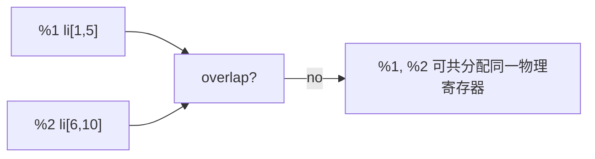

# 寄存器分配：Graph Coloring & Linear Scan

## TL;DR

寄存器分配把无限虚拟寄存器映射到有限物理寄存器。**两个算法家族**：Graph Coloring（Chaitin 1981, 经典 NP-hard 但质量最高）—— 把"同时活跃的虚拟寄存器"建成干涉图，相邻不共色的就 spill；Linear Scan（Poletto & Sarkar 1999）—— 不建图、按起点快排扫描 live interval 区间、立即分配——快 10 倍、质量稍差但够 JIT 用。现代 LLVM 把 Graph Coloring 做得工业级，HotSpot、V8、Cranelift 都偏 Linear Scan 变种。理解 spill、copy coalescing、calling convention、register pressure 是这章的核心。

---

## 一、活跃性分析 (Liveness)

### Live-In / Live-Out

一个变量在某个 program point 是 live 的，当存在从该点出发的 path 里的 use 没被中间 def 覆盖。形式化：

```
live_in[b]  = use[b] ∪ (live_out[b] - def[b])
live_out[b] = ∪ live_in[s]    for s ∈ succs(b)
```

迭代到底不动点（典型 dataflow equation）。这是后向分析 (backward analysis)。

### Live ranges & live intervals

在一个 basic block 内连续活跃的虚拟寄存器 = live interval `[start_pos, end_pos]`。SSA-down 后dealloc'd 后，变量的 live range = 一系列 live interval 段，并起来。

```
%1 = ...
... %1 ...     ; %1 live 第 1-5 行
%2 = ...
... %2 ...     ; %2 live 第 6-10 行
```



不重叠 → 不干涉 → 可同色 → 可共分配同一物理寄存器。这是 graph coloring 的基础。

---

## 二、干涉图 (Interference Graph)

```c
int a = ...;         // live: [1..5]
int b = ...;          // live: [3..7]
```

`%a` 和 `%b` 在 [3, 5] 重叠 → **interfere** → 必须不同颜色（不同物理寄存器）。

构建干涉图：
1. 跑 liveness analysis 得每个 vreg 的 live interval
2. 对每两 live interval `i`、`j`：若 overlap，加边 `(i, j)`
3. 同时考虑 **pre-colored** node（必须固定到物理寄存器——比如 calling convention 要求参数在 `%rdi` / `%rsi`）

### Pre-colored Example (x86-64 SysV ABI)

```c
int sum(int a, int b) { return a + b; }
```

`a` 必须在 `%rdi`，`b` 必须在 `%rsi`——call convention 强制。这些 vreg 是 pre-colored：

- `%arg_a` → 已经是 `%rdi` （色 = RDI）
- `%arg_b` → 已经是 `%rsi` （色 = RSI）

干涉图上其他 vreg 必须避免占这俩色。

---

## 三、Graph Coloring 算法

### Chaitin-Briggs (classic)

Kempe's heuristic:

1. **Simplification**: 找 degree < K (K = 物理寄存器数) 的 node，push 到 stack 后从图删。
2. 直到所有 node 都 < K，或剩下的都 ≥ K（spill 候选）。
3. **Spill**: 选一个 spill 候选，标记为 spill；不分配物理寄存器，运行时通过 stack。
4. **Select**: pop stack，分配尚未被邻居占用的颜色。

```
loop:
   if exists node with degree < K:
      stack.push(node); remove from graph
   else:
      pick highest cost / least frequently spilled; mark potential_spill
      stack.push(node); remove from graph
until graph empty

while not stack.empty:
   n = stack.pop()
   if can color: pick color avoiding neighbors
   else: actually_spill (regenerate IR with loaded value)
```

迭代 spill: spill 后重新跑 liveness，可能产生新 node 然后再 round，直到全部 on reg 或确认稳定的 spill 集。

### Chaitin vs Briggs

- **Chaitin**: 直接选 spill 候选 + drop，扫整图后重做。
- **Briggs**: optimistic spill——pop 时若实际有 color，不算 spill。Briggs 的 reverse order 让 optimistic 多一次机会。

工业 LLVM 用 **PBQP (Partitioned Boolean Quadratic Programming)** 求解器 / **Greedy** coloring 跨大图好。

### 实例 Coloring

K = 3 (3 个物理寄存器 R0/R1/R2)，干涉图:

```
A — B
|   |
D — C
```

四 node 都相互干涉 (clique K4)：

- K4 degree 是 3 = K，不能 simplify
- 选 B spill（标记 spill 后再 iter）
- 实际：希望重新跑把 B 全部加载 / 重命名拆干 → B 重新成两个更短间隔 → 不重叠 → 上色

### Cost Function for Spill

```
spill_cost(v) = 使用次数 × load/store 单价 / live interval 长度
```

长 live range 上 spill 不划算（频繁 load/store），短 range 上 spill 划算。

---

## 四、Linear Scan

Poletto-Sarkar Linear Scan：

```
1. 把所有 live interval 按 start_pos 排序
2. 维护 active list: 当前分配中的 interval
3. for each interval i (in start order):
     expire_old_intervals(i.start)  # end < i.start 的从 active list 删除、还寄存器
     if free_reg:
        assign free_reg to i
     else:
        spill_at_interval(i)        # 选 spill 候选：
                                     #   - active list 中 end_pos 最大者
                                     #   - 如果它的 end_pos > i.end_pos:
                                     #     spill 它, 把 i 放到它腾的 reg
                                     #   - 否则 spill 自身 i
     push i to active list
```

O(N log N) 排序 + O(N) 扫描。比 graph coloring 快 10-30 倍。

### 现代改进: Traub's Linear Scan (LLVM / HotSpot)

- **Live Interval split**: 在压力高的点把 long interval 拆成多段，每段独立分配——可 spill 一部分留寄存器另一部分。
- **Position-aware spill**: 不只"spill 不在寄存器时 load"，而是常用寄存器 cache 最近 use 模式。
- **Hinted register**: 优先选相同 hint 的色——减少 copy coalescing pain。

### 实例 Linear Scan

K = 2，三个 live intervals:

```
v1: [1..10]    v2: [2..5]         v3: [6..12]
```

按 start sort: v1, v2, v3.

1. v1: active = [v1], reg[v1] = R0
2. v2: active = [v1, v2], reg[v2] = R1
3. v3: expire ≤ 5: v2 expire → active = [v1], free R1. v3 = R1. active = [v1, v3]
4. return: reg[v1]=R0, reg[v3]=R1

完美使用 K=2 即可——active list 最多 ⌈K⌉ 个 node。

---

## 五、Copy Coalescing

### Source of copies

```llvm
%a = call i32 @f()
%b = %a        ; copy
%c = %b + %c
```

`%b` 是 `%a` 的 copy。如果分配器把 `%a` 和 `%b` 给同一个物理寄存器，copy 消失。

### Move Coalescing

很多 copy 来自 calling convention：

```
%arg = %rdi        ; 第一个参数 copy 到 vreg 时
```

很多 copy 来自 SSA destruction 的 φ 节点:

```
loop.header:
  %x = phi [ %xinit, %entry ], [ %xnext, %back ]
```

SSA destruction 在每个 predecessor block 尾插 `mov %xinit, %x_phys`——这是一个 copy。

### Coalescing 算法

1. **Iterated Register Coalescing (IRC)**: George-Appel 1996, 同时做 coalescing 与 simplification。coalesce edge (a,b): 若合并后 a∪b 的所有邻居都 < K, OK。否则保守——可能 spill 成本升高。
2. **Briggs**: 合并后邻居中 degree ≥ K 的数 < K, OK。

LLVM 与 HotSpot 都用 **Briggs / IRC 改编**。Cranelift 用更简单的 coalescer——速度优先。

---

## 六、Register Pressure & Spill Quality

### Pressure

N vreg 同时 live = pressure N。如果 stress = N > K，必须 spill。

LLVM 在 IR 阶段就能 audit pressure——通过剪压阈值如 heuristic (about-ish: if predicted pressure > K, abort a pass early)。该机制让编译器能主动放弃 aggressive inline（避免压力爆）。

### Spill Mode

**Spill to Memory**:

```
%v = add %a, %b         ; %v live
store %v, [stack slot]
...                      ; use of %v freed for re-use
%reload = load [stack slot]
use %reload
```

但是 store+load 太 expensive —— profiler 上 spill-to-memory 比 spill-more-load (just-reload-on-use) 慢 3 倍。

**Spill at Use (better)**: 只在使用前 load:

```
%v = add %a, %b
store %v, [stack slot]
...                      ; %v not used here
... 
%reload = load [stack slot]
%r2 = add %reload, %c
```

Clever allocator 把 spill value 重新 split: 有时 load + use + free reg + reload + use。

### Rematerialization

某些值重新计算比 spill 便宜——比如：

```
%c = const 5
...use %c
...long live range overlap
...use %c again
```

不必 store `%c = 5` 然后再 load。直接用**一个新的 `mov $5, %r`** 替代 load —— cycle 数相同、 不需 stack slot。识别"cheap-to-remat" 值是 allocator 的 quality gain。

---

## 七、Calling Convention

### Caller-saved vs Callee-saved

ABI 定义：

- **Caller-saved** (volatile): 调用方负责保存的寄存器。若调用方 live value 占这寄存器，必须 call 前 push、return 后 pop。
  - x86-64 SysV: RAX, RCX, RDX, RSI, RDI, R8-R11 + XMM0-15
  - ARM64 AAPCS: X0-X18 (X0-X7 args, X9-X15 temps, X8/X16/X17 special)
- **Callee-saved** (non-volatile): 被调方负责保存的寄存器。callee 用这些 reg 前必须 prologue push、epilogue pop。
  - x86-64 SysV: RBX, RBP, R12-R15
  - ARM64 AAPCS: X19-X28

### Cost

callee-saved 寄存器需要保存—— 哪怕 callee 函数没用 X19 也不用 push；用就要 push + pop。**Strategy**:allocator 倾向先用 caller-saved 寄存器（短函数里没子调用就行），然后才 callee-saved。这对短 leaf function 至关重要——LLVM 的 `PrologEpilogInserter`pass 做这个。

### Function attributes

`norecurse`、`leaf`、`nounwind` 等属性帮助 allocator 判断 callee-save 寄存器能省。无子调用且 leaf 的函数可以不保存 caller-saved。

---

## 八、架构变种

### x86 麻烦事

- 8 GPR（x86-64）：RAX, RCX, RDX, RBX, RSI, RDI, R8-R15. 14-16 if count RSP/RBP reserved.
- RBP 由 LLVM 默认作 frame pointer（debug-frame 风险），后 `-fomit-frame-pointer` 可省。
- XMM 寄存器（16 SSE/AVX）：很多工程代码不用，但 vectorize 时的 pressure 大。
- 32bit x86 只有 6 GPR，压力极大。

### ARM64

- 31 X 寄存器 (X0-X30, X31 = SP / Zero)，鲜少 pressure。
- SIMD/FP 同一批寄存器。

### RISC-V

- 31 GPR, 标准 ABI RV64G。
- 浮点是独立 X0..X31 register file——若架构有 F/D 扩展。

---

## 九、易错清单

1. **ABI 不保存的寄存器、allocator 假设保存了 → caller-side bug**：Rust 曾有 LLVM bug 把 XMM 假设 saved 导致 SSE spill 后 FP-clobbered 出错。
2. **leaf function 太长 spill 到 callee-saved 让 cycle cost 高**: profile shows callee-save spill+restore is 5-10 cycle × multi 行——很多函数实际编译 -O0 + leaf。
3. **register pressure > 4** → 向量化重 abort：很多 LLVM vec pass 会在压力过高时不再 vectorize，避免 spill 反而恶化。开发者看不到这种 abort、权当自动向量化假装生效。
4. **寄存器 hinting 错位**：两个 copy vreg 但分配器没 coalesce → 仍有 mov, 性能小心脏。LLVM 输出 IR 中 `copy` 指令保留很容易 catch via `llc -print-after-all`。
5. **PGO 决定 spill cost**: PGO 知道某个 use 实际热/冷，allocator 重 alloc 时优先热路径拥有 reg。Google Chrome、PGO-mode Chromium 都强烈受此影响。

---

## 十、这一章带走的东西

1. 寄存器分配本质是**有限物理寄存器到无限虚拟寄存器 (vreg) 的映射**, spill 是 fall-back。
2. Graph Coloring 经典算法——Chaitin-Briggs、Simplification、Select、Cost-based Spill,质量和复杂度最好。
3. Linear Scan 是 JIT 友好的简化——排序 + active list + immediate spill 决策。
4. Copy Coalescing 把"是 copy 的两条 mov" 删成 0——大部分 copy 来自 SSA destruction 与 ABI 强制。
5. Calling Convention 决定 caller-saved vs callee-saved 拆分——allocator 倾向 caller-saved for short leaf functions。
6. Spill 质量: spill-at-use 比 store-to-stack 便宜；remat `const N` 比 store 便宜。

---

下一节 → [JIT、Tiered Compilation、V8 Turbofan、Cranelift](jit.md)
