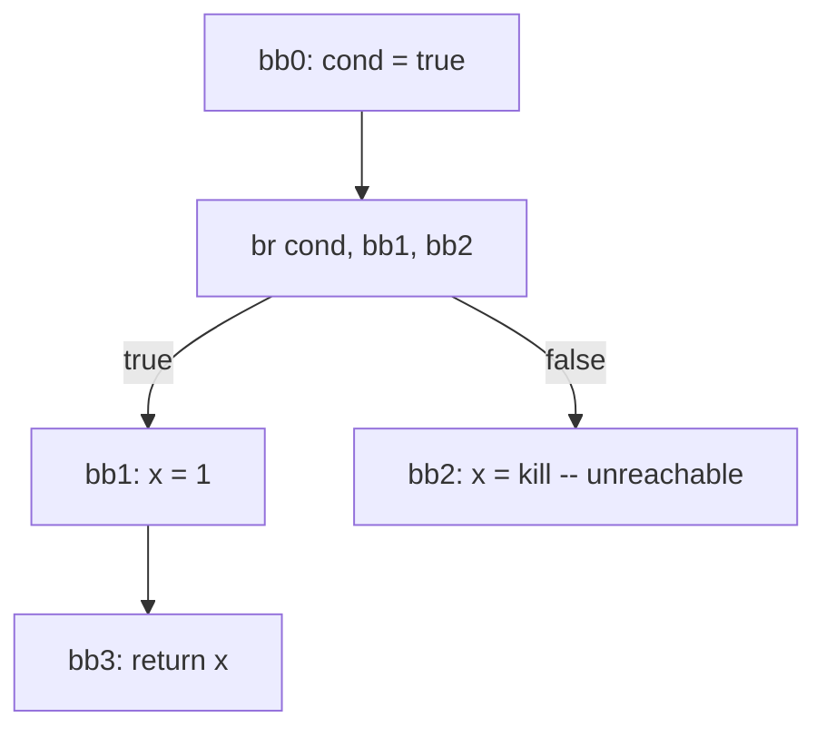

# 常量折叠 / 复写传播 / 死代码消除

## TL;DR

这三者是 IR 上最廉价也最频繁的 pass：常量折叠在编译期计算常量表达式，条件常量传播 (SCCP) 直接消除死分支；复写传播用 SSA 等价别名替换 use site；死代码消除 (DCE) 靠活跃性分析 + 副作用标记删不可达指令。SSA 让这三者变得近乎 trivial——每个变量单次定义、use-def 链显式、支配关系提供"看到什么常量"的精界定。

---

## 一、为什么 SSA 是基础

观察这段 C：

```c
int x = read();
int y = x + 1;       // x 不是常量
int z = 3;           // 常量
int w = z * 2;       // 折叠为 6
```

非 SSA 形式下，要做常量传播得跑 **reaching definitions**（哪个定义活到了当前点）。一个变量可能在 if 两个分支被赋不同值——非 SSA 得 merge，得到 `T` (top, 表示非常量)。

SSA 后每个变量唯一一次定义，**常量信息就是 def 节点上的 lattice 值**，use 直接查 def 即可。这就是为什么 LLVM、HotSpot、Cranelift 全部用 SSA——优化 pass 写起来直接 10 倍短。

---

## 二、常量折叠

### 编译期计算规则

```c
int x = 1 + 2;        → int x = 3;
int y = x * 5;        → int y = 15;          // 配合常量传播
int z = 12 >> 2;      → int z = 3;
bool b = (3 > 2);     → bool b = true;
```

折叠规则表：

| 表达式 | 条件 | 折叠结果 |
|--------|------|---------|
| `a + b` | 都是常量 | 直接相加 |
| `a / b` | b == 0 | **不折叠**，留给运行时（C/Java 会抛异常或 UB） |
| `a << b` | b ≥ bitwidth | **不折叠**（C UB）或 mask（Java） |
| `(int)(float)1.5` | 都是常量 | 折叠为 1 |
| `INT_MIN / -1` | 都是常量 | **不折叠**（C UB，溢出） |

### IEEE 754 特殊性

浮点折叠有"陷阱"：编译器**不能**随意结合浮点（GCC `-ffast-math` 可以，但破坏 IEEE 语义）。

```c
// 不能折叠：(a + b) - b != a，因为 NaN/Infinity
double f(double a, double b) {
    return (a + b) - b;   // 若 b = Inf，a = 1，结果 = NaN，不等于 a
}
```

LLVM `fadd` 不带 `fast` flag 时保守不重排；Rust `f32`/`f64` 同样保守。

### SSA 上的常量折叠

```
%a1 = 1
%b1 = 2
%c1 = add %a1, %b1          →   %c1 = 3
%d1 = mul %c1, 5            →   %d1 = 15
```

只要 def 节点是常量，use 节点直接计算即可。这是 IR 上的"代数化简" (algebraic simplification) 的子集。

---

## 三、条件常量传播 (SCCP)

SCCP (Sparse Conditional Constant Propagation) 是 Click & Cooper 1995 的经典算法——**常量传播 + 死分支消除同时跑**，比单纯 CP 强很多。

### 算法核心

Lattice 值：

- `⊥` (top): 未定
- `c` (常量): 已确定为常量 c
- `⊤` (bottom): 非常量

分支指令 `br %cond, bb1, bb2` 中，若 `%cond` 是常量 `true`，则直接**切断** bb2 的边——这让 bb2 中所有定义变成 unreachable，触发后续 DCE。



### 实例

```c
int f(int x) {
    if (3 > 2) return x + 1;     // (3 > 2) 折叠为 true
    return x - 1;                // unreachable
}
```

→ SCCP 算一遍直接砍掉第二个 return。**很多工程里的"魔法代码"**——比如有 `#ifdef DEBUG` 包住的块——靠 SCCP 在 release 编译下整段消掉。

### SCCP 的 Worklist 算法

```
worklist = {入口块}
while not empty(worklist):
    bb = pop worklist
    for inst in bb:
        new = lattice_eval(inst)         # 用 operand lattice 值推 inst lattice 值
        if new != lattice[inst]:
            lattice[inst] = new
            for use of inst:
                push use's block to worklist
    for succ in bb.succs:
        # 若分支条件已确定，只把真分支加入 worklist
        if lattice_eval(branch_cond) is constant:
            push succ_only_taken
        else:
            push succ_all
```

复杂度 O(N)（基于 SSA 稀疏性），跑一遍就到不动点。

---

## 四、复写传播 (Copy Propagation)

### 问题

```c
int a = compute();
int b = a;          // 复写
return b + 1;
```

`b` 永远等于 `a`。所有 `b` 的 use 都可以替换为 `a`，让 `b = a` 变成死定义。

### SSA 上的等价

SSA 让"是同一变量"变成"def 节点 id 相等"：

```
%a1 = call compute()
%b1 = %a1                       ; 直接是 copy
%c1 = %b1 + 1     →   %c1 = %a1 + 1
                            ; %b1 无 use → DCE 删除
```

### Copy Coalescing (一种特殊复写传播)

内存→寄存器提升后，会产生大量 `{ %1 = load %slot; ...; store %1 to %slot }`。这样一个 copy 链在 SSA destruction 之前需要 **coalesce**——把等价 SSA 值合并到同一物理寄存器。这是寄存器分配的关键步骤，见 [regalloc.md](../codegen/regalloc.md)。

### 不要传播的场景

- 跨 alias group：`int *p = &a; int b = *p;` 不可认为 b == a，因为 `*p` 有副作用读。
- 跨函数边界：`b = a; foo(&a); return b;` —— foo 可改 *(&a)，b 不再等于 foo 调用后的 a。SSA 模型里 a 是不可变值就没事；但 load/store 模型不能简单传播。

GVN (Global Value numbering) 是更强的传播——它判定两条指令**语义等价**（包括 `a * 2` 和 `a + a`），用值编号识别。LLVM 的 `EarlyCSE` 做局部 GVN，`GVN` pass 做全局 GVN。

---

## 五、死代码消除 (Dead Code Elimination)

### 不可达代码

```c
return 42;
int x = 1;       // unreachable
```

CFG 上从入口开始的可达性分析能识别。

### SSA 上的 DCE (Aggressive DCE)

现代 LLVM 的 ADCE 算法：

1. 标记所有 **有副作用** 的指令为 live（call、store、volatile load、return、landing pad）。
2. 反向遍历 use-def 链：live 指令的 operand 也 live。
3. 未标记的删。

```
%a1 = 1                // 无 use
%b1 = 2                // 无 use
%c1 = add %a1, %b1     // %c1 无 use
store %c1, *ptr        // 副作用，live → 反推 %c1 live → %a1, %b1 live
```

→ 不能删。

### 副作用边界

| 指令类型 | 能否 DCE |
|----------|---------|
| 纯算术（SSA def） | 只要无 use 就能删 |
| `call @pure_func` | 标 `readnone/nounwind` 可删（GCC `__attribute__((const))`、Rust `#[inline] pure fn`） |
| `call @unknown_func` | 不能删，可能有副作用 |
| `store` | 不能删，除非证明所写内存无人读 |
| `volatile load/store` | **永远不能删**，C 语义里 volatile 表示硬件 MMIO |
| 释放堆指针 `free(p)` | 不能删——即使 p 之后不读，free 有副作用 |

### Memory SSA：为 DCE 识别 store 副作用

LLVM 用 **Memory SSA** 把内存访问建模成 SSA：

```
%a = MemoryDef(liveOnEntry)  ; store 1 to %x
%b = MemoryDef(%a)           ; store 2 to %x
%c = MemoryUse(%a)           ; load from %x → 但其实看到 %a 写的 1
```

若能证明 `%b` 写的内存段下游无人读，则 `%b` 是 MemoryDef dead → 可删。这套机制靠 alias analysis + MemorySSA 提供，是 LLVM 现代优化器 (NewGVN、DSE、MemCpyOpt) 的核心。

---

## 六、性能影响

| Pass | 平均加速 | 常见触发 |
|------|---------|---------|
| Constant Folding | 5-10% | 数组维度、编译期已知下标 |
| SCCP | 5-15% | 配置常量、宏字面量代码 |
| Copy Propagation | 1-3% | SSA destruction 后 |
| DCE | 不变速，但减体积 | Debug 代码、assert |

`-O2` 的实际收益里这三者只占一小块——但它们**解锁** Inline、向量化等高阶 pass。LLVM 的 `instcombine` pass 是这一类优化的大杂烩，跑很多遍。

---

## 易错清单

1. **浮点别随便折叠/重排**：除非 `-ffast-math` 或 Rust `fadd fast`，否则 NaN/Inf/-0.0 语义会被破坏。
2. **SCCP 不要删可能 throw 的分支**：Java 的 `if (false) { throw ... }` 可以删；但 `if (false) { /* 析构 */ }` 涉及 RAII 不能简单删。
3. **Volatile 永远不能 DCE**：嵌入式 / 内核驱动里 volatile 是 MMIO 的语义，破坏会硬件异常。
4. **`pure` 标记错会出大事故**：标错非纯函数为 pure → 编译器删调用 → 副作用消失。LLVM 的 `inferattrs` pass 静态推断，错推断的 bug 历史上多次回归。
5. **DCE 在 Inline 后跑**：没 inline 之前，外层看不到内层 return 后的代码是被删还是被执行。

---

## 这一章带走的东西

1. SSA 让 CP/DCE 变成稀疏 def-use 查询，复杂度从 O(N²) 降到 O(N)。
2. SCCP 把常量传播与分支消除合一，是"消除死分支"的工业标准。
3. DCE 的关键是 **副作用边界**——纯算术可任意删，volatile/store/unknown call 守住边界。
4. Memory SSA 是 LLVM 现代化的内存副作用分析骨架，让 DSE/MemCpyOpt 能精准消除冗余 store。
5. 浮点折叠必须尊重 IEEE 754，没有 `-ffast-math` 别碰。

---

下一节 → [循环优化、向量化、strength reduction](loop.md)
