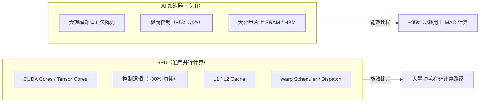
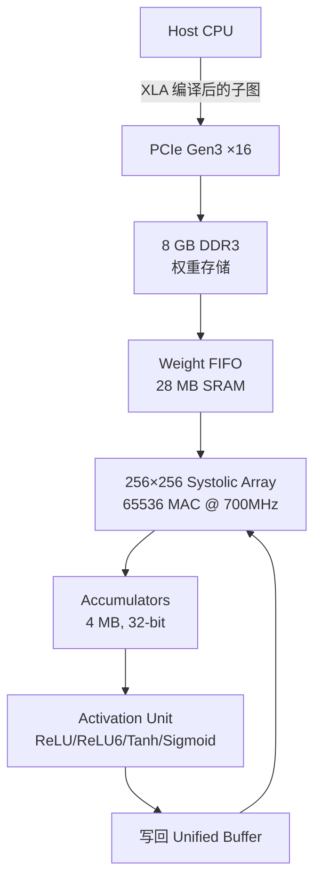
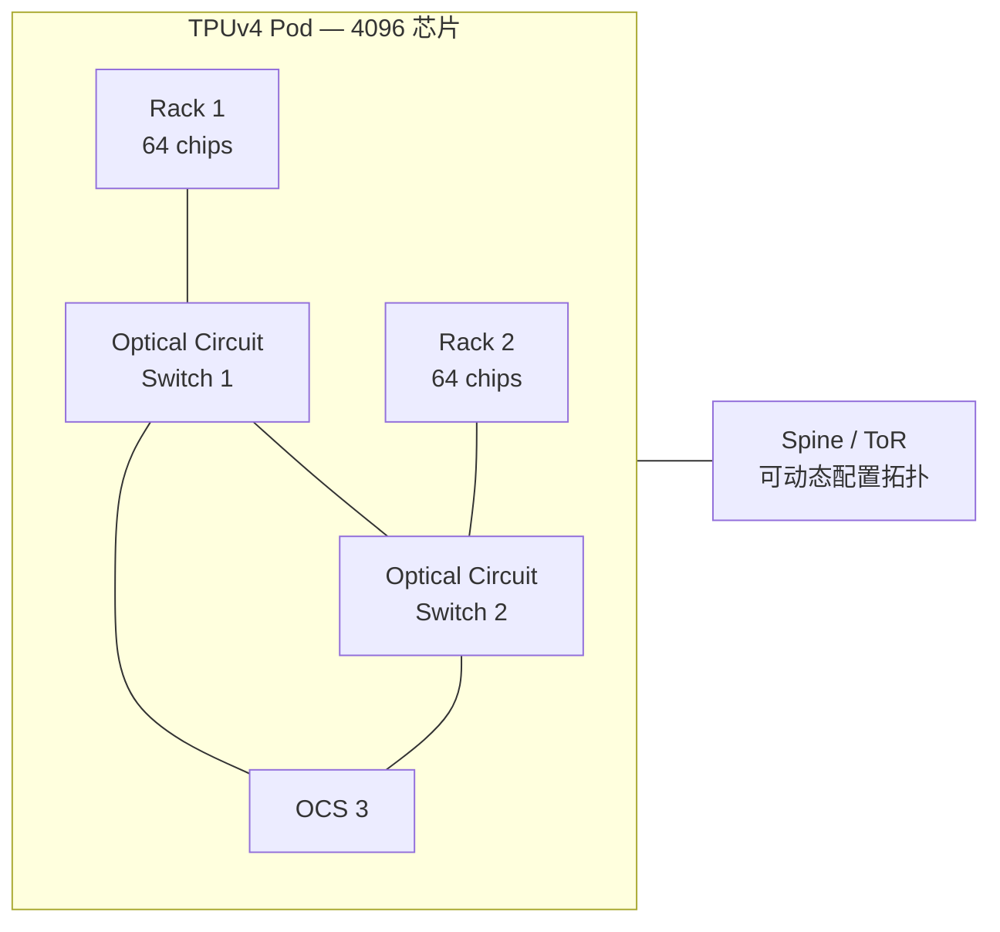
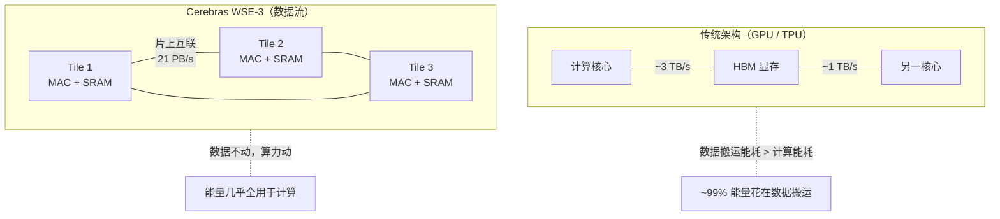
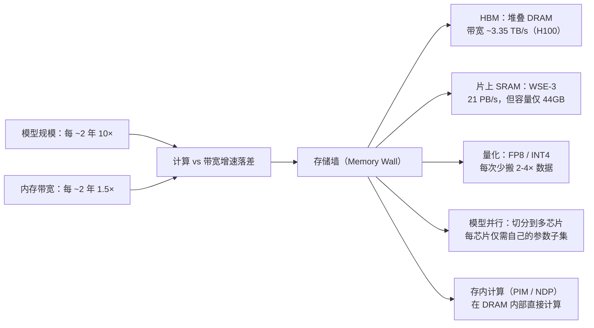

# AI 加速器：TPU / NPU / FPGA

## TL;DR

- GPU 做 AI 的致命伤不是算力不够，而是**能效比**：GPU 约 30% 功耗花在控制逻辑上（分支预测、调度、寄存器重命名），对矩阵乘法来说全是浪费。
- TPU 的核心思想是**脉动阵列（Systolic Array）**：数据像波浪一样流过 MAC 单元阵列，每个周期每个单元都在做乘加，零控制开销。
- 当代加速器的军备竞赛本质是对抗**存储墙（Memory Wall）**：模型 >1T 参数，99% 的时间在等权重从显存搬过来。Cerebras 的激进答案是整张晶圆做芯片（WSE-3），44GB 片上 SRAM，21 PB/s 带宽，模型不离开芯片。
- Groq LPU 走了另一条路：完全确定性计算，编译器在编译期就排好了每个数据在每个周期的位置——没有缓存、没有分支预测、没有乱序执行。
- ASIC（TPU）有最高能效和峰值算力，FPGA 有最低延迟和可重配置性，CPU（AMX）有最强的通用性。三者不是替代关系，是**异构计算**的拼图。
- 最大的护城河不是硬件，是**软件生态**：CUDA 做了 15 年，这也是为什么 Intel Gaudi 硬件不差但市场份额微乎其微。

---

## 1. 为什么不能只用 GPU？

要回答"Why not just GPUs?"，先看一组数据（H100 SXM，FP8）：

| 指标 | 数值 |
|------|------|
| 峰值算力 | 1979 TFLOPS |
| 内存带宽 | 3.35 TB/s |
| TDP | 700W |
| 晶体管 | 80B |

75 行 Python 启动一次 GEMM，调用栈是：Python → PyTorch → cuBLAS → CUDA Driver → 指令调度 → Tensor Core。GPU 为了通用性付出了巨大的控制开销：warp scheduler、dispatch unit、L0 指令缓存、scoreboard、分支发散处理。这些东西对矩阵乘法没有用，但它们占着面积，烧着功耗。

粗略估算：一张 H100 上约 30% 的面积和功耗花在非计算逻辑上。对于训练 GPT-4 级模型（几万张 GPU 跑几个月），这 30% 意味着上千万美元的电费和额外的散热基建。



**结论：用 GPU 训练大模型不是"最优解"，是"先用着最方便的解"。** CUDA 生态让 NVIDIA 成为唯一可行的选择，但这不等于 GPU 在硬件上是为 AI 而生的。

---

## 2. 脉动阵列：TPUv1 的心脏

### 2.1 什么是脉动阵列（Systolic Array）

想象一个 256×256 的网格，每个格子是一个 MAC（Multiplier-Accumulator）：

```
Iteration 0:    Iteration 1:    Iteration 2:
┌─┬─┬─┐        ┌─┬─┬─┐        ┌─┬─┬─┐
│w│ │ │        │ │w│ │        │ │ │w│
├─┼─┼─┤        ├─┼─┼─┤        ├─┼─┼─┤
│a│ │ │   →    │ │a│ │   →    │ │ │a│
├─┼─┼─┤        ├─┼─┼─┤        ├─┼─┼─┤
│ │7│ │        │ │ │8│        │ │ │ │95
└─┴─┴─┘        └─┴─┴─┘        └─┴─┴─┘

左：输入激活  右：部分和    上：权重
每个格子 = MAC(a_in, w_in, sum_in) → (a_out, sum_out)
```

数据流动规则：
- **权重从上往下**流动（提前预加载）
- **输入激活从左往右**流动
- **部分和从上往下**累积

256 个周期后，整个矩阵乘法结果从底部流出。整个过程**没有寄存器写回冲突、没有缓存未命中、没有任何控制流指令**。

### 2.2 TPUv1 规格（Google，2015 年发表）

| 参数 | 值 |
|------|-----|
| 脉动阵列尺寸 | 256 × 256 MAC |
| 总 MAC 单元数 | 65,536 |
| 单周期操作数 | 65536 multiply-adds |
| 峰值算力 | 92 TFLOPS（INT8） |
| 频率 | 700 MHz |
| 片上缓冲 | 28 MB SRAM（权重） + 24 MB SRAM（激活） |
| 片外内存 | 8 GB DDR3-2133 |
| 内存带宽 | 34 GB/s |
| TDP | ~75W |
| 工艺 | 28nm |
| 编程接口 | TensorFlow（直接下推 XLA 编译的图） |

关键限制：v1 只能推理，不能训练（只有 INT8 计算，没有反向传播所需的高精度梯度累积）。



TPUv1 仅需一个 PCIe 插槽，功耗 75W，在当时（2015）性能远超同功耗的 GPU 推理。

---

## 3. TPUv4 / v5 的演进

### 3.1 TPUv4（2021）

| 参数 | 值 |
|------|-----|
| 峰值算力 | 275 TFLOPS（BF16） |
| 片上 HBM | 32 GB HBM2e |
| 内存带宽 | 1.2 TB/s |
| 单芯片 TDP | ~200W |
| Pod 规模 | 4096 芯片 |
| Pod 算力 | 1.1 EFLOPS（BF16） |
| 互联拓扑 | **光电路交换（OCS）**——动态可重构 |

TPUv4 的创新在于**光电路交换（Optical Circuit Switching）**。传统 GPU 集群的拓扑是固定的（如 NVIDIA DGX 的 NVSwitch + NVLink 全互联），而 TPUv4 可以通过 MEMS 镜片动态改变芯片间的连接拓扑，使得不同训练阶段（数据并行 vs 模型并行 vs 流水线并行）可以使用最优的互联拓扑。



### 3.2 TPUv5p（2023）

| 参数 | 值 |
|------|-----|
| 峰值算力 | 459 TFLOPS（BF16）/ 918 TFLOPS（INT8） |
| 片上 HBM | 95 GB HBM2e |
| 关键新特性 | **SparseCore**——硬件加速的嵌入查找 |
| 每 Pod 芯片 | 8960 |
| Pod 算力 | 4.1 EFLOPS（BF16） |

Google 用 TPUv5p 训练 Gemini 系列模型。值得注意：Bard / Gemini 的推理也大量运行在 TPUv5e 上（"e" 表示推理优化版）。

---

## 4. SparseCore：嵌入查找的硬件加速

### 4.1 问题

推荐系统（YouTube、TikTok）和 MoE（Mixture of Experts）模型的核心操作是**大稀疏矩阵乘法**——嵌入表查找。举个具体例子：

```
YouTube 推荐模型：10 million items × 1024 dim embedding = 10 GB 嵌入表
每次 query：只访问 ~100 个 item（即稀疏访问 100 行）
GPU 操作：gather → matmul → scatter  （内存不连续 → 带宽利用率极低）
```

GPU 的 `gather` 指令在这里效率极差。HBM 的峰值带宽只有在**连续访问、128B 对齐**时才打得满，而嵌入查找天生是随机的、步长不等的。

### 4.2 SparseCore 方案

TPUv4 之后，Google 在芯片上放了专用的 SparseCore：一个小型的、高带宽的嵌入查找加速器。SparseCore 有自己的 SRAM 缓存和硬件 scatter/gather 引擎，能同时做：

1. **嵌入查找**：根据索引从表中取值
2. **规约**：将查到的向量进行 reduce（sum / mean / concat）
3. **与稠密部分汇合**：将稀疏结果传给主 Systolic Array

效果：推荐模型训练/推理的嵌入查找部分加速了 **5-7 倍**。

---

## 5. 数据流架构：Cerebras WSE-3

WSE（Wafer-Scale Engine）的哲学跟所有其他芯片相反：**既然数据传输消耗 99% 的能量，那就让数据别动了。**

### 5.1 规格

| 参数 | 值 |
|------|-----|
| 晶体管 | 4 万亿 |
| AI 核心数 | 900,000 |
| 片上 SRAM | 44 GB |
| 片上带宽 | 21 PB/s |
| 芯片面积 | 46,225 mm²（整张 300mm 晶圆） |
| 功耗 | 23 kW（整片） |
| 工艺 | 5nm（TSMC） |
| 内存 | **无片外 DRAM**——所有数据在片上 |

对比 H100：片外 HBM3 带宽 3.35 TB/s vs WSE-3 片上 21 PB/s。差距是 6000 倍。但这 44GB SRAM 也意味着模型必须完整装进去——GPT-4 的 1.7T 参数完全不可能。Cerebras 的目标场景是：**科学计算、分子动力学、流体力学的稀疏/规则网格计算**，以及中等规模的 LLM（如 LLaMA 2 7B）的极致训练速度。



---

## 6. Groq LPU：确定性处理器

Groq 的创始人 Jonathan Ross 也是 TPU 的创始人之一。LPU（Language Processing Unit）的设计理念是**极致确定性**。

### 6.1 核心设计

```
传统处理器（CPU/GPU）：
    程序→取指→译码→调度→执行→缓存未命中→等待→写回
    每一步都有不确定性（缓存命中率、分支方向、执行端口竞争）

Groq LPU：
    编译器在编译期就排好了：
      - 每个数据在第几个周期到达哪个功能单元
      - 每个算术操作的结果去向哪个 SRAM 地址
      - 每次片间通信的精确时序
    硬件上：零缓存、零分支预测、零乱序执行、零 scoreboard
```

### 6.2 架构

Groq 的芯片由 **Functional Slice** 组成，排列成一个 2D 网格。每个 Slice 包含：
- 一个 SIMD 向量计算单元（16 条通道 × 32 位）
- 一块本地 SRAM
- 一个路由单元（与四方邻居通信）

**软件定义网络（Software-Defined Network）**：编译器把每个数据流映射成芯片上的一条路径，数据从 SRAM→SIMD→路由→邻居→路由→...→目标 SRAM，全部在编译期确定。

### 6.3 规格

| 参数 | 值 |
|------|-----|
| 片上 SRAM | 230 MB |
| 内存带宽 | 80 TB/s |
| 峰值 INT8 | 188 TFLOPS |
| 峰值 FP16 | 94 TFLOPS |
| TDP | ~300W |
| 工艺 | 7nm |

Groq 的目标场景是 LLM 推理（所以叫 Language Processing Unit）。Llama 2 70B 推理可以达到 ~300 tokens/s/用户。核心卖点：**延迟可预测性和极端内存带宽**（80 TB/s 远超 H100 的 3.35 TB/s）。

---

## 7. Apple Neural Engine（ANE）

从 A11 Bionic（2017，iPhone 8/X）开始，每代 A 系列和 M 系列芯片都包含一个独立的 ANE。

| SoC | 年份 | ANE 规格 | TOPS (INT8) |
|-----|------|----------|-------------|
| A11 | 2017 | 2 核 | 0.6 |
| A12 | 2018 | 8 核 | 5 |
| A13 | 2019 | 8 核 | 6 |
| A14 | 2020 | 16 核 | 11 |
| A15 | 2021 | 16 核 | 15.8 |
| A16 | 2022 | 16 核 | 17 |
| A17 Pro | 2023 | 16 核 | 35 |
| M4 | 2024 | 16 核 | 38 |

**架构特点：**
- ANE 是独立于 CPU/GPU 的硬件模块，有自己的 DMA 引擎和内存空间
- 支持几十种 CoreML 算子（卷积、池化、归一化、激活函数）
- **无公开低层 API**——所有开发必须通过 CoreML 框架（Apple 统一编译到 ANE）
- 功耗极低：A17 Pro 的 ANE 满载约 2W，同性能功耗 GPU 需要约 15W
- 应用场景：Face ID、实时照片处理、键盘预测、Siri 本地处理

**关键设计取舍：** Apple 牺牲了通用可编程性来换取极致能效比。你不能在 ANE 上跑自定义 CUDA kernel，但 iPhone 上 99% 的 ML 任务已经被 CoreML 覆盖。

---

## 8. Qualcomm Hexagon NPU

Hexagon 不是新产品线——Qualcomm 做 Hexagon DSP 已经超过 15 年。但 Hexagon NPU（从 Snapdragon 8 Gen 1 开始）是全新架构。

Snapdragon 8 Gen 3 的 **AI Engine** 是一个融合结构：

```
                ┌──────────────────────────────┐
                │  Snapdragon 8 Gen 3 AI Engine  │
                ├──────────────────────────────┤
                │  Hexagon NPU（Transformer 加速）│
                │  + Adreno GPU（通用 ML）        │
                │  + Kryo CPU（标量 / 控制流）     │
                │  + Sensing Hub（超低功耗感知）    │
                └──────────────────────────────┘
```

| 参数 | 值 |
|------|-----|
| 峰值 INT4 | 45 TOPS |
| 峰值 INT8 | 22.5 TOPS |
| 支持 | LLaMA 2 7B（INT4 量化，纯本地运行） |
| 编程 | Qualcomm AI Engine Direct SDK / Qualcomm AI Hub |

关键能力：**在整个 SoC 上分配 ML 算子**。Transformer 的 Attention 跑在 NPU 上，LayerNorm 跑在 CPU 上，量化/去量化跑在 GPU 上。高通的异构调度器自动决定每个算子的最优硬件。

---

## 9. Intel AMX：CPU 里的张量核心

Sapphire Rapids（第 4 代 Xeon 可扩展，2023）引入了 **AMX**（Advanced Matrix Extensions）。

### 9.1 架构

AMX 给 x86 增加了**Tile Register**——一组扁平化的、2048 位的二维寄存器文件（8 个 tile 寄存器 × 每 tile 16 行 × 64 字节/行 = 1 KB / tile = 共 8 KB）。

```
指令集：
  TDPBF16PS( tdest, tsrc1, tsrc2 )
    // Tile Dot Product BF16 × BF16 → FP32
    // 单条指令完成一个 16×16 的 BF16 矩阵乘法

  TILELOAD / TILESTORE
    // 从内存到 tile 寄存器的加载/存储

  TILERELEASE
    // 释放 AMX 状态（上下文切换前必须调用）
```

### 9.2 性能

| 操作 | 每核/周期 | 56 核 @ 2.0 GHz 总计 |
|------|----------|----------------------|
| INT8 matmul | 2048 ops | 114.7 TFLOPS |
| BF16 matmul | 1024 ops | 57.3 TFLOPS |

本质上，AMX 就是 **"CPU 上的 Tensor Core"**。

### 9.3 为什么 CPU 也要做 AI

两件事驱动：
1. **推理不必都在 GPU**：很多推理任务是突发小批量（如 API 服务），GPU 启动延迟就几十微秒。CPU 上没有 kernel launch 开销，对微小 batch 反而更快。
2. **数据中心 CPU 本来就插满了**：如果 CPU 就能跑推理，不需要额外的 GPU 采购、供电、冷却。

Intel 的策略不是替代 GPU，而是让 Xeon 可处理"GPU 太浪费、普通 CPU 太慢"的中间地带工作负载。

---

## 10. FPGA 在 ML 推理中的角色

### 10.1 为什么用 FPGA？

FPGA 的独特优势不是峰值算力，而是：

| 维度 | GPU / TPU | FPGA |
|------|-----------|------|
| 延迟 | 微秒级（kernel launch + 调度） | 纳秒级（无 OS 内核开销） |
| 大批量效率 | 高（利用所有算力） | 中（流水线深度有限） |
| 小批量效率 | 差（批次填不满 Tensor Core） | 优（pipeline 可以浅） |
| 可重配置 | 否 | 是（烧一个新比特流） |
| 开发难度 | CUDA/PyTorch | HLS / Verilog |
| 单芯片 TOPS | 极高 | 中低 |

### 10.2 代表性产品

**Microsoft Project Brainwave（2018）**
- 目标：Azure 上实时 DNN 推理（< 1ms 延迟）
- 硬件：Intel Stratix 10 FPGA + HBM2
- 架构：软核 DNN 处理器，无批量处理（batch=1 也是满吞吐）
- 结果：ResNet-50 推理 450K QPS @ < 1ms，2018 年业界最优
- 关键创新：FPGA 上直接做浮点运算矩阵乘法，数据从 HBM → LUT/DSP → 结果，没有软件栈

**Xilinx（AMD）Versal AI Engine**
- 架构：VLIW SIMD 处理器阵列（不是传统 LUT 逻辑）
- 每个 AI Engine：32KB 本地数据 + 512-bit SIMD
- 互联：AXI4-Stream，软件可重配数据流
- 性能：VC1902 约 180 TFLOPS INT8（FPGA 中最高）
- 编程：AI Engine 用 C++ kernel，编译器做时空映射

### 10.3 FPGA 的困局

FPGA 理论上优雅：为算法定制电路。现实中三个问题：
1. **编程门槛极高**：CUDA 程序员一抓一把，HLS/Verilog 工程师少得多
2. **单芯片算力仍低于 GPU/TPU**：ASIC 能用晶体管极致优化一种计算，FPGA 必须用通用 LUT 模拟一切
3. **每芯片贵、大批量部署不如 ASIC 经济**

FPGA 的最佳生态位：**超低延迟推理**（自驾驶感知、量化交易）和**定制算子加速**（SmartNIC 上的 ML 处理、5G 基站内的 AI）。

---

## 11. 存储墙：所有加速器的共同敌人



**具体估算：**

```
GPT-4 推理（推测 ~1.7T 参数，FP16）：
  模型大小 = 1.7 × 10^12 × 2 bytes = 3.4 TB
  H100 带宽 = 3.35 TB/s
  纯搬运时间 = 3.4 / 3.35 ≈ 1 秒 / token

  实际 GPU 集群用 8 张 H100：
  每张 8 / 3.35 ≈ 2.4 秒（需等待，不能并行读取所有参数）
  实际还要算 FLOPs，但瓶颈仍是带宽。

  Token 生成速度 ≈ 内存带宽 / 模型大小（首近似）
```

这就是为什么量化（INT4/FP8）是推理优化的第一优先级：直接把数据量砍 4 倍，延迟砍 4 倍。

---

## 12. 加速器对比总表

| 加速器 | 峰值算力 | 内存带宽 | 功耗 | 工艺 | 定位 |
|--------|----------|----------|------|------|------|
| NVIDIA H100 | 1979 TFLOPS (FP8) | 3.35 TB/s (HBM3) | 700W | 4nm / TSMC | 训练 + 推理（CUDA） |
| Google TPUv5p | 459 TFLOPS (BF16) | ~2.7 TB/s (HBM2e) | ~450W | 5nm | Gemini 训练 + 推理 |
| Cerebras WSE-3 | ~100 PFLOPS (BF16) | 21 PB/s (片上 SRAM) | 23 kW | 5nm / TSMC | 科学计算 + 中等 LLM |
| Groq LPU | 188 TFLOPS (INT8) | 80 TB/s (片上 SRAM) | ~300W | 7nm | LLM 推理（确定性延迟） |
| Apple ANE (A17) | 35 TOPS (INT8) | 共享 LPDDR5 | ~2W | 3nm / TSMC | 端侧推理（CoreML） |
| Intel AMX (8480+) | 57 TFLOPS (BF16) | DDR5 共享 | 350W | Intel 7 | 中等批量 CPU 推理 |
| AMD Versal VP1902 | ~180 TOPS (INT8) | ~1.6 TB/s | ~120W | 7nm | 实时推理 / 信号处理 |
| Qualcomm Hexagon | 45 TOPS (INT4) | 共享 LPDDR5X | ~5W | 4nm / TSMC | 手机端 LLM |

> 注意：**峰值 TOPS 不等于实际吞吐**。同样 TOPS 的不同硬件，实际利用率可能差 2-3 倍。Cerebras 和 Groq 靠片上 SRAM 能达到 70-80% 利用率，GPU 在大部分工作负载下仅 30-50%。

---

## 13. 工程案例

### 13.1 Project Brainwave（微软，2018）

- **挑战**：Azure 上的实时 AI 服务要求 <1ms 延迟。GPU 的 kernel launch + batch 累积有几十微秒的不可控延时。
- **方案**：用 Intel Stratix 10 FPGA，直接在硬件上实现 DNN 推理。无 CPU 调度、无 kernel 启动，数据流直通。
- **成果**：ResNet-50 推理延迟 <1ms（batch=1），单 FPGA 吞吐 450K QPS，Azure 大规模采用。
- **启示**：对超低延迟推理，FPGA 可能比 GPU 和 TPU 都好——不是算力大，是延迟可控。

### 13.2 Habana Gaudi（Intel，2019-2024）

Intel 收购 Habana 后推出的训练加速器：
- **硬件不差**：Gaudi2 在 ResNet-50/ BERT 训练上与 A100 打平甚至超出
- **互联强**：每个 Gaudi2 芯片集成 24 个 100GbE RoCE 端口，专为大规模 Scale-out 设计
- **实际问题**：**软件兼容性**。PyTorch 的 `torch.compile` 和底层 CUDA kernel 是 15 年的积累，Gaudi 的 SynapseAI 软件栈需要逐算子适配。到 2024 年仍有很多模型无法无缝迁移。
- **教训**：AI 加速器的护城河 80% 在软件生态。

---

## 14. 易错清单

| 错误认知 | 正确理解 |
|----------|----------|
| "TOPS 越高越快" | 峰值 TOPS 仅代表所有 MAC 单元同时工作的理论上限。实际性能取决于**内存带宽**和**软件映射效率**。H100 的 1979 TFLOPS 在大部分 Transformer 训练中利用率仅 40-50%。 |
| "FPGA 总是比 GPU 功耗低" | 取决于场景。做同样的矩阵乘法吞吐，FPGA 需要更多 LUT/DSP 资源，整体功耗可能反而高于类似工艺的 ASIC（如 TPU）。FPGA 的功率优势体现在对**特定小工作负载**的极致优化。 |
| "买个加速器就能加速模型" | 加速器的软件栈成熟度直接决定上线周期。CUDA 生态 15 年积累 vs 新硬件仅支持 PyTorch 基础算子。自研模型（自定义 attention、特殊激活函数）可能完全无法在非 NVIDIA 硬件上运行。 |
| "片上 SRAM 大就是好" | 容量和速度是 trade-off。Cerebras WSE-3 的 44GB SRAM 虽然带宽极高，但装不下 70B+ 的大模型，必须走模型并行。Groq 230MB SRAM 对 LLM 70B 也需要数百张卡拼接。 |
| "TPU 比 GPU 好，Google 不用 GPU" | Google 内部同时使用 TPU（主力）和 GPU（匹配公有云客户需求）。2024 年 Google Cloud 提供 A3 实例（H100）和 TPUv5e 实例，两种都商用。 |
| "AI 加速器会取代 GPU" | 不会。GPU 的通用性在处理非 ML 工作负载（图形渲染、科学仿真、视频编解码）时仍有不可替代性。正确的问题是"什么工作负载跑在什么硬件上最优"，而不是找一个通用答案。 |

---

## 15. 这一章带走的东西

1. **能效是 AI 加速器存在的理由，不是算力**：GPU 够快但太费电。专用硬件把 30% 控制开销降到 5%，省下的就是真金白银。
2. **脉动阵列是 AI 加速器的基础范式**：TPUv1 就已验证，后来几乎所有 NPU（包括 Google TPU、AWS Trainium、华为昇腾）都采用类似的 Systolic Array 乘加结构。
3. **存储墙是当前的头号瓶颈**：模型规模增速（~10×/2年）远快于内存带宽增速（~1.5×/2年）。对抗存储墙的手段包括 HBM 堆叠、片上 SRAM、量化、模型并行和存内计算。
4. **异构计算是终端侧的必然**：手机上的 AI 不是只跑在 NPU 上——高通、苹果、联发科全都在做"NPU + GPU + CPU + DSP"异构调度。未来没有哪个芯片能单独解决所有 ML 问题。
5. **软件生态 > 硬件指标**：这是 AI 加速器行业 10 年来最重要的教训。Intel Gaudi、AMD Instinct、Cerebras CS-3 的硬件都不差，但没有一个能真正撼动 NVIDIA + CUDA 的组合。硬件可以 18 个月追上，软件生态需要 10 年。
6. **FPGA 和 ASIC 不是竞争，是分工**：ASIC（TPU 等）做大批量、高吞吐的云端训练/推理；FPGA 做超低延迟、小批量、可重配置的边缘场景。

---

> **下一节 → [总线与互联：PCIe / CXL / NVLink / RDMA](interconnects.md)**
> 如何把成千上万个加速器连起来组成一个训练集群？PCIe 带宽为什么不够用了？CXL 怎么把内存池化？RDMA 如何让 GPU 直接写对端 GPU 的 HBM？下一章讲互联总线。
