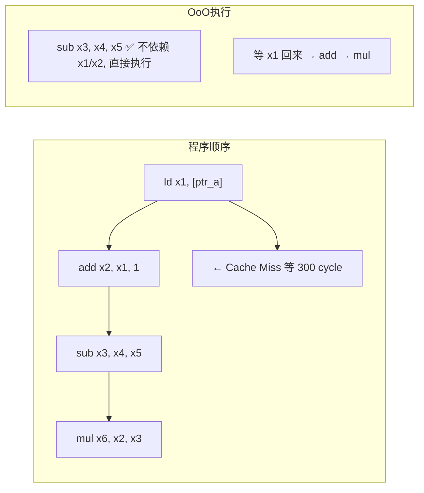
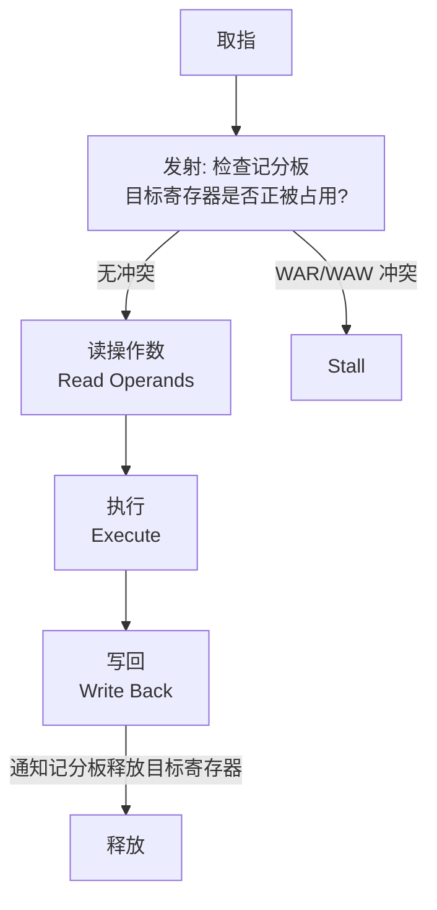
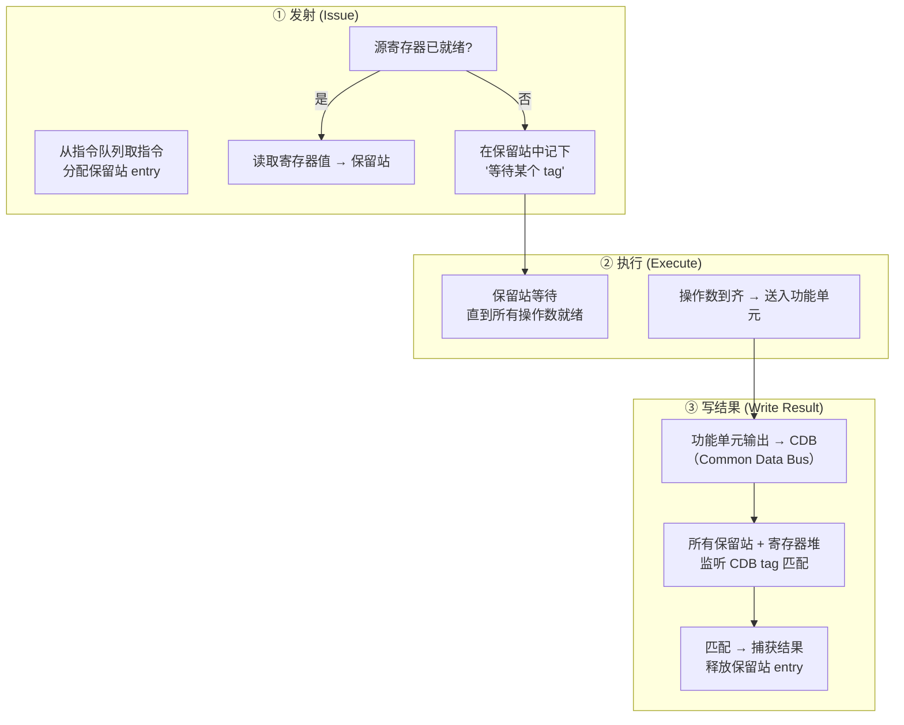
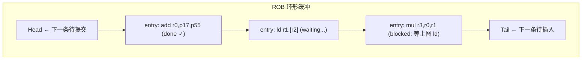

# 超标量 / 乱序执行 / Tomasulo 算法

## TL;DR

上一章的 5-stage pipeline 是 **IPC ≤ 1** 的标量在序（in-order）处理——一条指令等 cache miss，后面几百条全排队干等。超标量（superscalar）+ 乱序执行（Out-of-Order, OoO）的核心思想是：**同时发射多条指令到多条流水线，哪条操作数齐了就先执行哪条，跟程序顺序无关**。



关键数字：in-order IPC ≈ 0.3–0.8（大部分 stall 等内存），OoO IPC ≈ 0.5–2.5（现代 6-wide 核心常见每周期完成 1.2–1.8 条指令，密集计算可冲 3–4+）。

本章从 1966 年 Tomasulo 算法讲起，逐步推到当代 Golden Cove / Zen 5 / M3 的完整 OoO 管线：寄存器重命名、ROB、保留站、LSQ、投机执行、内存消歧。

---

## 一、为什么需要 OoO？

### 在序（in-order）的 IPC 天花板

```
[指令流]
  ld x1, [a]       ← L1 miss，等 4 cycle
  add x2, x1, 1    ← RAW 依赖 x1，stall 等 4 cycle
  sub x3, x4, x5   ← 跟上面两条无关，却在流水线里被挡住
  mul x6, x7, x8   ← 同上，被挡
```

在序处理器的**发射阶段**严格按程序顺序检查操作数：即使 `sub` 的两个源寄存器 `x4, x5` 都已就绪，也必须等前面的 `add` 先发射——这叫做"in-order issue"。IPC 被三种闲置打下来：

| 因素 | 影响 |
|------|------|
| 数据依赖（RAW） | 每周期可执行 N 条，但真正独立的没几条 |
| Cache miss | 即使 99% L1 命中，剩下 1% 平均 miss penalty ~12 cycle (L2) → ~50 cycle (L3) → ~300 cycle (DRAM) — 单条堵塞全部 |
| 分支误预测 | mispredict 时 flushing 全流水线重来 — 深流水线 19+ cycle 白费 |

OoO 的解法：**解耦发射和执行**——指令在前端按程序顺序取入，进入"指令窗口"（instruction window）后，哪个操作数到了就执行哪个。遇到 cache miss 的 `ld`，它后面的独立指令照样发射执行。未就绪的操作数通过物理寄存器标签（tag）等待，而不是阻塞整条流水线。

典型对比：

```
in-order:   IPC ≈ 0.3–0.8    (ARM Cortex-A53, original Pentium)
OoO:        IPC ≈ 0.5–2.5    (Golden Cove, Zen 5, M3 — 真实负载)
理想 ILP:    IPC ≈ 3–4+      (specint 密集基本块, 无 miss)
```

---

## 二、Scoreboard（记分板）—— CDC 6600 (1964)

Tomasulo 的前身。记分板是一个**集中化的硬件表**，跟踪每条指令的目标寄存器、源寄存器状态：



记分板的三条检查：

1. **WAW**：目标寄存器是否有未完成的写？有 → stall。
2. **WAR**：源寄存器是否被其他指令作为目标寄存器（正在写）？是 → stall。
3. **RAW**：源寄存器在记分板中标记为"未就绪"？是 → stall。

记分板的致命缺陷：**WAR/WAW 靠 stall 解决，不靠重命名**。意味着只要有寄存器名字冲突就得等前一条写完——即使两条指令毫无数据关系。这严重限制了 ILP。

```
# 记分板下白白 stall 的例子
fdiv f0, f2, f4    # 浮点除法：20 cycle
fadd f0, f6, f8    # 也写 f0 → WAW，必须等 fdiv 写完，即使 fadd 1 cycle 就能做完
```

---

## 三、Tomasulo 算法 (1966, IBM 360/91)

### 核心洞见：寄存器重命名 via 保留站

Tomasulo 不再用寄存器名字来跟踪依赖关系，而是用**保留站（Reservation Station）标签**来流通数据。每条指令被发射时分配到某个保留站；保留站的编号/标签（tag）临时取代寄存器名。



**公共数据总线（CDB, Common Data Bus）** 是 Tomasulo 的核心：它不是写回寄存器后就完事了，而是**广播**到所有等待这个结果的保留站。等于在硬件层面实现了"发布-订阅"——谁要这个值、谁拿，不用经过寄存器文件。

### 算法步进（浮点执行为例）

| 步 | 动作 | 保留站 | 寄存器状态表 |
|----|------|--------|------------|
| 0 | `fld f0, data1` | `RS0 {op: load, tag: T0}` | f0 → T0 |
| 1 | `fld f2, data2` | `RS1 {op: load, tag: T1}` | f2 → T1 |
| 2 | `fmul f4, f0, f2` | `RS2 {op: mul, src1: wait T0, src2: wait T1, tag: T2}` | f4 → T2 |
| 3 | `fadd f0, f6, f8` | `RS3 {op: add, src1: f6 ready, src2: f8 ready, tag: T3}` | f0 → T3 |
| 4 | T0 返回 (ld f0 done) → CDB 广播 | RS2 捕获 src1, 仍等 src2 | |
| 5 | T3 返回 (fadd f0 done) → CDB 广播 | 寄存器和等待 f0 者更新 | f0 → T3 |
| 6 | T1 返回 (ld f2 done) → CDB 广播 | RS2 全部就绪 → 发射乘法 | |

**关键观察**：
- 第 3 步 `fadd f0, f6, f8` 也写 `f0`——这在记分板中会 stall（WAW），但在 Tomasulo 中，`f0` 被重命名为 T3，与之前的 T0 完全独立。这是**硬件寄存器重命名**的创始实现。
- 第 5 步中的 `fadd f0` 用 1 cycle 就算完了——但记分板中，这个操作得等所有写 `f0` 的前序指令全结束，20+ cycle。

### Scoreboard vs Tomasulo 比较

| 维度 | Scoreboard | Tomasulo |
|------|-----------|----------|
| WAR / WAW 处理 | stall（阻止发射） | 寄存器重命名（不 stall） |
| RAW 处理 | stall 等操作数就绪 | tag 匹配：操作数就绪自动唤醒 |
| 依赖追踪 | 集中化记分板查表 | 分布式保留站 + CDB tag 广播 |
| 结果传播 | 写寄存器 → 源指令再读寄存器 | CDB 广播 on-the-fly forwarding |
| 复杂度 | 较简单 | 较高——需要 tag 匹配和 CDB 仲裁 |
| 并行度上限 | WAR/WAW 限制了 ILP | 仅受 RAW（真依赖）限制 |

---

## 四、现代 OoO 管线

Tomasulo 算法在当代 CPU 中的形态已经大幅演化。现代超标量 OoO 管线的完整流程：


### 4.1 寄存器重命名（Register Renaming）

x86-64 只有 16 个 GPR（加上 16 个向量寄存器），但程序中大量的 `mov` 和中间变量会产生大量虚假 WAR/WAW 依赖。硬件维护一个庞大的**物理寄存器文件（Physical Register File, PRF）**，每条写入目标寄存器的指令被分配一个空闲物理寄存器。

```
架构寄存器 → 重命名表 (RAT, Register Alias Table) → 物理寄存器
```

```c
// 源代码
int a = b + c;     // r0 = r1 + r2
int d = e + f;     // r3 = r4 + r5
int g = a + d;     // r6 = r0 + r3  (RAW on r0, r3)
int a = h + i;     // r0 = r7 + r8  (WAW on r0 — 重命名化解)
```

| 指令 | 架构目标寄存器 | 分配的物理寄存器 | RAT[r0] |
|------|-------------|---------------|---------|
| `add r0, r1, r2` (a = b+c) | r0 | p17 | p17 |
| `add r3, r4, r5` (d = e+f) | r3 | p28 | r3→p28 |
| `add r6, r0, r3` (g = a+d) | r6 | p42 | — |
| `add r0, r7, r8` (a = h+i) | r0 | p55 | p55 |

第四条 `r0 = p55` 不依赖第一条 `r0 = p17`——两者用不同物理寄存器，WAW 虚假依赖完全消失。物理寄存器数量决定了 OoO 窗口的上限：**Golden Cove 物理寄存器 ~280 个**。

### 4.2 ROB（重排序缓冲区，Reorder Buffer）

ROB 是一个环形缓冲区，按**程序顺序**记录每条发射的 μop。它的三个核心功能：

1. **按序提交（in-order commit）**：μop 执行完可以把结果放到 ROB entry，但只有该 entry 到达 ROB 头部且不异常时才对架构状态可见。
2. **精确异常（precise exception）**：当前面某条指令产生异常时，ROB 按序提交隐式保证了异常点之前的所有指令已完成、之后所有指令无副作用——直接 flush 异常指令后的所有 ROB entry。
3. **投机状态缓冲**：分支预测后的所有 μop 结果暂存 ROB；分支被误预测时 flush ROB 后段。



每 cycle 提交 N 条（N = 提交宽度，通常 = 发射宽度，6–8 条/cycle）。

### 4.3 保留站（Scheduler / Reservation Station）

保留站是**乱序发射的核心**——每个执行端口有若干 entry。μop 在 dispatch 阶段被分配到某个保留站，携带：
- 操作码（opcode）
- 物理源寄存器 A：值已就绪 → 直接存值；否则 → 存 tag（产生该值的物理寄存器 / ROB id）
- 物理源寄存器 B：同上
- ROB entry id（用于提交时定位）

当且仅当所有源操作数就绪（即 tag 为空，值已捕获），条目被"唤醒"，竞争功能单元。各端口独立仲裁（通常是最老的就绪条目优先），每 cycle 可发射 N 条。

### 4.4 LSQ（Load-Store Queue，加载-存储队列）

Load/Store 指令不光有寄存器依赖，还有**内存依赖**：

- **写后读（RAW via memory）**：`str [addr], r1` → `ldr r2, [addr]`（store-to-load forwarding）
- **读后写（WAR via memory）**：`ldr r1, [addr]` → `str [addr], r2`（load 必须先完成读，不能被后面的 store 覆盖实际内存顺序）
- **写后写（WAW via memory）**：`str [addr], r1` → `str [addr], r2`（需按序写）

LSQ 按程序顺序保存所有未提交的 load/store。当 load 发射时，它搜索 LSQ 中所有未完成且地址较早的 store——若地址匹配则直接从 store_data 转发。

---

## 五、投机执行：越过分支

分支预测器猜了方向，但"猜"不等于"对"。误预测的代价是：管道中所有依赖于分支后指令的状态必须清空。ROB 机制处理这一件事：

```
[正确预测]
Fetch → ... → Commit (branch resolved, taken ✓) → 继续执行

[误预测]
Fetch → ... → branch resolved (actually NOT TAKEN ✗)
  → 找到 branch uop 的 ROB entry
  → flush 所有 ROB entry 编号 > branch
  → 重置 RAT（寄存器重命名表）为分支前的快照
  → 重定 PC 为正确路径，重新取指
```

**恢复快照**：每次分支指令在 rename 阶段时，硬件会对 RAT 做一次 checkpoint（保存当前映射表副本）。误预测发生时从最近的 checkpoint 恢复。Zen 5 / Golden Cove 一般支持 16–32 个 RAT checkpoint。

**资源代价**：误预测率 1% 听起来低，但 5GHz × 1% = 每 ns 0.05 次 mispredict。每次 mispredict 浪费 ~19 cycle（Golden Cove 深度）→ 约 4ns 无效工作 → 相当于 ~2% 的无用功。但这远好于 rest 100 cycles 不做任何指令——**投机执行将分支代价从 "必等" 变成了 "小概率等"**。

---

## 六、真实 CPU 微架构对比

| 参数 | Intel Golden Cove | AMD Zen 5 | Apple M3 P-core | ARM Cortex-X4 |
|------|-------------------|-----------|----------------|---------------|
| 解码宽度 | 6-wide (x86→μop) | dual 4-wide | 9-wide | 8-wide |
| μop Cache | 4K entries (DSB) | 6.75K (Op Cache) | 超大 μop cache | 4K entries |
| ROB 大小 | 512 entries | 384 entries (est.) | ~630 entries | ~400 entries |
| 物理寄存器 | ~280 (int) + ~224 (vec) | ~224 (int) + ~192 (vec) | ~400+ (int) | ~300 (int) |
| 执行端口 | 12 (5 int + 5 fp/vec + 2 store) | ~16 int+fp 共享 | 高度专用化多端口 | ~12 |
| 保留站/Scheduler entries | 97 (unified) | 96 (int) + 64 (fp) | ~160 | ~80 (int) |
| 提交宽度 | 8 μop/cycle | 8 μop/cycle | ~10 μop/cycle | 8 μop/cycle |
| 分支预测 | TAGE + Neural | Perceptron-based | 大规模感知器 | TAGE-like |
| 分支误预测惩罚 | 19–20 cycles | ~19 cycles | ~12–14 cycles | ~13–15 cycles |
| 时钟频率 | 4.5–5.7 GHz | 5.0–5.7 GHz | ~4.05 GHz | ~3.4 GHz |

**核心洞察**：
- Apple M3 更宽（9-wide decode）、更深（~630 ROB）但更低主频，靠 ILP 取胜 → 每 clock 做更多工作。
- Intel/AMD 走高主频路线（5.7GHz+），深流水线代价是 mispredict 惩罚重（19 cycles）。
- ROB 大小直接决定 OoO **时间窗口**：512 entries / 8 commit width ≈ 64 cycles 的指令窗口 = ~120 条 x86 指令的范围找 ILP。
- ARM 苹果核心放弃 SMT（超线程），每条线程独占全部 OoO 资源 —— 单线程峰值 IPC 更高。

---

## 七、执行端口与功能单元

每个执行端口绑定若干功能单元。一条 μop 被 issue 到对应端口，不同指令有不同的延迟和吞吐：

| 指令类型 | 延迟 (cycle) | 吞吐 (每 cycle) | 示例 |
|---------|------------|-------------|------|
| 整数 ALU (add/sub/and/or/xor/移位) | 1 | 4–6 | `add rax, rbx` |
| 整数乘法 | 3–5 | 1 | `imul rax, rbx` |
| 整数除法 | 10–20+ | 1/10–20 | `idiv rax, rbx` |
| 浮点加法 (FP ADD) | 3–4 | 1–2 | `addss xmm0, xmm1` |
| 浮点乘法 (FP MUL) | 4–5 | 1–2 | `mulss xmm0, xmm1` |
| 浮点乘加 (FMA) | 4–5 | 2 | `vfmadd132pd zmm0, zmm1, zmm2` |
| Load (L1 hit) | 4–5 | 2–3 | `mov rax, [rbx]` |
| Store (L1 hit) | 1 (AGU) + 1 (store-data) | 1–2 | `mov [rbx], rax` |
| 分支 | 1 (执行端口) | 1–2 | `je target` |

**FMA 关键**：`a = b × c + d` 在支持 FMA 的 CPU 上用一条指令完成——比先乘再加省一个 round-off 误差和 1–2 cycle 延迟。Tensor Core / SME 的算力全是基于 FMA。

AGU（Address Generation Unit）是 Load/Store 专用的加法器，计算 `base + index×scale + offset` 用于内存地址生成，不占用 ALU。

---

## 八、内存消歧（Memory Disambiguation）

当一条 load 之前有未完成的 store 且 store 地址未计算出时，load 无法确定是否依赖该 store：

```asm
str  r1, [r2]       # store to [r2]  → r2 未算出
ldr  r3, [r4]       # load from [r4] → 与 [r2] 冲突？未知
```

此时 load 有两个选择：

1. **保守等待**：等所有前面的 store 地址都出来 → 安全但丢性能（每 cycle 几十条指令被堵住）。
2. **投机执行**：假设 load 与 store 不冲突，先发射 load；当 store 地址后算出时验证——若发现地址相同，flush load 和所有依赖它的指令，重执行 load。

现代 CPU 用**存储-加载转发预测器（Store-to-Load Forwarding Predictor, SLFP）**来控制这个决策——跟分支预测器类似，记录历史 mode：哪些 load-store pair 频繁冲突，直接用预测结果指导调度。

```
冲突率: 通常 ~1-3%，但对于指针密集代码（链表遍历、树遍历）可到 10%+
错误重发代价: flush + 重新执行 ~10-15 cycle
```

---

## 九、工程事故：Pentium 4 Prescott 的 Replay 机制

**时间**：2004 年 Intel 发布 Pentium 4 Prescott，基于 NetBurst 微架构的进化。

**问题**：Prescott 的流水线深度达到了恐怖的 **31 级**（Northwood 是 20 级）。L1 D-cache miss 时，不是像传统做法那样 stall 管线，而是搞了一个**"回放回路（Replay Loop）"**——把依赖 L1 cache miss 结果的 μop 重新循环回到调度器里不断重新执行，直到 cache miss 被服务完毕。

```
[正常做法]
μop 等 L1 → stall reservation station → cache miss 解决后 release

[Prescott 的 Replay]
μop 等 L1 → 发射执行 → 发现数据未到 → 不挡管线 → 
  重新插入保留站 → 再次发射 → 再次 miss → ... → 直到数据返回
```

**结果**：CPU 在等待 cache miss 期间不断消耗电力执行无用 μop（每次 replay 都在功能单元上跑一次），发热量爆炸但真实 IPC 不升反降。这是 NetBurst "高频低效" 策略的典型体现。

**历史收敛**：2006 年 Intel 放弃 NetBurst，以 Pentium M (Banias) 的团队开发的 **Core 2 Duo (Conroe)** 取代——后者采用短流水线（14 级）+ 宽发射（4-wide）+ 大 OoO 窗口，IPC 提升 ~80%，功耗下降 ~50%。这条设计哲学一直沿用到今天的 Golden Cove。

**教训**：深流水线 ≠ 高性能。窗口大小（ROB + 物理寄存器 + 保留站）是 OoO 的硬通货——Prescott 的 31 级流水线虽然有名义上的深度，但 replay 机制让有效的 OoO 窗口大打折扣。

---

## 十、易错清单

1. **"OoO 执行"≠"OoO 提交"**：指令乱序执行但必须**按程序顺序提交**（ROB 保证）。写回架构状态（寄存器文件、内存）的顺序必须与程序顺序一致——否则无法实现精确异常。

2. **WAR/WAW 不是数据依赖**：`mov r0, r1; mov r0, r2` 这两条没有 RAW 依赖，WAW 可以通过重命名完全消除。混淆 WAR/WAW 与 RAW 会导致误判程序 ILP 上限。

3. **架构寄存器 ≠ 物理寄存器**：x86-64 代码可见 16 GPR，但物理寄存器池 ~200–400 个。流水线图中画"寄存器"时必须区分 RAT 查表后的物理寄存器与代码中的架构寄存器。忘记重命名这层，整个 OoO 图全错。

4. **ROB 大小 ≠ 指令条数**：512-entry ROB 大约容纳 ~120–200 条 x86 指令 (大量 μop 是 1:1，但 CISC load-op 指令可能 1:2–4 μop)。估算 OoO 窗口时按 μop 算。

5. **提交速度瓶颈**：即使前端 fetch 6 条/cycle、issue 8 条/cycle，commit 速度只有 8 μop/cycle。高频 CPU 的长串依赖链（如链表遍历的 ld→cmp→ld→cmp）会被 commit 宽度挡死。OoO 不能解决 **真依赖链** 的延迟。

6. **负载/储存转发不是免费的**：Store-to-load forwarding 只需要 store 在执行时就绪（same-cycle），但如果 store 的 AGU 延迟（base 未算出）会导致 LSQ forwarding 失效，load 必须等 store 地址 + 数据都到 LSQ。这会产生 ~10 cycle 的额外延迟。

7. **分支预测 99% = 仍有 1% flush**：Flush 不只是 PC 的丢失——被 flush 的 μop 占用了 ROB 空间和保留站资源，等于浪费了 OoO 窗口。在 mispredict 密集的代码（parser、正则引擎、JIT 编译）中，有效 ROB 利用可能萎缩 30–50%。

---

## 十一、这一章带走的东西

1. **OoO 的本质**：发射前检查"操作数是否就绪"代替"前面指令是否发完" → 用可执行指令填充空流水线。Cache miss、长延迟浮点除法的等待被后面独立计算填充。

2. **Tomasulo 的核心贡献**：保留站 + CDB 实现了**分布式依赖追踪**，WAR/WAW 从 stall 变成改名（用 tag 取代寄存器名）。这是往后 60 年所有高性能 CPU 微架构的基石。

3. **寄存器重命名**：架构寄存器的虚假 WAR/WAW 依赖被物理寄存器池吸收。物理寄存器数 + ROB 大小 = OoO 的硬窗口。

4. **ROB** 保证按序提交和精确异常——不管里面多乱，外面看到的一定是顺序状态。

5. **投机执行不仅仅是分支预测**：分支预测 + ROB 快照让 CPU 在不确定方向的情况下全速前进；一旦误预测就恢复 checkpoint，代价只有若干 cycle 的 flush。

6. **超标量各代对比**：M3 走宽窗口低主频（630 ROB / 4 GHz），Zen 5 / Golden Cove 走深流水线高主频（384-512 ROB / 5.7 GHz）——OoO 的设计在窗口大小与 clock frequency 间做 trade-off。

7. **OoO 不能解决真依赖**：一段全是 `a = a + b[n]; n = next[n]` 的代码，本质是单链依赖——再大的 ROB、再多的保留站也只蹲一条链路。ILP 的真实上限是**程序中的独立并行度**，不是硬件能"挖掘"多少。

8. **LSQ** 解决内存依赖消歧：地址未知时的 load-store 冲突通过预测器处理；预测错 flush 重执行。

---

下一节 → [存储层次：Cache / DRAM / HBM](memory-hierarchy.md)
