# GPU 架构：SM / CUDA Core / Tensor Core

> **TL;DR** — GPU 与 CPU 的根本分野在于设计哲学：CPU 押注**延迟优化**（大缓存、深流水线、乱序执行、分支预测），GPU 押注**吞吐优化**（海量轻量核心、零开销线程切换、高带宽显存）。理解 SM → Warp → CUDA Core → Tensor Core 这一层次结构，是写出高性能 CUDA 程序的前提。H100 上 16896 个 CUDA Core 以 warp (32 线程) 为单位被 warp scheduler 发射，Tensor Core 在同一时钟内完成 4×4 矩阵乘加，实现了 FP16 下 989 TFLOPS 的算力密度。

---

## 思维链：从"为什么要 GPU"开始

先问一个问题：同样是硅基半导体，为何 GPU 能比 CPU 的 FP32 吞吐高出两个数量级？

答案藏在两个数字里：CPU 约 25% 的晶体管用于运算单元 (ALU/FPU)，其余 75% 用于控制逻辑（分支预测、乱序窗口、调度器）、缓存和多级存储。GPU 把这比例颠倒过来——>80% 晶体管投入计算单元，缓存和控制的面积被压缩到极致。

你可以把 CPU 想象成一队 F1 赛车（低延迟，快速完成单次任务），GPU 是一万辆摩托车（高吞吐，并行处理海量任务）。对于深度学习推理中几百 GB 的矩阵乘法，一万辆摩托车完胜 F1。

---

## 1. GPU vs CPU：两种设计哲学

| 维度 | CPU (典型: Intel Sapphire Rapids) | GPU (典型: NVIDIA H100) |
|------|-----------------------------------|-------------------------|
| 核心数量 | 8-64 个大核 (P-core) | 16896 个 CUDA Core |
| 每核心缓存 | L1 32-64KB private, L2 1-2MB per core | SM 内共享 256KB L1 |
| 线程切换开销 | ~100 cycles (OS 上下文切换) | 0 cycles (warp 硬件调度) |
| 乱序窗口 | ~512 entry ROB | 无乱序 (in-order) |
| 内存带宽 | ~1 TB/s (DDR5 × 8ch) | 3.35 TB/s (HBM3) |
| 设计目标 | 单线程延迟最小化 | 总吞吐量最大化 |
| 面积分配 | ~25% 计算, ~75% 控制+缓存 | ~80% 计算, ~20% 控制+缓存 |

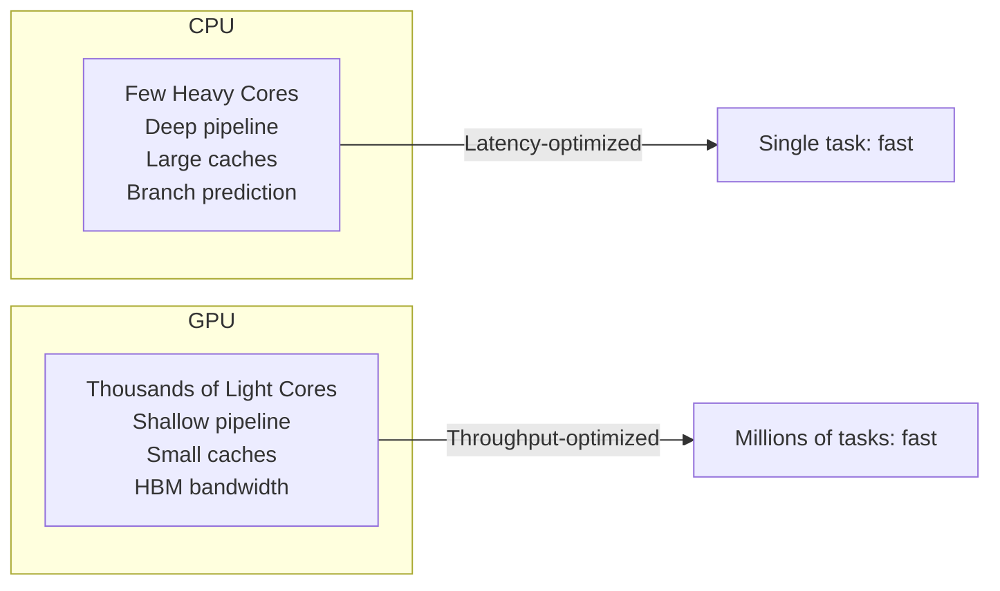

CPU 的哲学可概括为：**让每一条指令执行得尽可能快**——所以你看到分支预测器、乱序执行窗口、多级私有缓存、硬件数据预取。这些设计对 `./a.out` 单线程跑得快至关重要。

GPU 的哲学则是：**让总吞吐量尽可能大**——既然 ML 训练和图形渲染天然需要做数百万次几乎相同的运算，那么放弃分支预测（大量分支→warp divergence）、放弃乱序执行（靠多 warp 零开销切换隐藏延迟）、放弃大私有缓存（用 programmer-managed shared memory 替代），把省下来的晶体管全部塞进 FP 单元。

**关键指标对比：**

```
CPU (AMD EPYC 9654, 96 cores):
  L1 带宽合计 ≈ 6 × 32B/cycle × 3 GHz = ~576 GB/s per socket

GPU (H100, 132 SMs):
  每 SM 128 CUDA cores × 2 FLOPS/FMA × 1.98 GHz = ~507 GFLOPS/SM
  132 SM × 507 GFLOPS = ~67 TFLOPS (FP32)
  FP16 Tensor Core: 989 TFLOPS
  HBM3 带宽: 3.35 TB/s
```

---

## 2. SIMT 模型：同一指令，多条线程

NVIDIA GPU 的执行模型叫 **SIMT (Single Instruction, Multiple Threads)**。核心概念是 **warp**——32 个线程为一组，共享同一个程序计数器 (PC)，执行同一条指令。

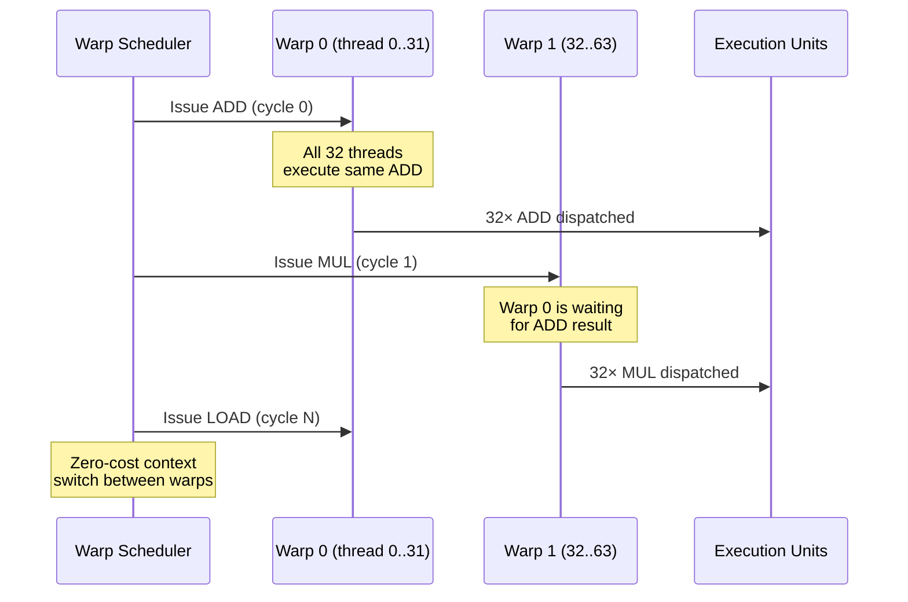

SIMT 与 CPU 上 SIMD (AVX-512) 的关键区别：

| 特性 | SIMD (CPU AVX-512) | SIMT (GPU Warp) |
|------|---------------------|------------------|
| 向量宽度 | 512-bit (16× FP32) | 32 threads (逻辑) |
| 编程模型 | 显式 intrinsic (`_mm512_add_ps`) | 标量线程 (编译器映射到 warp) |
| 分支处理 | 必须全同路径 (mask) | 允许 divergence (序列化) |
| 线程标识 | 无 | `threadIdx.x`, `blockIdx.x` |

**CUDA 代码视角：**

```cuda
// 程序员写的是标量线程代码 —— 感觉像 CPU 编程
__global__ void vecAdd(float *a, float *b, float *c, int n) {
    int i = blockIdx.x * blockDim.x + threadIdx.x;
    if (i < n) {
        c[i] = a[i] + b[i];
    }
}
// GPU 上：硬件将 32 个相邻 thread 打包成一个 warp
// 同一 warp 的所有线程同时执行 c[i] = a[i] + b[i]
```

---

## 3. CUDA Core：FP32 的基本计算单元

一个 **CUDA Core** = 一个全流水线化的 FP32 FMA (Fused Multiply-Add) 单元，每时钟周期可完成一次 `a × b + c`，按业界惯例计为 **2 FLOPs**。

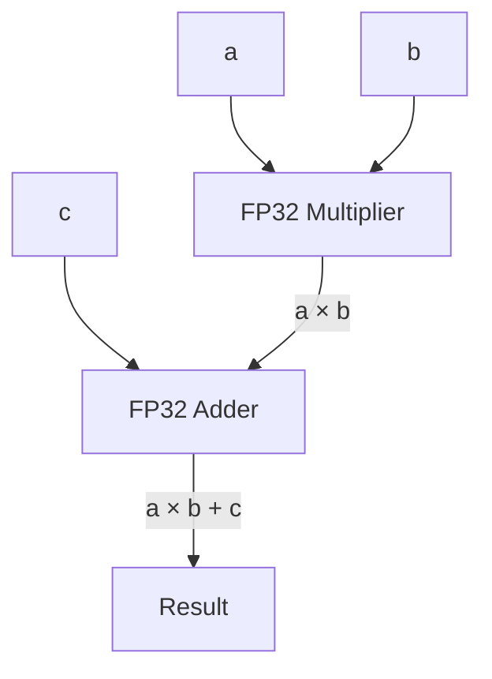

**FMA 的精度优势：** 非融合的乘加 `MUL→round→ADD→round` 产生两次舍入误差，FMA 在中间结果 `a×b` 保持无限精度，只在最终加 `c` 后舍入一次。这对数值稳定性和迭代收敛速度有可测量的影响——例如 Kahan 求和可以在 FMA 上获得更好的误差界。

**CUDA Core 的组织方式：**

```
H100 SM 内部:
  ┌──────────────────────────────────────┐
  │  Warp Scheduler (×4)                 │
  │    ├─ Dispatch Unit                  │
  │    ├─ Register File (65536×32-bit)   │
  │    └─ Execution Ports               │
  │         ├─ FP32 CUDA Core ×32  ──── 每周期 32 FMA
  │         ├─ FP64 Core ×16            │
  │         ├─ LD/ST Unit ×16           │
  │         └─ Tensor Core ×1 (4th Gen) │
  └──────────────────────────────────────┘
```

**实际吞吐并非峰值：** 虽然每个 CUDA Core 理论上每时钟 1 FMA = 2 FLOPs，但实际吞吐受以下因素限制：

1. **寄存器带宽：** 每线程每周期最多 1 次 32-bit 读 + 1 次 32-bit 写
2. **Warp scheduler 发射能力：** 每个 scheduler 每周期 1 条指令
3. **操作数就绪：** 如果 warp 等待 HBM 加载，调度器自动切换到另一就绪 warp，无需软件干预

```cuda
// 要达到峰值：每个 SM 上至少需要让 4 个 warp scheduler
// 都持续有就绪的 warp 可发射 → occupancy 是关键
// 每个 warp scheduler 跟踪 16 个 warp (H100 上 max 64 warp/SM)
```

---

## 4. NVIDIA SM 架构详解 (H100)

H100 的 Streaming Multiprocessor 是 GPU 计算的核心单元。每颗 H100 芯片包含 **132 个 SM**，总面积 814 mm² (TSMC 4N)。

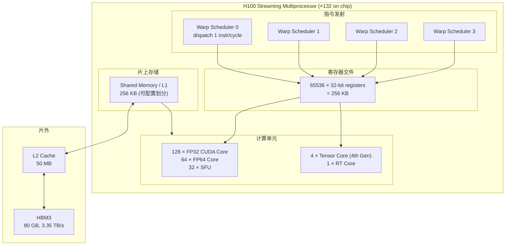

**每个 SM 的关键参数：**

| 参数 | H100 值 | 说明 |
|------|---------|------|
| FP32 CUDA Cores | 128 | 每 SM 128，总计 132×128 = 16896 |
| FP64 Cores | 64 | FP64 : FP32 = 1:2 |
| Tensor Cores | 4 | 4th Gen，每个可执行 4×4×4 MMA |
| Warp Schedulers | 4 | 每 scheduler 可跟踪 16 warp |
| Max Warps / SM | 64 | 64 warps × 32 threads = 2048 threads |
| Max Thread Blocks / SM | 32 | — |
| Max Threads / Block | 1024 | 由程序员决定 |
| Register File | 65536 × 32-bit | 每个 thread 最多使用 255 registers |
| Shared Memory / L1 | 256 KB | configurable: up to 228 KB shared mem |
| L1 Bandwidth | — | ~4 TB/s per SM (aggregate ~528 TB/s on-chip) |

**Warp Scheduler 的工作机制：**

```
每个 scheduler 维护 16 个 warp 的硬件上下文:
  - 程序计数器 (PC)
  - 栈指针（用于函数调用/递归，实际存放在 local memory）
  - 寄存器基址（映射到 register file 的哪一段）

每周期: scheduler 扫描其 16 个 warp → 挑选 1 个
        "就绪" 的 warp (操作数均已就绪) → 发射 1 条指令

关键: 如果某 warp 在等 HBM 数据（~300 cycles 延迟），
      scheduler 瞬间切到另一个就绪 warp，零开销。
      这要求 SM 上至少有 4+ active warps per scheduler。
```

**H100 vs A100 SM 差异：**

| | A100 (GA100) | H100 (GH100) |
|---|---|---|
| SM 数量 | 108 | 132 |
| CUDA Cores / SM | 64 | 128 |
| Tensor Cores / SM | 4 (3rd Gen) | 4 (4th Gen) |
| Shared Mem / SM | 192 KB | 256 KB |
| FP8 支持 | 无 | ✅ (Transformer Engine) |
| TMA | 无 | ✅ |
| FP16/TC TFLOPS | 312 | 989 |

---

## 5. Tensor Core：矩阵乘法加速器

### 5.1 工作原理

Tensor Core 的核心指令是 **MMA (Matrix Multiply-Accumulate)**：在一个时钟内完成 `D = A × B + C`，其中每一个操作数都是小矩阵。

**第 4 代 Tensor Core (H100) 的 MMA 维度：**

```
每个 Tensor Core 每周期: 4×4×4 MMA
  即: 4×4 的 A × 4×4 的 B + 4×4 的 C

  每次 MMA 包含 4×4×4 = 64 次 FMA = 128 FLOPs

每 SM 有 4 个 Tensor Core，4 个 warp scheduler
  → 16 次 MMA / 周期 / SM (如果 4 个 scheduler
    都发射 MMA 指令到各自的 Tensor Core)
```

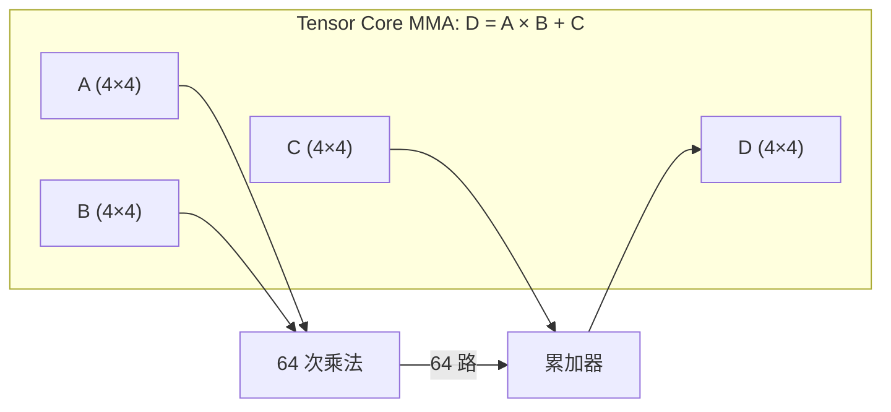

### 5.2 H100 各精度算力

| 精度 | TFLOPS | 用途 |
|------|--------|------|
| FP64 | 67 | HPC、科学计算（要求 64-bit 精度） |
| TF32 | 494 | AI 训练的最优选择——19-bit 精度，32-bit 范围 |
| FP16 | 989 | 推理、Transformer 训练 |
| BF16 | 989 | 与 FP16 同吞吐，更大的动态范围 |
| FP8 | 1979 | Transformer Engine 专用，最高吞吐 |
| INT8 | 1979 | 量化推理 |

**TF32 的巧妙之处：** TensorFloat-32 使用 19-bit 精度（与 FP16 尾数相同）但保持 8-bit 指数（与 FP32 相同）。这意味着 TF32 有 FP32 的动态范围（可表示 ~1e-38 到 ~3e38），又有 FP16 级别的速度。对训练而言，这是"几乎无损失、几乎双倍速"的精度选择。

```cuda
// PTX 级别的 MMA 指令（warp 级矩阵乘法）
// 假设 A 和 B 已加载到 shared memory, C 和 D 在寄存器中
// A[m16, k16] × B[k16, m16] = C[m16, n16]

// 伪代码示意（真实语法更复杂）
mma.sync.aligned.m16n8k16.row.col.f16.f16.f16.f16
    {d0, d1, d2, d3},    // 输出 D (FP16)
    {a0, a1},             // 输入 A (FP16)
    {b0, b1},             // 输入 B (FP16)
    {c0, c1, c2, c3};    // 累加器 C (FP16)
```

### 5.3 为什么 Tensor Core 重要

```
对比: FP32 CUDA Core vs Tensor Core FP16 (H100)

CUDA Core 算矩阵乘法:
  每 SM 128 CUDA Core × 2 GHz = 256 GFLOPS FP32
  132 SM → 33.8 TFLOPS FP32 (实际受限于 load/store)

Tensor Core 算矩阵乘法:
  每 SM 4 TC × 256 FP16 FMA × 2 GHz = 2048 GFLOPS
  132 SM → 989 TFLOPS FP16 (官方峰值)

Tensor Core 比 CUDA Core 快 ~6× (FP16 vs FP32) 或 ~3× (TF32 vs FP32)
```

在 Transformer 的自注意力 `Q × K^T` 和 FFN 的 `W_up × X` 计算中，矩阵乘法占 90%+ 的 FLOPs。Tensor Core 几乎就是为这类 GEMM (General Matrix Multiply) 设计的。

---

## 6. RT Core：实时光追硬件

H100 每个 SM 包含 1 个 RT Core，主要用于光线追踪可视化。它硬件加速两个关键操作：

1. **BVH 遍历 (Bounding Volume Hierarchy Traversal)**：光线的层次包围盒测试。BVH 将场景中的三角形组织成树形结构——先测试大包围盒，命中再深入子节点，大幅减少无意义的三角形交集测试。

2. **光线-三角形求交 (Ray-Triangle Intersection)**：给定光线和三角形，计算交点、重心坐标。这涉及浮点除法（求解重心坐标）和条件判断，纯 CUDA Core 实现效率低。

```mermaid
graph TD
    RAY[Ray Origin + Direction] --> BVH[BVH Traversal<br/>RT Core 硬件加速]
    BVH -->|Hit leaf node| TRI[Ray-Triangle Intersect<br/>RT Core 硬件加速]
    TRI -->|Hit| SHADE[Shader (CUDA Core)<br/>计算颜色、递归反射]
    BVH -->|Miss/早退| SKIP[Skip subtree<br/>省去大量无用计算]
```

**OptiX 框架：** NVIDIA 的 OptiX API 封装了 RT Core，提供 `optixTrace()` 调用。开发者只需提供着色器函数（closest-hit, any-hit, miss 等），硬件负责 BVH 遍历。

RT Core 对 AI 训练无直接用途——它独立于 Tensor Core，但 H100 保留 RT Core 是因为 Hopper 也被用于 Omniverse 等 3D 渲染场景。

---

## 7. GPU 内存层次

GPU 的内存层次比 CPU 更扁平，但带宽差异更极端。

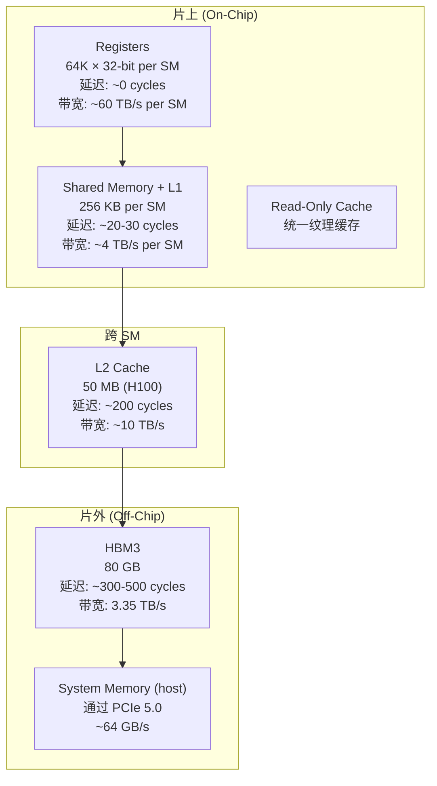

**各级存储对比：**

| 层次 | H100 规格 | 关键特性 |
|------|----------|----------|
| Register File | 256 KB × 132 = 33 MB total | 最快，编译时分配；溢出到 local memory (HBM) |
| L1 / Shared Mem | 256 KB × 132 = 33 MB total | 可配置划分 (profiling 后调优) |
| L2 Cache | 50 MB (unified) | A100 为 40 MB，H100 增大至 50 MB |
| HBM3 | 80 GB | 6 个 HBM3 stack，5120-bit 接口，3.35 TB/s |
| NVLink | 900 GB/s per GPU (bidir) | 8 GPU 全互联 (NVSwitch) |
| PCIe 5.0 | ~64 GB/s | GPU ↔ Host 传输瓶颈 |

**Shared Memory 的可配置划分：**

```cuda
// 在 kernel launch 时动态设置 shared memory 大小
// 可选 carveout: 0, 8, 16, 32, 64, 100, 132, 164, 196, 228 KB

// 方式 1: 编译时声明
__global__ void kernel() {
    __shared__ float tile[32][32]; // 静态分配
}

// 方式 2: 运行时指定 (第三个参数)
kernel<<<grid, block, smem_bytes, stream>>>();
// H100 最大 228 KB shared mem per block

// 方式 3: 查询优先选项
cudaFuncSetAttribute(kernel, cudaFuncAttributeMaxDynamicSharedMemorySize, 228*1024);
```

---

## 8. TMA：Tensor Memory Accelerator

H100 引入了一项关键的硬件单元——**TMA (Tensor Memory Accelerator)**。传统 GPU 中从 HBM 加载数据到 shared memory 需要每个 warp 发射多个 `LDG` 指令（每条加载 16 bytes），占用 CUDA Core 周期。TMA 将 2D 数据搬运卸载到专用硬件。

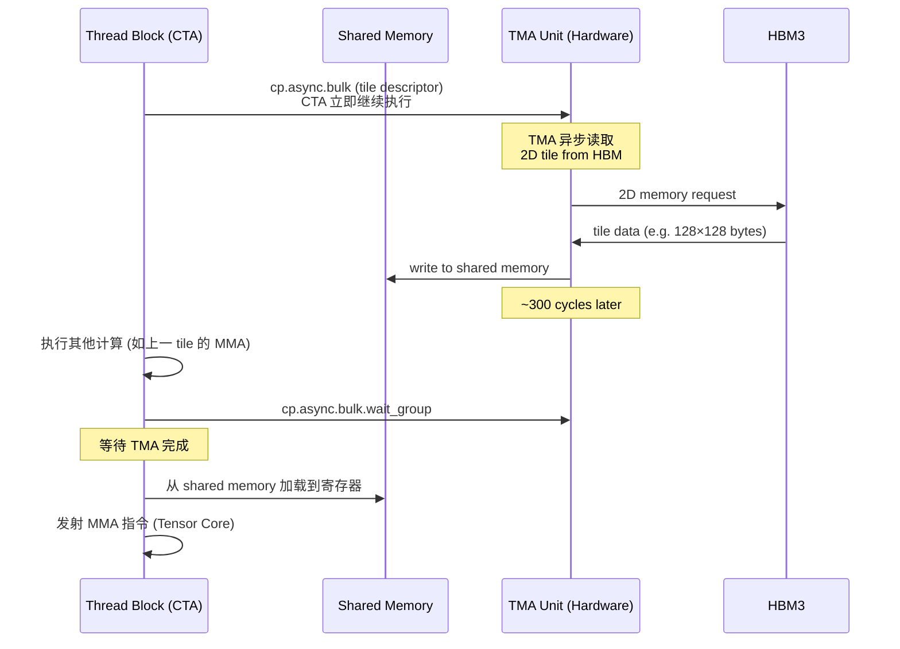

**TMA 的关键特性：**

- **2D copy：** 与常规 `memcpy` 的一维线性复制不同，TMA 理解 2D 内存布局（width, height, stride between rows），直接复制矩阵 tile。
- **Bypass L1：** TMA 写入 shared memory，直接跳过 L1 缓存，避免污染 L1。
- **异步屏障：** `cp.async.bulk.wait_group` 等待指定数量的 pending TMA 事务。
- **硬件一致性：** TMA 保证 shared memory 写入与后续 warp 访问的顺序一致性。

```cuda
// TMA 加载伪代码 (实际通过 PTX cp.async.bulk)
// 定义一个 2D tile descriptor → TMA 硬件读取 → 写入 shared memory

// 简化的 TMA 编程模式：
// 1. 创建 CUtensorMap 对象（描述 HBM 中的 2D 张量布局）
// 2. 在 kernel 中调用 cp.async.bulk.tile.2d 启动异步拷贝
// 3. 发射 cp.async.bulk.commit_group 标记事务组
// 4. 发射 cp.async.bulk.wait_group N 等待 N 个事务完成
// 5. __syncthreads() 确保 shared memory 对 block 内所有线程可见
// 6. 从 shared memory 读取数据 → 进入 MMA 计算
```

TMA 对于 ML 训练的价值：在 FlashAttention 等算法中，原始实现用 CUDA Core 加载 Q, K, V tile，TMA 可以将加载的指令周期节省下来用于计算。实测中，TMA 在 BERT/LLaMA 训练中可将 matmul kernel 效率从 ~70% 提升到 ~85%。

---

## 9. Warp Divergence：GPU 性能杀手

Warp 内 32 个线程共享同一个 PC（程序计数器）。如果分支导致线程走不同路径，硬件必须 **序列化** 执行：

```cuda
if (threadIdx.x < 16) {
    // 路径 A: 16 个线程活跃
    result[threadIdx.x] = a[threadIdx.x] * 2.0f;
} else {
    // 路径 B: 16 个线程活跃
    result[threadIdx.x] = a[threadIdx.x] / 2.0f;
}
// 执行顺序:
//   1. 执行路径 A (thread 0..15 活跃, 16..31 被 mask 掉)
//   2. 执行路径 B (thread 16..31 活跃, 0..15 被 mask 掉)
// 实际吞吐 = 50%
```

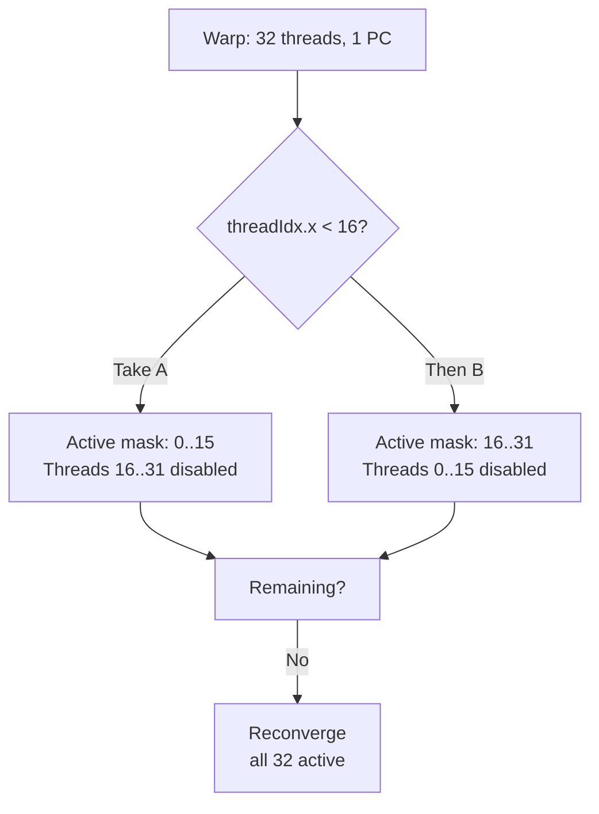

**常见的 warp divergence 场景：**

| 场景 | 问题 | 解决方案 |
|------|------|----------|
| 边界检查 `if (idx < N)` | 最后一个 warp 的尾部 divergence | 不可避免，但影响有限 |
| 基于 threadId 的条件 | 固定 pattern 可能导致每次 launch 都 divergence | 重组线程映射 |
| 基于数据的条件 | 最严重：运行时决定，编译器无法优化 | 数据预处理、按值排序 |
| 循环 `while` 的不同退出点 | 各线程退出时间不同 | 使用固定迭代次数 |

**`__syncwarp()` 的作用：**

```cuda
// __syncwarp() 是 warp 级同步屏障
// 与 __syncthreads() 不同，它只同步同一 warp 内的线程

// 场景: warp-level reduction 中确保部分结果就绪
__shared__ float partial_sum[32];
int lane = threadIdx.x % 32;

// 每个线程写入自己的部分
partial_sum[lane] = compute_something();

__syncwarp();  // 确保 warp 内所有线程的写入对彼此可见

// 现在可以安全地做 warp shuffle
float sum = __shfl_down_sync(0xFFFFFFFF, partial_sum[lane], 1);
```

**Warp Shuffle 指令：** `__shfl_down_sync`, `__shfl_xor_sync` 等是同一个 warp 内线程间直接交换寄存器的硬件指令——比 shared memory 快，比 global memory 快两个数量级。配合 `__syncwarp()` 即可在 warp 内安全地做 reduction。

---

## 10. Shared Memory Bank Conflicts

H100 的 shared memory 由 **32 个 bank** 组成，每个 bank 每周期可服务一个 4-byte 地址。如果同一 warp 的 32 个线程分别访问 32 个不同 bank → 一次 servicing 完成。如果有多个线程访问同一 bank → **bank conflict**，请求被序列化。

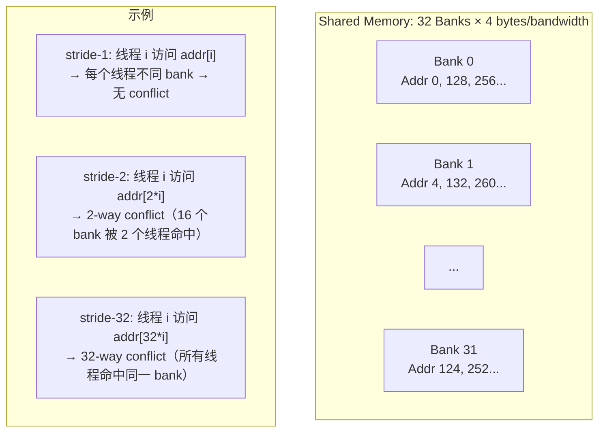

**Bank conflict 实战：**

```cuda
// 常见错误：以 strided 方式访问 shared memory
__shared__ float smem[32][32];

// ❌ 危险: stride-32 访问 → 32-way bank conflict
float val = smem[threadIdx.x][threadIdx.y];  // 如果 blockDim.x=32
// 所有线程访问 smem[0..31][same_column]
// → 同一列偏移相同 → 同 bank

// ✅ 安全: stride-1 访问 → 无 conflict
float val = smem[threadIdx.y][threadIdx.x];

// ✅ 解决方案：添加 padding 打散 bank 映射
__shared__ float smem[32][32 + 1];  // padding of 1
// 现在 smem[0][0] 和 smem[1][0] 不再在同一 bank
```

**H100 上的变化：** H100 将 shared memory 的 port 数量从 A100 的 16 增加到 32，每个 bank 的宽度从 4 bytes 增加到 32 bytes。这意味着对于 FP32 数组(4 bytes)，同一 bank 可同时服务 8 个地址请求（当它们落在同一 32-byte bank line 中时）。但这不影响 strided-access 导致的 conflict。

---

## 11. GPU Occupancy：隐藏延迟的数学

**Occupancy = active warps per SM / max warps per SM**

H100 的每个 SM 最多同时驻留 64 个 warp（2048 threads）。高 occupancy 的好处是：当一个 warp stall（等待内存），scheduler 立即切到另一个就绪 warp。每个 warp 的上下文（寄存器、PC、栈指针）都在硬件中，切换**不消耗任何周期**。

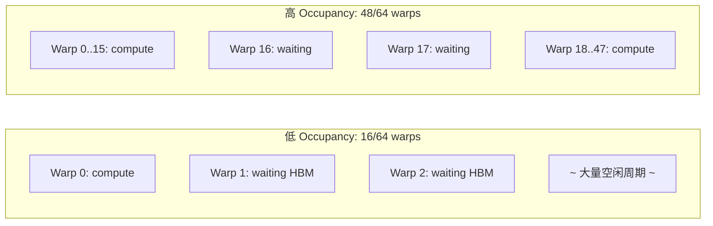

**Occupancy 计算的关键约束：**

| 资源 | H100 每 SM | 对 occupancy 的影响 |
|------|-----------|---------------------|
| Max Threads / SM | 2048 | 64 warps × 32 threads |
| Register File | 65536 × 32-bit | 每 thread 用 255 regs → 只能容纳 256 threads = 8 warps |
| Shared Memory | 228 KB max | 每 block 用 64 KB → 最多 3 blocks (如果 thread 数允许) |
| Max Blocks / SM | 32 | 小 blocks 可提高 occupancy |

**Trade-off 示例：**

```
配置 A: 每 thread 64 registers, blockDim=256
  → registers used: 256 × 64 = 16384 per block
  → max blocks per SM: min(65536/16384=4, 32) = 4
  → occupancy: 4 × 256 / 2048 = 50% (32 warps)

配置 B: 每 thread 128 registers, blockDim=256
  → registers used: 256 × 128 = 32768 per block
  → max blocks: min(65536/32768=2, 32) = 2
  → occupancy: 2 × 256 / 2048 = 25% (16 warps)

结论: 寄存器使用翻倍 → occupancy 减半。
      但 128 regs/thread 可能换取 2× 指令级提升。
      不一定低 occupancy 就慢——需要 profiling。
```

**经验法则：**
- 算术密集型 kernel (如 GEMM)：occupancy 25-50% 可能就足够隐藏延迟
- 内存密集型 kernel (如 element-wise ops)：需要 50%+ 的 occupancy
- 永远用 `ncu` (Nsight Compute) 的 Occupancy 分析而非猜测

---

## 12. 多 GPU：NVLink + NVSwitch

单 GPU 不够时，DGX H100 把 8 颗 GPU 用 NVSwitch 全互联。

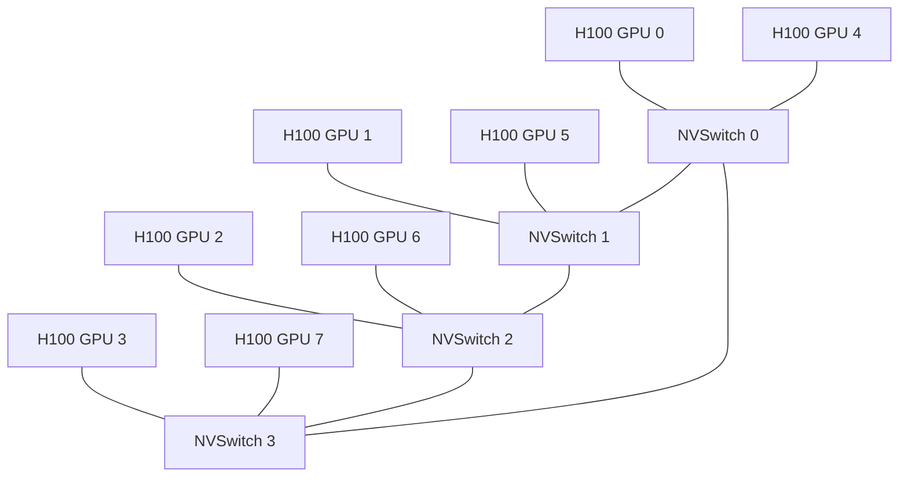

**NVLink 4.0 (H100) 规格：**

| 参数 | 值 |
|------|-----|
| 每 GPU NVLink 带宽 | 900 GB/s (bidirectional) |
| NVLink 链路数 | 18 条 (每条 50 GB/s unidir = 25 GB/s × 2 lanes) |
| DGX H100 总 NVLink 带宽 | 8 GPU × 900 / 2 = 3.6 TB/s (full-duplex ≈ 7.2 TB/s) |
| NVSwitch 架构 | 4 颗 NVSwitch × 每个连接 8 GPU |
| PCIe 5.0 | 128 GB/s (PCIe 5.0 ×16, 双向)，远低于 NVLink |

**通信原语：**

```cuda
// NCCL: NVIDIA Collective Communications Library
// All-Reduce (最常用): 每 GPU 的梯度汇总到所有 GPU
// 在 NVSwitch 网络上使用 Ring 或 Tree 算法

ncclAllReduce(sendbuff, recvbuff, count, ncclFloat32,
              ncclSum, comm, stream);

// NVSwitch 的全互联特性意味着 All-Reduce 只需 1 step
// (而非 PCIe 拓扑下需要 log2(N) steps)
```

**Tensord Parallelism 与 Pipeline Parallelism：**

```
模型并行策略:
  Tensor Parallelism (TP):
    单层权重切分到多 GPU → 每步需 All-Reduce
    NVLink 带宽至关重要 (通信放缩)
    典型: TP=8 (DGX H100 的 8 卡)

  Pipeline Parallelism (PP):
    不同层分配到不同 GPU → 微批次流水线
    通信少但对负载均衡敏感

  Data Parallelism (DP):
    每 GPU 持有完整模型副本 → 梯度 All-Reduce
    NVLink 能提供比 PCIe 快 ~10× 的梯度同步
```

---

## 13. AMD MI300X vs H100：竞争对手视角

AMD 以 CDNA3 架构的 MI300X 正面挑战 H100。

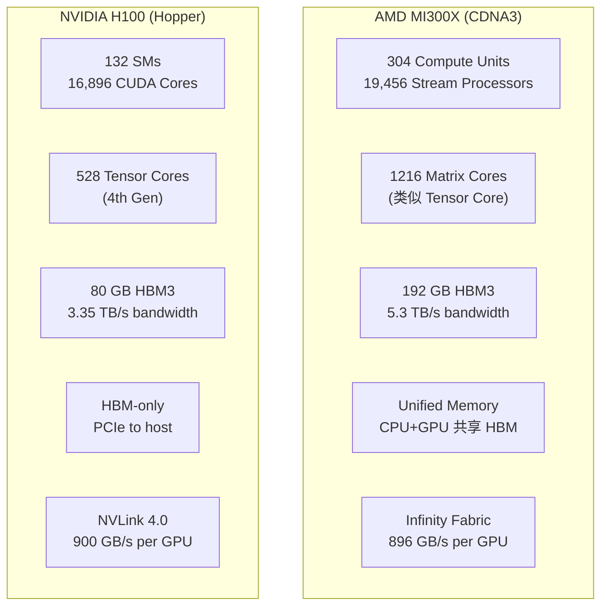

**关键参数对比：**

| 参数 | H100 (SXM) | MI300X |
|------|-----------|--------|
| 制程 | TSMC 4N | TSMC 5nm + 6nm |
| TDP | 700W | 750W |
| FP16 TFLOPS (dense) | 989 | 1300 (理论) |
| FP8 TFLOPS | 1979 | 2600 (理论) |
| HBM 容量 | 80 GB | 192 GB |
| HBM 带宽 | 3.35 TB/s | 5.3 TB/s |
| 软件生态 | CUDA (成熟) | ROCm (追赶紧密) |

**MI300X 的优势与劣势：**

- **优势：** 更大的 HBM 容量（192 GB vs 80 GB）意味着可装入更大的模型而无需 TP 切分。在 Llama-2-70B 推理中，MI300X 可以将整个权重和 KV cache 放在单 GPU 上。
- **劣势：** ROCm 软件生态在算子覆盖度、调试工具（对标 Nsight）、框架集成（PyTorch 的 `torch.compile`）上仍有差距。CUDA 的 `-arch=sm_90` 这个编译目标包含了 15 年的积累。
- **Unified Memory (APU)：** AMD 的 MI300A 将 CPU (Zen 4) 和 GPU (CDNA3) 共享同一个 HBM 池——消除 CPU↔GPU 的 PCIe 拷贝，对 HPC 代码（如网格求解器）意义重大。

---

## 14. 真实数字：训练 GPT-3 需要多少算力？

GPT-3 训练（175B 参数，300B tokens）的最优配置分析：

```
已知:
  - 总 FLOPs: ~3.14 × 10^23 FLOPs (6 × 175B × 300B)
  - H100 BF16: 989 TFLOPS 理论 / ~500 TFLOPS 实际效率 (50%)
  - 训练时间目标: ~3.5 个月 (约 90 天)

单 GPU 需时:
  3.14e23 / (500e12) = 6.28e8 秒 ≈ 19.9 年

需要 GPU 数量:
  19.9 年 / 0.29 年 (3.5 个月) ≈ 68,600 GPU

考虑到多 GPU 通信开销 (~40% 效率):
  68,600 / 0.6 ≈ 114,000 GPU

InfiniBand 互联下的实测数据 (Meta):
  ~16,000 H100 集群, 3.5 个月训练 Llama-3-405B
  MFU (Model FLOPs Utilization): ~38%
```

**MFU 为什么达不到 100%？**

```
理想情况: 所有 FLOPs 都是计算密集的 matmul
现实情况:
  1. Attention: softmax 归一化、mask 操作 (compute-bound 弱)
  2. LayerNorm / RMSNorm: element-wise 操作 (memory-bound)
  3. 激活函数 (GELU/SiLU): 对标量操作
  4. 多 GPU 的通信间隙 (bubble)
  5. 编译器 fusion 不完美

业界最佳实践: MFU 在 50-60% (大规模训练)
Meta 公开的 Llama-3 训练: ~38% MFU
```

---

## 15. 工程事故录

### 15.1 Bumpgate (2008)

NVIDIA G84/G86 系列 GPU（GeForce 8400M/8600M）使用的 flip-chip 封装中，solder bump 材料的热膨胀系数与 die 不匹配，导致重复热循环后 bump 断裂。故障模式：笔记本冷启动正常→温度升高→GPU 脱焊→花屏/不显示。NVIDIA 为此计提了 ~$200M 费用，苹果、戴尔、惠普全线召回。对硬件的教训：封装热应力的长期可靠性测试不可跳过。

### 15.2 Ampere SM Count Bug (RTX 3080)

NVIDIA 最初公布的 RTX 3080 规格是 68 SMs，但上市后的软件（CUDA 11.1）检测到 82 SMs，少算了 14 个。原因是早期 silicon stepping 中部分 SM 的 yield 影响了决策，但最终 stepping 修复后所有 SM 可用，而上市规格文档未及时更新。这对开发者意味着：不同批次的 RTX 3080 可能有不一致的核心数量，写 CUDA 程序时不应 hard-code SM 数量。

### 15.3 Hopper TMA Silicon Bug (H100 Early Stepping)

早期 H100 (步进 A0/A1) 的 TMA 在特定地址对齐条件下，`cp.async.bulk` 事务会返回错误数据——当 tile 跨过 DRAM 页边界（~2MB boundary）时，TMA 的地址转换缓存 (TLB) 状态机出现竞态条件。NVIDIA 通过在 driver 中插入 firmware patch（microcode 修正）来规避：在已知的触发模式前插入 barrier 指令。对用户透明但在早期 CUDA 12.0/12.1 下，如果使用 TMA 特性且检测到旧 stepping，驱动会退化为软件模拟 (SW-based TMA emulation)。修复后的步进为 A2/B1。

---

## 16. 易错清单 (Mistake Checklist)

**1. Warp Divergence 不知不觉吃掉一半带宽**

```cuda
// ❌ 错误: 分支内包含昂贵的 HBM 访问
if (is_edge[threadIdx.x]) {
    val = global[threadIdx.x];     // 16 threads doing HBM load
} else {
    val = global2[threadIdx.x];    // 16 threads doing different HBM load
}
// 序列化后: 两个 Load 串行发出, 延迟叠加

// ✅ 正确: 先 load 再分支
float v1 = global[threadIdx.x];
float v2 = global2[threadIdx.x];
float val = is_edge[threadIdx.x] ? v1 : v2;
// 两个 load 可以并行 (LD/ST 单元支持多 in-flight 请求)
```

**2. Shared Memory Bank Conflicts**

```cuda
// ❌ 按列访问: 32-way bank conflict
__shared__ float tile[32][32];
float val = tile[threadIdx.x][blockIdx.x % 32];

// ✅ 按行访问: stride-1, 无 conflict
float val = tile[blockIdx.x % 32][threadIdx.x];

// ✅ Padding 技巧: 消除 stride-N 访问的 conflict
__shared__ float tile[32][33];  // 加 1 列 padding
```

**3. Occupancy vs Register Pressure 的 trade-off**

```cuda
// ❌ 寄存器过度使用 → occupancy 极低
// kernel 中声明了大量局部变量
// 编译器报告: "Registers per thread: 255 (max)"
// → SM 只能驻留 256 threads = 8 warps → occupancy: 12.5%

// ✅ 检查: ncu --set full 看 Occupancy section
// ✅ 优化: 用共享内存做寄存器溢出 (用 __shared__ 替代部分局部变量)
// ✅ 标记: __launch_bounds__(maxThreadsPerBlock, minBlocksPerSM)
```

**4. `__syncthreads()` 缺失**

```cuda
// ❌ 危险: shared memory 写入后缺少 barrier
__shared__ float tile[32][32];
tile[threadIdx.y][threadIdx.x] = load_from_global(idx);
// 没有 __syncthreads() !
float result = tile[threadIdx.x][threadIdx.y];  // 可能读到旧值！

// ✅ 正确: 写入 shared memory 后必须 barrier
tile[threadIdx.y][threadIdx.x] = load_from_global(idx);
__syncthreads();  // block 内所有线程的写入对彼此可见
float result = tile[threadIdx.x][threadIdx.y];
```

**5. FP16 累加到 FP16 — 精度陷阱**

```cuda
// ❌ FP16 accumulator: 尾数只有 10-bit
__half sum = 0.0f;
for (int i = 0; i < 1000000; i++) {
    sum = __hadd(sum, large_values[i]);  // 小增量会丢失
}

// ✅ FP32 accumulator: 尾数 23-bit, 适合归约
float sum = 0.0f;
for (int i = 0; i < 1000000; i++) {
    sum += __half2float(large_values[i]);
}
// Tensor Core MMA 指令也接受 FP32 accumulator
```

**6. 忘记 TMA 的异步屏障**

```cuda
// ❌ 使用 TMA 后没有 wait → 读到未完成的数据
cp.async.bulk.tile.2d(...);
// 直接使用 shared memory → 数据可能还没到！
use_shared_memory();

// ✅ TMA 事务分组 + wait
cp.async.bulk.tile.2d(..., group_0);
cp.async.bulk.commit_group();
cp.async.bulk.wait_group(0);  // wait for group_0 to finish
__syncthreads();              // 确保 block 内可见
use_shared_memory();
```

**7. PCIe 带宽瓶颈忽略**

```cuda
// ❌ 在 training loop 中频繁 cudaMemcpy
for step in range(10000):
    data = generate_on_cpu()       # CPU 生成
    cudaMemcpy(d_data, data, N)    # ~12 GB/s (PCIe ×16)
    launch_kernel(d_data)          # ~3.35 TB/s HBM → <1ms
    # 拷贝时间远大于计算时间 → GPU 空闲

// ✅ 保持数据在 GPU 上
// 或用 GPU Direct Storage (GDS) 直接从 NVMe 到 GPU
// 或用 CUDA Graphs 减少 kernel launch 开销
```

---

## 这一章带走的东西

1. **GPU 和 CPU 设计哲学相反。** CPU 为低延迟牺牲了晶体管效率（75% 用于控制），GPU 为高吞吐把 80% 晶体管投入计算单元。理解这个根本 trade-off 是掌握 GPU 编程的前提。

2. **SIMT 模型的 warp 是基本调度单位。** 32 线程一组，共享 PC。warp divergence 序列化分支执行，是 GPU 性能的第一杀手。

3. **CUDA Core 是 FP32 的基本砖块。** 每个周期 1 FMA (2 FLOPs)。H100 有 16896 个 CUDA Core，但峰值算力取决于 SM 内 warp scheduler 能否持续找到就绪的 warp。

4. **Tensor Core 是矩阵乘法的专用加速器。** 每时钟 1 次 4×4×4 MMA (128 FLOPs)，比 CUDA Core 快 6×。H100 FP8 下 1979 TFLOPS，而 FP32 仅 67 TFLOPS——精度选择直接决定训练速度。

5. **TMA 是 H100 的新武器。** 硬件异步 2D copy 释放了 CUDA Core，在注意力计算中提升 matmul 效率 10-15%。

6. **内存层次是性能的命脉。** 从 Register (0 cycle) → Shared Memory (20-30 cycles) → L2 (200 cycles) → HBM (300-500 cycles)，每次越级都是带宽悬崖。Shared memory 的 bank conflict 是常见性能 bug 的根源。

7. **Occupancy 不是越高越好。** 更多的 registers/thread 换取更好的指令级效率，和更多的 active warps 换取更好的延迟隐藏，二者不可兼得。必须用 nsight compute profiling。

8. **软件生态是真正的护城河。** H100 的硬件规格 vs MI300X 很接近（甚至 MI300X 在带宽和容量上领先），但 CUDA 的 toolchain、库（cuBLAS, cuDNN, CUTLASS）、框架集成和调试工具（Nsight）构成了 15 年的先发优势。

9. **工程实践中的坑都是血泪教训。** bumpgate (封装热应力)、Ampere SM 数量错误（规格文档与 silicon 不一致）、TMA silicon bug（跨页 DMA 竞态）提醒我们：硬件不是教科书里的理想模型，真实世界有 stepping、errata、和热管理。

10. **FLOPs 不等于训练速度。** GPT-3 训练的 MFU 只有 38-50%，超过一半的"峰值"被 attention softmax、LayerNorm、多 GPU 通信间隙吃掉。算法-系统协同设计（FlashAttention, ring attention, kernel fusion）和硬件选型同样重要。

---

## 延伸阅读

- **[NVIDIA H100 White Paper](https://resources.nvidia.com/en-us-tensor-core)** — Hopper 架构官方技术文档
- **[CUDA Programming Guide](https://docs.nvidia.com/cuda/cuda-c-programming-guide/)** — 第 5 章详述 SM 执行模型
- **[CUTLASS](https://github.com/NVIDIA/cutlass)** — NVIDIA 开源的 CUDA C++ 模板库，包含最优 GEMM 实现
- **"Professional CUDA C Programming"** (Cheng, Grossman, McKercher) — 第 3 章 GPU 架构详解
- **"Dissecting the Ampere GPU Architecture through Microbenchmarking"** (Jia et al.) — GPU 微架构逆向

---

**← 上一节：[内存层次与缓存一致性](memory-hierarchy.md) &nbsp;&nbsp;|&nbsp;&nbsp; 下一节 → [AI 加速器：TPU / NPU / FPGA](ai-accelerators.md)**
