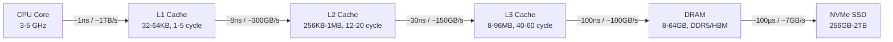
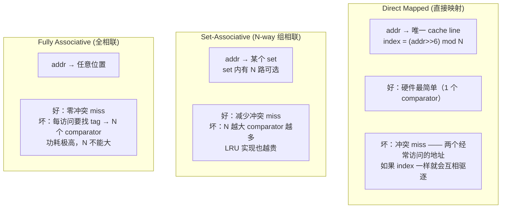
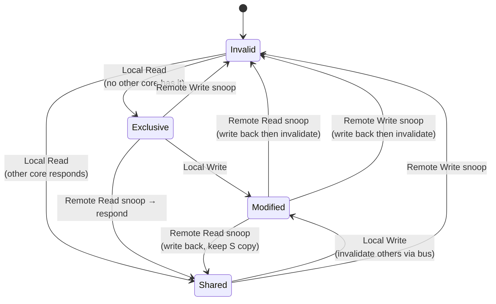

# 存储层次：Cache / DRAM / HBM

## TL;DR

CPU 的 L1 cache 访问 ~1ns（4 cycle @ 4GHz），DRAM 访问 ~100ns（400 cycle），SSD 访问 ~100µs（400,000 cycle）。这个 4 个数量级的延迟鸿沟是计算机体系结构最核心的问题。缓解策略是一场关于**局部性（locality）**的战争——cache 利用指令/数据的时间和空间局部性，把大概率命中的数据放在离计算单元更近、更快、更小的地方。



软件开发者的三个核心数字：cache miss 成本约 100 条 ALU 指令，L3 miss 成本约 400 条，DRAM 访问成本约顶 1000 条。程序行为——数据布局、访问模式、数据结构选择——直接决定了你在 cache 金字塔里掉落的层数。

---

## 一、为什么需要存储层次？

### 延迟、带宽、功耗三重鸿沟

| 层级 | 延迟 | 带宽 (64B block) | 功耗 | 等价 CPU cycle (4GHz) |
|------|------|------------------|------|----------------------|
| L1 cache | ~1ns | ~1 TB/s | ~20 pJ/access | 4 |
| L2 cache | ~8ns | ~300 GB/s | ~100 pJ/access | 32 |
| L3 cache | ~30ns | ~150 GB/s | ~500 pJ/access | 120 |
| DRAM (DDR5) | ~100ns | ~100 GB/s | ~12 nJ/access | 400 |
| NVMe SSD | ~100µs | ~7 GB/s | ~100 µJ/read | 400,000 |

**关键认知**：DRAM 访问耗能是 L1 cache hit 的 ~600 倍（12 nJ vs 20 pJ）。这不是线性差距，而是指数级。如果你写一段代码把 cache miss 从 10% 降到 1%，节约的不是"9% 的延迟"，而是"9 次 DRAM 访问 × 12 nJ 的能耗"。移动端（Apple M 系列）的核心优势之一就是巨大的 cache 结构让 app 有极高的 cache hit rate，从而节电。

```c
#include <stdint.h>
#include <stdlib.h>

// 演示：cache miss 的延迟成本
// int 数组求和：顺序 vs 随机访问
int64_t sum_sequential(const int *arr, size_t n) {
    int64_t s = 0;
    for (size_t i = 0; i < n; i++) s += arr[i];
    // 每条 cache line (64B) = 16 个 int，miss rate ≈ 1/16 = 6.25%
    return s;
}

int64_t sum_random(const int *arr, const size_t *idx, size_t n) {
    int64_t s = 0;
    for (size_t i = 0; i < n; i++) s += arr[idx[i]];
    // idx 随机排列 → 几乎每 16 个 int 就 miss → miss rate ≈ 100%
    // 这个循环比 sum_sequential 慢 10-50 倍
    return s;
}
```

---

## 二、SRAM 与 DRAM：两种存储技术的本质差异

### SRAM（Static RAM）— 用于 cache

```
   SRAM 6T cell (6 个晶体管):
        Vdd
         │
     ┌───M2───M4───┐
     │             │
   M1┼─ M3        M5 ─┼ M6
     │             │
     └──Q─────Qbar──┘
```

**特点**：交叉耦合的反相器对（M1-M4）产生双稳态锁存。只要有电，数据永久保持——因此叫"Static"。无需刷新、速度极快（1ns 级）、但 6 个晶体管占面积大，每 bit 成本高。

### DRAM（Dynamic RAM）— 用于主内存

```
   DRAM 1T1C cell (1 个晶体管 + 1 个电容器):
   
   字线 (WL) ──┐
              [T] 晶体管
   位线 (BL) ──┼── [C] 电容器 (~30 fF) ── GND
```

**特点**：靠电容器储存电荷表示 0/1。读取是破坏性的（破坏性读出）——读完后必须恢复。电容器漏电，必须在 **64ms** 内刷新所有行（JEDEC 标准 tREF = 64ms for Tcase ≤ 85°C）。1T1C 密度极高（1T vs 6T），但速度慢、功耗（刷新开销）大。

### 为什么 DRAM 延迟 ~100ns？

DRAM 不是"读一个地址"——它的内部结构决定了每次访问要走三步：

```
地址 = {row_addr, bank, column_addr}

① Row Activate (tRCD ≈ 15ns)
   把整行 (比如 8Kb = 1024 字节) 从 bitcell array 读到行缓冲区 (row buffer / sense amp)

② Column Read (tCL ≈ 15ns)
   从行缓冲区选择列地址对应的那些 bit (64 字节)，驱动到 IO 线

③ Precharge (tRP ≈ 15ns)
   关闭当前行，为下一行 activate 做准备——因为 sense amp 被占用，不能同时 serve 两个行

④ Bus transfer (tBurst ≈ 4ns @ DDR5-5600)
   64 字节 × 8-bit = 8 次 transfer @ burst length 16 (BL16, DDR5) → ~4ns for 64B
```

真正读懂这个时序的含义：**DRAM 的瓶颈不是传输速度，是行切换的开销**。顺序访问（同一 row buffer 下）连续读 16 × 64B = 1KB 只需要一次 tRCD + 16 × tBurst ≈ 15 + 64 = 79ns → 整行 1KB 只用 ~79ns。随机访问（每次换个 row）呢？每次都是 tRCD + tCL + tRP = ~45ns *额外* + ~4ns burst = ~50ns per 64B。随机访问速度是顺序的 1/10。

---

## 三、Cache 组织

### 核心映射方式：从单行到全路

Cache 的"在哪存放一个 64 位地址"归结为三种映射方式：



**地址分解（48-bit 虚拟/物理地址）**：

```
|  tag  |  index  |  offset  |
|  t位   |   s位   |   b=6位  |   (因为 line size = 64B = 2⁶)

s = log₂(num_sets)
t = 48 - s - 6

例如：32KB, 8-way, 64B line
  num_lines = 32KB / 64B = 512
  num_sets  = 512 / 8 = 64
  s = log₂(64) = 6
  t = 48 - 6 - 6 = 36
```

### 真实例子

```c
// 用 C 代码模拟直接映射和组相联的 miss 行为

#define LINE_SIZE 64
#define CACHE_KB 32
#define NUM_LINES (CACHE_KB * 1024 / LINE_SIZE)  // 512

typedef struct { uint64_t tag; uint8_t valid; } cache_line_t;

// 直接映射: 每个地址只映射到唯一一行
size_t direct_mapped_index(uint64_t addr) {
    return (addr / LINE_SIZE) % NUM_LINES;
}

// 8-way 组相联: 每个地址映射到 set; set 内有 8 路竞争
size_t set_associative_index(uint64_t addr, int ways) {
    size_t num_sets = NUM_LINES / ways;
    return (addr / LINE_SIZE) % num_sets;
}
```

**冲突 miss 可见化**：假设 32KB D-cache（直接映射），你要同时访问 `a[0]` 和 `a[8192]`——这两个元素恰好在相同的 cache line index（因为 8192 × 4B = 32KB，正好一个 cache 大小差）。每次交替读写这两个地址都会互相驱逐，即使用到的数据只有 8 字节，cache 只有不到 1% 的空间被有效使用。

---

## 四、Cache Line 与写策略

### 为什么是 64 字节？

**好处**：程序员/编译器有能力证明程序"在一个连续范围内工作"——64B 利用了空间局部性。一个 `struct`、一小组数组元素、一条代码路径基本都落在 64B 内。

**代价**：false sharing（见后文 易错清单），且 100ns 的 miss penalty 对 64B 和 16B 其实是相同的（因为 DRAM tRCD + tBurst 主导了延迟）。

从 32B 到 64B 到 128B（IBM POWER），本质是 miss penalty 的固定成本（tRCD + tRP）被更大的 line 摊分。但 128B 的缺点：false sharing 严重、cache 空间碎片化。目前业界共识是 64B。

### 写策略

| 策略 | 命中时 | 未命中时 |
|------|--------|---------|
| **Write-through + No-write-allocate** | 同时更新 cache + 下一级 | 不分配 cache line，直接写下一级 |
| **Write-back + Write-allocate** | 只更新 cache（设 dirty bit） | 从下一级调入 line → 修改 → 标记 dirty |

所有现代 CPU 的 L1 都用 **Write-back + Write-allocate**。原因：写命中率也高，且写穿（write-through）会让 store 指令的延迟等于 DRAM 延迟（100ns），无法接受。

```
dirty bit = 1 bit per cache line
evict 时如果 dirty=0 → 直接丢弃
evict 时如果 dirty=1 → 写回下一级（L1→L2 或 L2→L3）
```

---

## 五、替换策略

### LRU（Least Recently Used）

**理论最优**（针对传统局部性模式），但实现代价随相联度 N 增长：
- 4-way: 6 bits (log₂(4!) = 4.6 → 需 6 bits for exact)
- 16-way: ~44 bits → 对于 16-way L2 来说不经济

### 真实硬件使用的

| 策略 | 原理 | 用于 |
|------|------|------|
| **Pseudo-LRU (PLRU)** | 二叉树的每个节点 1 bit 指向最近使用的子树方向 | ARM/AMD L1, L2 |
| **RRIP (Re-Reference Interval Prediction)** | Intel Sandy Bridge 起，每个 cache line 有一个 2-bit 计数器预测 re-reference 时间 | Intel L1, L2, L3 |
| **Bimodal RRIP (BRRIP)** | RRIP 的扩展：对于扫描模式（scan-heavy），部分避免为扫描行填满 cache | Intel Haswell+ L3 |
| **Apple Adaptive** | 跟踪 recency + frequency，类似软件中的 ARC (Adaptive Replacement Cache) | Apple M 系列 |

```
RRIP 的核心思想：
  n 位计数器 per cache line
  新插入 line → RRPV = 2^n - 2 (near-immediate)
  命中 → RRPV = 0
  需要淘汰时 → 找 RRPV = 2^n - 1 (max) 的行 → 如果没有，将所有行 RRPV++
```

### 暴力演示：LRU vs RRIP 在扫描下的差异

```c
// 演示：遍历一个比 L3 大的数组
// L3 = 36MB, array = 72MB
// LRU: 扫描会把之前有用的 cache line 全部赶走 → scan 后 cache 是"垃圾"
// BRRIP: 扫描行插入时直接给"快过期"的 RRPV → 保护此前有价值的行

void scan_large_array(float *a, size_t n) {
    for (size_t i = 0; i < n; i++) a[i] *= 2.0f;
    // 约 18M 个 float × 4B = 72MB, 远超 L3（36MB）
    // → a[0] 在遍历完前已被 a[9M+] 赶走 → 100% miss
    //  但 miss 是不可避免的，关键是第二次遍历 a 时的剩 cache → BRRIP 可能保住一些
}
```

---

## 六、Cache 一致性协议（MESI）

### 动机

多核环境下的核心问题：如果 Core 0 的 L1 里有 `x=42`，Core 1 修改 `x=7`，怎么让 Core 0 看到 7 而不是 42？

### MESI 四状态



**Modified**：数据已被本 core 修改（dirty），并且只有本 core 有最新副本。当别的 core 想读这个地址时，本 core **必须**把数据写回（或"倒灌"到请求方），不能再靠 DRAM 的过期副本。

**Exclusive**：数据干净，但只有本 core 持有。因为只有一份，写入时直接变成 Modified，**无需** invalidate 别的 core（省了无用广播）。

**Shared**：多个 core 都在读，大家都干净。某个 core 要写时，必须在总线上发 **Read For Ownership (RFO)** 信号把其他 core 的 S copy 全 invalidate 掉。

**Invalid**：cache line 可用 slot，或已被 invalidate。任何 miss 最终落到这里。

### MOESI（AMD）与 MESIF（Intel）

```
MESI 的基础问题：
  Core 0: Modified → Remote Read snoop 来了 → 写回 DRAM → Core 3 从 DRAM 读取
  ❌ 写回 DRAM 这一步是多余的——为什么不直接 copy 到 Core 3？
```

**MOESI (Owned state)**：解决上面这个。Modified 是脏且唯一的，**Owned** 是脏但可能被多个 core 共享的——当远程读时，Owner core（通常是 M 或 O 的 core）直接把脏数据转发给请求方，**不经过 DRAM**。写回推迟到真正的 eviction 时。

**MESIF (Forward state)**：Intel 的解法。增加一个 **Forward** 状态：在多 core 共享某一行时，只有一个 core 被指定为 F（Forwarder）。当别的 core 再次请求该行时，只有 F 回应的 core 可以响应。这样可以避免 N 个 S-state core 同时在总线上回应（信号碰撞/总线仲裁开销）。

### 目录协议与 NUMA

MESI 的"总线上广播（snooping）"做法在规模扩大时崩溃——几十个 core 的总线广播带宽占用、延迟都不可接受。AMD Infinity Fabric 和 Intel UPI 使用**目录协议（Directory-based）**：

```
目录协议的基本思想：
  每个 DRAM controller 有一个"directory"记录它管理的每个 cache line 被哪些 core 持有
  某个 core 要写时 → 向 HOM（Home Node）发请求
  HOM 查目录 → 只向持有该 line 的 core 发 invalidate 请求（不广播）
  
  注意：invalidation 消息是"精确发送"的，不是"全喊"的 → O(持有者) 而非 O(N)
```

---

## 七、多级 Cache 层级

### 真实微架构参数对比

| 参数 | Apple M3 P-core | AMD Zen 5 | Intel Golden Cove (Lunar Lake P-core) |
|------|-----------------|-----------|--------------------------------------|
| L1 I-cache | 192 KB, 6-way | 64 KB, 8-way | 64 KB, 8-way |
| L1 D-cache | 128 KB, 8-way | 48 KB, 12-way | 48 KB, 12-way |
| L1 延迟 | 3-4 cycle | 4-5 cycle | 5 cycle |
| L2 cache | 16 MB (shared by 4 P-cores) | 1 MB per core, 16-way | 2.5 MB per core, 10-way |
| L2 延迟 | ~12 cycle | 12-14 cycle | 16 cycle |
| L3 cache | 24 MB (shared all cores) | 32 MB per CCD (8 cores) | 12 MB shared per cluster |
| L3 延迟 | ~40 cycle | 45-50 cycle | 45-52 cycle |
| 带宽 (L1→L2) | ~200 GB/s per core | ~128 GB/s per core | ~128 GB/s per core |

**设计差异背后的哲学**：
- **Apple M3**：超宽 decode（10-wide）+ 超大指令 cache（192KB）→ 前端必须喂入大量指令，I-cache 需要装更多；P-core 集群共享 16MB L2 提供极低延迟的 inter-core 通信。一切为**每瓦性能（perf/W）**服务。
- **Zen 5**：8 核共享一个 CCD（Core Compute Die），每个核心携带自己的 1MB L2，而 32MB L3 以 8 个 slice 分布到各核上方（3D V-Cache 模式下再叠 64MB）。**关键是 L3 的 8-slice 网状拓扑避免瓶颈**。
- **Golden Cove (Lunar Lake)**：2.5MB L2 比前代（P-core 1.25MB）翻倍，L3 为 12MB — 适合中小规模的频繁 cache re-use（绝大多数应用的实际 working set 在 10MB 以内）。

---

## 八、DRAM 组织

### DIMM → Rank → Chip → Bank → Row → Column

```
一块 DDR5 DIMM (比如 32GB) =
  2 个 Rank × 每个 Rank 4 个 Chip × 每个 Chip 8 个 Bank Group × 4 个 Bank × 32K Row × 1K Column

 DDR5 关键数字：
  · 2 个独立的 32-bit channel（DDR4 是 1 个 64-bit channel）
  · 每个 channel 带宽 = 5600 MT/s × 32-bit / 8 = 22.4 GB/s
  · 一块 DIMM 总带宽 = 2 × 22.4 = 44.8 GB/s
```

### DDR5 时序参数（DDR5-5600 CL46）

| 参数 | 含义 | 值 |
|------|------|----|
| tCL | CAS 延迟 (read cmd → first data) | 46 ticks = 12.8ns |
| tRCD | RAS-to-CAS (activate → read) | 46 ticks |
| tRP | Precharge time (close row) | 46 ticks |
| tRAS | Row active time (minimum) | 52 ns |
| tRFC | Refresh cycle time | 295 ns |
| 带宽 | Per channel | 5600 × 2 × 32/8 = 44.8 GB/s for one DIMM |
| 实际延迟 | ACT + RD + PRE | ~12.8 + 12.8 + 12.8 + burst = ~40-45ns |

**核心洞察**：DDR4 → DDR5 的频率提升（3200 → 5600）让 tCL/tRCD/tRP **tick 数增加**了（14 → 46），real-time 没怎么变。收益在于：① bus 带宽加大（5600 MT/s 传输更快）② Bank 数更多（16 → 32）能同时激活更多 row → 更大的 MLP（memory-level parallelism）。

---

## 九、HBM（High Bandwidth Memory）

### 为什么 HBM 存在？

DDR5 DIMM 的物理极限：128-bit bus（一个 DIMM 2 channel × 64-bit），4 DIMM per channel → 最多 256-bit，约 224 GB/s。GPU（H100）需要 3 TB/s。如何实现？

**答案**：不搞"数据串行通过窄总线" → 搞"数据并行通过极宽总线"。

```
HBM3 的基本结构：

   Logic Die (控制 + PHY) ── 下层
     ↑  TSV (Through-Silicon Via) 竖着穿过 8-12 个 DRAM 堆叠层
     ↑  每层 DRAM die 都有 256-bit 的数据通道
   [DRAM Die 8] ── 最上
   [DRAM Die 7]
   [DRAM Die 6]
   [DRAM Die 5]
   [DRAM Die 4]
   [DRAM Die 3]
   [DRAM Die 2]
   [DRAM Die 1] ── 最下
   ───────────
   Logic Die ── 硅中介层 (Si Interposer) → GPU/Chiplet

每个 stack 的带宽 = 1024-bit bus × 6.4 Gbps per pin / 8 = 819 GB/s
NVIDIA H100: 6 个 HBM3e stack × 1.2 TB/s = 3.35 TB/s
```

### HBM vs DDR 为什么 HBM 延迟更低？

1. **物理距离短**：HBM 堆叠紧贴 GPU 计算芯片（~mm 甚至 µm 级），DDR DIMM 走 socket → PCB 走线 → 信号经几厘米距离。
2. **宽总线**：1024-bit vs 64-bit → 每个 pin 传输压力低，每个 chunk 能更快稳定采样。
3. **无 DIMM 边界**：DIMM 需要经过 Mem Controller 分配 Rank/Group/Bank → 额外几 ns 的仲裁延迟。

### HBM3 / HBM3e 对比

| 版本 | 带宽 /stack | 每 pin | 容量 /stack | 堆叠层 | 代表产品 |
|------|-----------|--------|------------|--------|---------|
| HBM2e | 460 GB/s | 3.6 Gbps | 16 GB | 8 | A100 (1.55 TB/s from 5 stacks) |
| HBM3 | 819 GB/s | 6.4 Gbps | 24 GB | 12 | MI300X |
| HBM3e | 1.2 TB/s | 8.0 Gbps | 36 GB | 12 | H100 (3.35 TB/s from 6 stacks) |

HBM 的工程代价：TSV 工艺难度极高，堆叠良率限制产能。HBM3e 堆叠 12 个 DRAM die，需要每个 die 极薄（~100µm），加上 TSV 穿硅孔几何精确对准 → 单 wafer 良率 vs 成本是工业级挑战。这也是为什么 HBM 单价约 $15-20/GB，而 DDR5 约 $3-4/GB。

---

## 十、3D V-Cache（AMD）

2022 年 AMD 在 Zen 3（5800X3D）上首次加入 3D V-Cache：**把额外的 64MB L3 以 chiplet 形式叠在 CCD 的正上方**，用铜制互联（Hybrid Bonding）连线。

```
           ┌──────────────┐
           │  64MB L3      │  ← 3D V-Cache die (叠加层)
           │  (附加缓存)    │
           ├─Hybrid Bond───┤
           │  CCD           │  ← 8 核 Zen 5 + 32MB L3
           │  32MB L3 (+I/O)│
           └──────┬─────────┘
                  │ Infinity Fabric
           ┌──────┴─────────┐
           │   I/O Die      │  ← DDR5 控制器 + PCIe lanes
           └────────────────┘
```

**效果**：总 L3 = 32MB (CCD 内置) + 64MB (3D V-Cache) = 96MB。游戏、渲染、数据库等大量工作负载在 80MB 到 96MB 区间内可获得接近 L3 延迟的命中率。

**技术关键**：Hybrid Bond 的 TSV 不在 DRAM 堆叠的 HBM 意义上——3D V-Cache 用更精细的铜-铜直接键合（not solder bump），密度高得多（~2-3 µm 间距），带宽远超早期 3D stacking 方案。延迟惩罚仅为 ~4 cycle 的跨越连接时间。

**实战数字**：在 7800X3D 上，模拟器（RPCS3）提升 ~30%，MMO 游戏提升 ~20-40%，部分编译负载提升 ~8-12%。效果取决于工作集大小——如果你的 app 的 working set > 32MB 但 < 96MB，3D V-Cache 是巨大卖点。

---

## 十一、Memory-Level Parallelism（MLP）

OoO CPU 可以同时有多个未完成的 cache miss——这些未完成的 miss 由 **MSHR（Miss Status Holding Register）** 跟踪。

```
MLP 的含义：
  while (p != NULL) {
      p = p->next;  // 链表遍历：每条指令依赖前一条 ld 的结果
  }
  → MLP = 1（只有 1 个 miss 在飞行，其余阻在头前）
  → 时间 = N × 100ns (每次 miss 串行)

  for (int i = 0; i < N; i++) {
      a[i] = b[i] * c[i];  // 三个独立数组访问，互不依赖
  }
  → 硬件 prefetcher 识别 stride + OoO 窗口撑开 ~10-16 个 miss
  → MLP = 10-16
  → 时间 = N / 平均 MLP (实际受 DRAM bank 并行度限制)
```

**软件优化原则**：让 cache miss 之间没有依赖关系。编译器可以重排访问顺序，OoO 的 ROB 能容纳 ~200-512 条指令，足够的窗口去并行发出多条 miss。链表、树、图的指针追逐是 MLP 的天敌。

**硬件视角**：Zen 5 有 8 个 fill buffer (L1 miss → L2)，16 个 L2 miss queue。每个 core 最多 16 个未完成的 L2 miss 在并行处理。Golden Cove 类似（12 L1 fill buffer + 32 L2 SQ）。

---

## 十二、预取（Prefetching）

### 硬件预取器

| 预取器 | 识别模式 | 常用子 |
|--------|---------|--------|
| **Next-line** | 总是预取下一条 cache line | 所有现代 CPU |
| **Stride** | 识别地址间距模式 (addr[n+1] = addr[n] + stride) | 所有 CPU, 2-3 个独立的 stride tracker |
| **AMPM (Access Map Pattern)** | 把内存分小块，跟踪过去 N 次访问 → 预测下次 | Intel (SnB+), 用于 L2 → L3/L1 |
| **Feedback Directed** | 动态关闭预取（如果预取准确率低） | Apple M series |

```
例子：
  for (int i = 0; i < N; i++) a[i]++;
  → 每次 load a[i] 地址递增 4 (int=4B)
  → stride prefetcher 检测到 stride=+4
  → 提前 1-3 个 cache line 启动预取
  → 程序看到 a[0], a[16], a[32], ... 全部命中（代码没看到 miss）
```

### 软件预取

```c
#include <xmmintrin.h>  // _mm_prefetch on x86

void software_prefetch_example(const float *src, float *dst, int n) {
    for (int i = 0; i < n; i++) {
        // 提前告诉 CPU：5 次迭代后将需要 src[i+5] 和 dst[i+5]
        _mm_prefetch((const char *)&src[i + 5], _MM_HINT_T0);  // 预取到 L1
        _mm_prefetch((const char *)&dst[i + 5], _MM_HINT_T1);  // 预取到 L2
        dst[i] = src[i] * 3.14f;
    }
    // 手动 prefetch 可用于 stride 过大（超过硬件 tracker 范围）
    // 或 non-unit stride（硬件 tracker 难以探测）场景
}
```

**GCC/Clang 内置**：`__builtin_prefetch(ptr, rw, locality)`，其中 `rw=0` (read), `locality=0-3` 决定 prefetch 到 L1/L2/L3。

**底线**：大多数场景下硬件 prefetcher 就够了（甚至 do better），手动 prefetch 仅在以下场景有用：稀疏矩阵乘法、图遍历已知邻接表布局、哈希表探测过程中提前 prefetch 下一个 bucket。

---

## 十三、工程事故：RowHammer

### 事件时间线

- **2014**：Yoongu Kim 等人在 CMU 发表论文《Flipping Bits in Memory Without Accessing Them》——用"反复激活同一 DRAM row"的手段让相邻行的 bit 随机翻转（0→1 或 1→0）。
- **本质**：DRAM 的电容耦合 + 行激活导致的电荷泄露。快速激活（~100K 次/refresh cycle）同一行 → 电场干扰相邻行 → 相邻行的电容器漏电加速 → 数据被"击穿"。
- **影响**：Google Project Zero 在 2015 年证明了 RowHammer 可用于权限提升（修改页表 → kernel mode 逃逸）。
- **缓解**：JEDEC 增加 TRR (Targeted Row Refresh) 机制——DRAM controller 检测频繁激活的 row，对其相邻 row 做额外刷新。DDR5 做了更彻底的设计：per-row 激活计数 + 自动刷新相邻行，不需要控制器的外部干预。

### 为什么这是一个"架构层次"的问题

```
RowHammer on DDR4:
  [ DRAM controller 不知道哪个 row 被 hammer ]
  → 它看不见 row 激活频率
  → JEDEC 要求加 TRR（控制器侧检测 hammer → 发额外刷新命令）
  → 但这又增加了 controller 的复杂度（每个 row 都要 counter）

RowHammer on DDR5:
  [ DRAM chip 本身有 row activation counter ]
  → chip 自己能检测 hammer 并触发相邻行刷新（RFM 机制）
  → controller 不再需要跟踪 hammer 信息
```

这个问题的本质是：物理层的电荷现象绕过了逻辑层的 access control。这提醒我们——即使在"完美"的逻辑模型下，物理实现中的缺陷仍可以成为攻击面。

---

## 十四、易错清单

1. **"缓存这么大，不需要关心 memory layout"**：32KB L1 只能装 512 条 cache line。一个满的 hash table、二叉树、linked-list traversal 轻松突破 L1 → L2 → L3，让本来 1ns 的访问变成 100ns。**Data-oriented design 永远有意义**。

2. **False sharing**：两个 core 各写一个不同的 `int`（各 4B），但它们落在同一条 64B cache line 上 → 每次写入都在 MESI 里引起 RFO + invalidate → 双方的 cache line 在两个 core 之间像乒乓球一样飞来飞去（ping-pong effect）。

   ```c
   // 修复前：两个 int 挨着（同一条 cache line）
   struct bad { int a; int b; };  // a 和 b 在一条 64B cache line 上

   // 修复后：cache line 对齐
   struct good {
       alignas(64) int a;
       alignas(64) int b;
   };
   // 现在 a 和 b 在不同的 cache line → 写 a 不会 invalidate b
   ```

3. **"大 cache 就没 miss"**：你给 8MB L3 做了直接映射，但 8 个地址恰好都有相同 index → 8 个地址互斥驱逐 → cache 实际只用了 1 条 line 的 64B。组相联是为了让冲突 miss 少一点，但无法消除。

4. **"DRAM 带宽 = 我能拿到的速度"**：DDR5 标称 44.8 GB/s，但这是"信道传输带宽"。真实内存访问的吞吐量受 `TD`（data rate）vs `ACT + tRCD` 的比值限制。对于随机访问（每 64B 需要 ACT + RD + PRE ~ 45ns），maximum throughput ≈ 64B / 45ns ≈ 1.4 GB/s per channel——连标称带宽的 3% 都不到。**DRAM 带宽和延迟不是同一回事**。

5. **"MESI 自动保证我看的是最新数据"**：对，但你要付 coherence 税。频繁写共享变量 → RFO 广播 → invalidate → 再取 → 100ns 每次。在高竞争的多线程程序中，这个税是性能杀手。

6. **"3D V-Cache 就是再叠一层 cache"**：对，但只有 working set 在 32-96MB 区间内才有效果。如果程序的工作集是 4KB（太小）或 2GB（太大），3D V-Cache 几乎没有加成。

7. **"DDR5 延迟比 DDR4 高"**：tCL tick counts 从 14 → 46，但因为时钟快了 75%（3200 → 5600），absolute latency 大致相同（~12-15ns）。DDR5 真正的改进在于更大带宽、更多 bank 带来的更高 MLP——延迟本身没有下降。

---

## 十五、这一章带走的东西

1. **Cache 是局部性的加速器**：时间局部性（刚用过的还再用）+ 空间局部性（挨着刚用过的也再用）→ cache 把 1% 的访问概率放大为 >95% 的命中率。写代码时要思考"数据在这个 cache level 命中的概率是多少"——不是"cache 会救你的"。

2. **DRAM 是分层组织**：bank / row / column 的物理结构直接决定了顺序访问和随机访问的性能差 10-50 倍。

3. **HBM 不是快 DRAM，是宽 DRAM**：1024-bit 通道的 8-12 层堆叠，专为 GPU/AI 芯片设计——3.35 TB/s 的带宽没有一个 DDR5 DIMM 能接近。

4. **MESI 是分布式一致性的一笔"硬件预演"**：Modified/Exclusive/Shared/Invalid 四个状态的处理与 Quorum / 一致性协议惊人地相似——软件中的分布式一致性（e.g., Raft, Paxos）就是在更大的尺度上复现了 MESI 的逻辑。

5. **False sharing 是写多线程代码的第一陷阱**：两个不同变量的 cache line 冲突足以把程序性能打回 10 年前的水平。

6. **3D V-Cache 证明了"cache > 频率"的策略有效**：AMD 用额外的 64MB L3 打赢了频率更高的 Intel 芯片（尤其在游戏领域）→ 局部性好的程序在更大的 cache 上获得非线性加速。

7. **RowHammer 是物理层攻破逻辑层的警示**：设计系统时，"不**允许**访问"（逻辑限制）不等于"不**能**访问"（物理绕过）。硬件信任边界之外的每一个物理参数都可能被攻击者利用。

---

下一节 → [MMU / TLB / DMA / IOMMU](mmu-dma.md)
