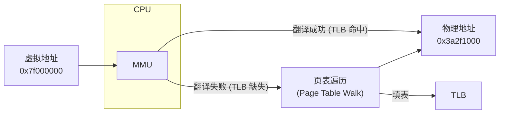
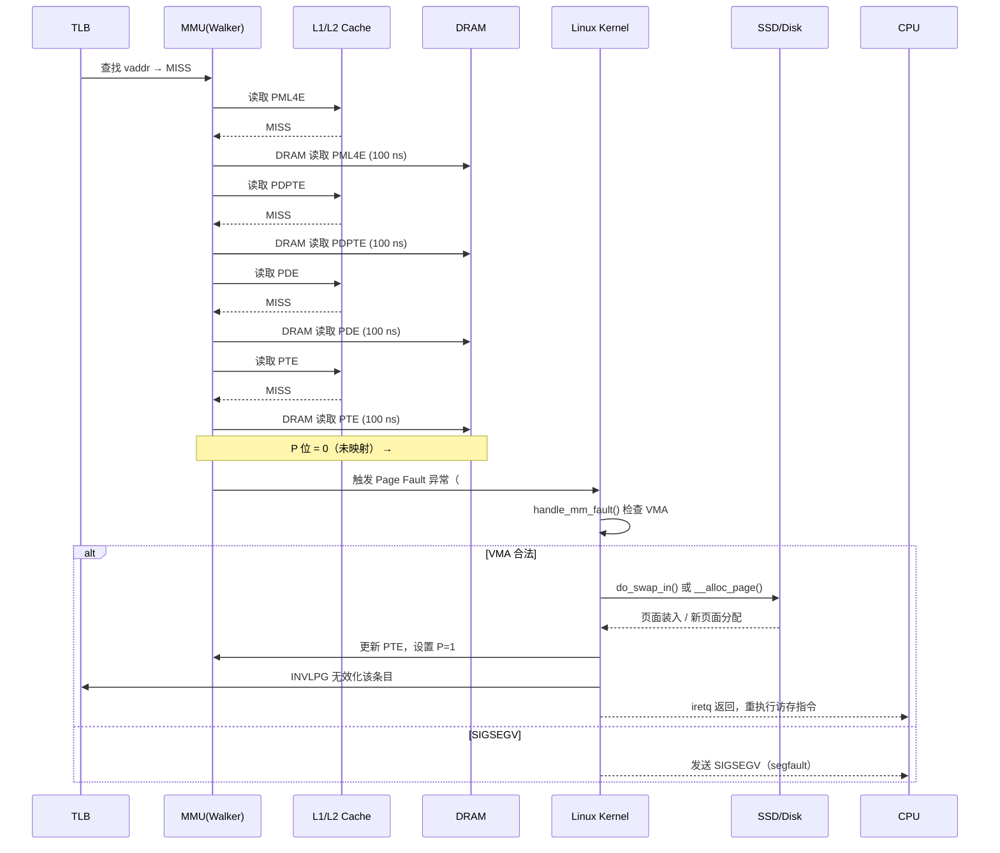
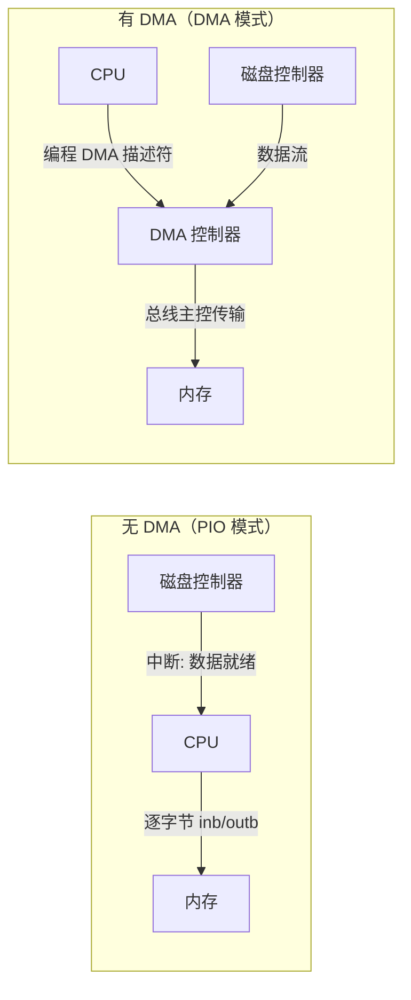
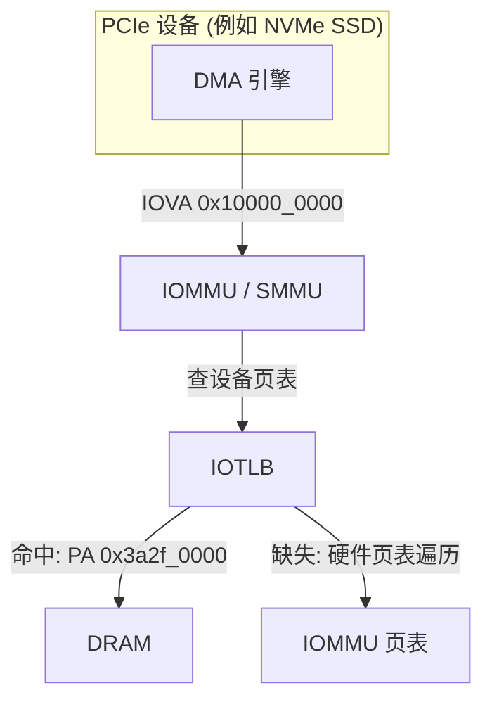
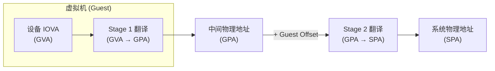

# 内存管理单元 / 页表缓存 / 直接内存访问 / I/O 内存管理单元

> **TL;DR** — CPU 通过 MMU 将虚拟地址翻译为物理地址；TLB 缓存页表项以加速翻译；DMA 让外设绕开 CPU 直接读写内存；IOMMU 为设备提供地址翻译与隔离，是虚拟化安全的基石。若只有一个关键词：**地址翻译无处不在**——CPU 侧、设备侧、虚拟机侧，每一层都在做同一件事。


---

## 目录

1. [MMU：从虚拟地址到物理地址](#1-mmu从虚拟地址到物理地址)
2. [页表遍历：四级与五级分页](#2-页表遍历四级与五级分页)
3. [TLB：地址翻译的第一道缓存](#3-tlb地址翻译的第一道缓存)
4. [页面大小：4KB / 2MB / 1GB](#4-页面大小4kb--2mb--1gb)
5. [TLB 标记：ASID 与 PCID](#5-tlb-标记asid-与-pcid)
6. [DMA：让设备直接访问内存](#6-dma让设备直接访问内存)
7. [IOMMU / SMMU：设备侧的 MMU](#7-iommu--smmu设备侧的-mmu)
8. [DMA 一致性：缓存同步问题](#8-dma-一致性缓存同步问题)
9. [工程事故与安全教训](#9-工程事故与安全教训)
10. [易错清单](#10-易错清单)
11. [这一章带走的东西](#11-这一章带走的东西)

---

## 1. MMU：从虚拟地址到物理地址

### 1.1 问题起源

假设两个进程 `firefox` 和 `chrome` 同时运行。它们的 `main()` 被链接器放在相同的虚拟地址 `0x400000`，但显然不能共享同一块物理内存——否则互相覆盖。

MMU（Memory Management Unit）解决的就是这个重定位问题：**每个进程拥有一张"翻译表"（页表），将进程视角的虚拟地址（VA）映射到全局唯一的物理地址（PA）。**



### 1.2 地址空间的"场"

- **用户空间**：x86-64 下典型为虚拟地址 `0x0` 到 `0x00007FFFFFFFFFFF`（低 47 位），即 128 TiB。ARM64 类似，用户空间在低位。
- **内核空间**：`0xFFFF800000000000` 以上，高 128 TiB。内核页表在所有进程间**共享**，所以系统调用与中断无需切换页表基址寄存器，只需切换栈。

每一次进程切换，内核将 CR3 寄存器（x86-64）或 TTBR0_EL1 寄存器（ARM64）指向目标进程的**顶级页表物理地址**。MMU 从那一刻开始，为该进程做地址翻译。

```c
// Linux 内核在上下文切换时写入 CR3（简化模型）
static inline void switch_mm(struct mm_struct *prev, struct mm_struct *next) {
    // ...
    load_cr3(next->pgd);   // pgd 指向 PML4 表的物理地址
    // 同时可能写入 PCID，避免全 TLB 刷新
}
```

> **关键事实**：虚拟地址 → 物理地址的翻译，发生在**每条访存指令之前**。这是一个在时钟周期级别上、每条 load/store 都要走的热路径。

---

## 2. 页表遍历：四级与五级分页

### 2.1 x86-64 四级分页（PML4）

x86-64 使用分层页表，将 48 位虚拟地址分为 5 个字段（4 个 table index + 12 位页内 offset）：

```
| 47    39|38     30|29     21|20     12|11       0|
|---------|---------|---------|---------|----------|
| PML4 idx| PDPT idx|   PD idx|   PT idx|  offset  |
|  9 bits |  9 bits |  9 bits |  9 bits |  12 bits |
```

| 级别 | 完整名称 | 条目大小 | 每个条目映射 |
|------|----------|----------|-------------|
| 1st | PML4 (Page Map Level 4) | 512 项 (9 bit) | 512 GiB |
| 2nd | PDPT (Page Directory Pointer Table) | 512 项 (9 bit) | 1 GiB |
| 3rd | PD (Page Directory) | 512 项 (9 bit) | 2 MiB |
| 4th | PT (Page Table) | 512 项 (9 bit) | 4 KiB |

> ARM64 使用不同的命名（PGD → PUD → PMD → PTE），但原理完全相同。RISC-V 使用 Sv39 / Sv48 / Sv57 方案，同样是多级页表。

### 2.2 一次完整的四级遍历

```c
// 软件模拟 4 级页表遍历（概念代码）
uint64_t walk_page_table(uint64_t cr3, uint64_t vaddr) {
    uint64_t pml4_idx = (vaddr >> 39) & 0x1FF;
    uint64_t pdpt_idx = (vaddr >> 30) & 0x1FF;
    uint64_t pd_idx   = (vaddr >> 21) & 0x1FF;
    uint64_t pt_idx   = (vaddr >> 12) & 0x1FF;
    uint64_t offset   = vaddr & 0xFFF;

    uint64_t *pml4 = (uint64_t *)(cr3 & ~0xFFF);         // PML4 表物理地址
    uint64_t pml4e = pml4[pml4_idx];                     // 读 PML4 项
    if (!(pml4e & 1)) page_fault();                       // Present 位

    uint64_t *pdpt = (uint64_t *)(pml4e & ~0xFFF);       // PDPT 表物理地址
    uint64_t pdpte = pdpt[pdpt_idx];                      // 读 PDPT 项
    if (!(pdpte & 1)) page_fault();

    // 大页：PD 项 或 PDPT 项的 PS 位为 1
    if (pdpte & (1ULL << 7)) {                            // 1 GiB 大页
        return (pdpte & ~0x3FFFFFFF) | (vaddr & 0x3FFFFFFF);
    }

    uint64_t *pd = (uint64_t *)(pdpte & ~0xFFF);
    uint64_t pde = pd[pd_idx];
    if (!(pde & 1)) page_fault();

    if (pde & (1ULL << 7)) {                              // 2 MiB 大页
        return (pde & ~0x1FFFFF) | (vaddr & 0x1FFFFF);
    }

    uint64_t *pt = (uint64_t *)(pde & ~0xFFF);
    uint64_t pte = pt[pt_idx];
    if (!(pte & 1)) page_fault();

    return (pte & ~0xFFF) | offset;
}
```

**硬件真正做的事**：MMU 内部的硬件页表遍历器（Hardware Page Table Walker）逐级发出内存读请求，收集 PML4E → PDPTE → PDE → PTE，每一步都是一次**完整的 DRAM 随机访问**（约 80–100 ns）。

### 2.3 五级分页（LA57）

2019 年 Intel Ice Lake 引入五级页表，额外增加一个 PML5 级别在 PML4 之上，将虚拟地址扩展到 57 位。此时地址划分如下：

```
| 56    48|47    39|38    30|29    21|20    12|11     0|
|---------|--------|--------|--------|--------|--------|
| PML5 idx| PML4   | PDPT   | PD     | PT     | offset |
```

- 支持虚拟地址空间：128 PiB 用户 + 128 PiB 内核
- 代价：一次 TLB 缺失的页表遍历从 4 次 DRAM 访存增长到 **5 次**

> **判断方式**：Linux 内核启动后检查 CPUID leaf 7.ECX[bit 16]（`la57` 标志位）。如果 `/proc/cpuinfo` 的 flags 包含 `la57`，则该 CPU 支持 5 级分页。

### 2.4 一个缺页异常的全路径



---

## 3. TLB：地址翻译的第一道缓存

### 3.1 为什么需要 TLB

假设一次四级页表遍历要 4 次 DRAM 随机访问（共 ~400 ns）。如果每条 load/store 都走一遍，单条指令就会有数倍于 L1 缓存命中时间的延迟——完全不可接受。

TLB 就是这个问题的解：**它是一个极小的全相联或组相联 SRAM 缓存，专门缓存虚拟地址 → 物理地址的映射，以及对应的权限位。**

### 3.2 TLB 层次结构（Intel Skylake 典型值）

| 层级 | 大小 | 关联度 | 延迟 | 覆盖 |
|------|------|--------|------|------|
| L1 i-TLB | 128 项 | 8 路组相联 | 1 cycle | 4 KiB + 2 MiB / 1 GiB |
| L1 d-TLB | 64 项 | 4 路组相联 | 1 cycle | 4 KiB + 2 MiB / 1 GiB |
| L2 STLB | 1536 项 | 12 路组相联 | ~7 cycles | 4 KiB + 2 MiB |
| 页表遍历缓存 | 2+4 项 | — | — | PML4E / PDPTE / PDE |

```c
// TLB 命中的黄金路径（概念）
uint64_t load_user_data(uint64_t vaddr) {
    // 1. MMU 查 L1 d-TLB：1 个周期
    uint64_t paddr = tlb_lookup(vaddr);
    // 2. L1 d-cache 命中：4 个周期
    return *(uint64_t *)paddr;
    // 总代价：~5 周期（与纯物理寻址几乎无区别）
}
```

> **TLB 缺失的代价**：4 次串行 DRAM 访问 ≈ 400 ns。在 3 GHz CPU 上，这是 **1200 个时钟周期**——相当于 L1 命中延迟的 300 倍。

### 3.3 硬件遍历 vs 软件遍历

| 架构 | TLB 缺失处理 | 特点 |
|------|-------------|------|
| x86 / x86-64 | **硬件自动页表遍历** | CR3 指向页表根，MMU 硬线逻辑完成；对 OS 透明 |
| ARM64 | **硬件自动页表遍历** | TTBR0_EL1 / TTBR1_EL1；也支持硬件 walk |
| MIPS | **软件 TLB 异常** | TLBL / TLBS 异常 → 内核 tlb_refill_handler() 用指令填入 TLB |
| SPARC | **软件 TLB 异常** | 类似 MIPS，内核直接操作 TLB 项 |

```asm
# MIPS 软件 TLB 填充示例（简化）
.set noreorder
tlb_refill_handler:
    # k0, k1 保留寄存器，无需保存
    mfc0    k0, CP0_BADVADDR    # 读取引起 miss 的虚拟地址
    lw      k1, saved_pgd       # 进程页表根
    # ... 软件页表遍历 ...
    mtc0    k0, CP0_ENTRYLO0    # 填入 PTE
    tlbwr                       # 写入随机 TLB 槽位（Random 寄存器选择）
    eret                        # 返回，重执行访存指令
.set reorder
```

### 3.4 TLB Shootdown

多核处理器上，如果核心 A 修改某个进程的页表（如 `munmap`），它必须通知所有其他正在运行该进程的核心：**你们 TLB 中的那个翻译已经过时了**。

这就是 TLB Shootdown：

```
1. Core 0 调用 mprotect() 使某个虚拟页失效
2. Core 0 更新页表（PTE 的 P 位清零）
3. Core 0 对自己执行 INVLPG(vaddr)           // x86
4. Core 0 向 Core 1..N 发送 IPI（核间中断）
5. Core 1..N 在 IPI 处理程序中执行 INVLPG(vaddr)
6. Core 1..N 发送 ACK 给 Core 0
7. Core 0 确认所有 ACK → mprotect() 返回
```

TLB Shootdown 的延迟与核心数量线性相关——在大规模 SMP 机器上，频繁的 `munmap` 与 `mprotect` 可能成为性能瓶颈。这也是**为什么 RCU（Read-Copy-Update）被广泛使用的原因之一**：避免频繁刷新 TLB。

---

## 4. 页面大小：4KB / 2MB / 1GB

### 4.1 三种页面大小一览

| 页面大小 | 地址位 | 单页容量 | 一个 TLB 项覆盖 | 内部碎片 |
|----------|--------|----------|----------------|----------|
| 4 KiB（标准） | 12 bit offset | 4,096 B | 4 KB | 极小 |
| 2 MiB（大页） | 21 bit offset | 2,097,152 B | **512 倍于 4 KiB** | 中等 |
| 1 GiB（巨页） | 30 bit offset | 1,073,741,824 B | **262,144 倍于 4 KiB** | 大 |

### 4.2 空间-时间权衡

- **大页** 让单个 TLB 条目覆盖更大的内存范围 → TLB 命中率提升 → 减少昂贵的页表遍历。
- **大页** 造成内部碎片：一个 2.1 MiB 的 malloc 分配，如果分配器使用 2 MiB 大页，第二页只有 0.1 MiB 被使用，其余 1.9 MiB 浪费。
- **小页** 碎片少，但 TLB 覆盖不足——一个 2 GiB 的工作集需要 **524,288 个 4 KiB TLB 条目**（远超任何 CPU 的 TLB 容量）。

### 4.3 Linux 透明大页（THP）

Linux 内核在后台自动将连续的 4 KiB 页面合并为 2 MiB 大页，对应用透明。

```bash
# 查看 THP 状态
$ cat /sys/kernel/mm/transparent_hugepage/enabled
[always] madvise never

# 查看大页使用情况
$ grep AnonHugePages /proc/meminfo
AnonHugePages:   2097152 kB     # 2 GiB 已被合并为大页
```

```c
// 应用层通过 madvise 显式建议使用大页
#include <sys/mman.h>

void *buf = mmap(NULL, 256 * 1024 * 1024, PROT_READ | PROT_WRITE,
                 MAP_PRIVATE | MAP_ANONYMOUS, -1, 0);
madvise(buf, 256 * 1024 * 1024, MADV_HUGEPAGE);
// 内核将在条件合适时，将 buf 映射为 2 MiB 大页
```

> **真实世界数据**：对于数据库（PostgreSQL, MongoDB）和 JVM 堆（通常使用 `-XX:+UseTransparentHugePages`），THP 可以提升 5%–15% 的吞吐量，主要收益来自 TLB 命中率提升。

---

## 5. TLB 标记：ASID 与 PCID

### 5.1 问题：切换进程必须刷 TLB 吗？

传统做法（没有 PCID/ASID 时）：每次切换进程，内核必须通过重置 CR3 来隐式刷新所有 TLB 条目。这导致系统调用密集或频繁上下文切换时，TLB 完全失效——"冷启"的 TLB 命中率几乎是 0%。

### 5.2 ASID（ARM / 地址空间标识符）

ARM 架构在 TLB 每个条目中附带一个 8-bit 或 16-bit ASID。

```
+--------------------------+--------+-----+
| 虚拟地址 (VA)            | ASID   | PTE |
+--------------------------+--------+-----+
| 0x7f000_0000            | 0x03   | ... |  ← 进程 A
| 0x7f000_0000            | 0x05   | ... |  ← 进程 B 的相同 VA，不同 PA
```

- 每个进程被分配唯一 ASID。
- TLB 命中需要**同时匹配 VA 和 ASID**。
- 切换进程时，不再需要刷 TLB（除非 ASID 耗尽，最多 256/65536 个进程后才会发生回收）。
- ARM ISA 提供 `TLBI` 指令族精确无效化：`TLBI VAE1IS, x0` 只刷当前进程特定 VA 的 TLB。

### 5.3 PCID（x86 / 进程上下文标识符）

Intel 自 Westmere（2010）引入 PCID，x86-64 的 CR3 低 12 位用于存储 12-bit PCID：

```
CR3 格式：
| 63                   12 | 11    0 |
|-------------------------|---------|
| 页表物理基址 (4K对齐)    | PCID   |
```

```asm
# x86-64：写入带有 PCID 的 CR3，不刷新全局 TLB
mov %cr3, %rax
bts $63, %rax            # 未使用，保留
and $0xFFFFFFFFFFFFF000, %rax
or  $current_pcid, %rax   # 附带 PCID
mov %rax, %cr3            # 写入 CR3 + PCID → TLB 保留
```

- **PCID = 0**：为内核保留（全局页面仍然使用 PCID 0）。
- **PCID = 1..4095**：为用户进程分配，最多支持 4095 个进程同时保留 TLB 条目。
- PCID 与 CR3 写入配合使用，极大降低上下文切换后的 TLB 重填代价。

### 5.4 Meltdown 与 PCID

Meltdown（2018）迫使所有操作系统全面启用 KPTI（Kernel Page Table Isolation）。KPTI 导致每次系统调用都要切换页表并代价高昂。PCID 在此时成为性能"救命稻草"——没有 PCID 的系统调用会强制刷新整个 TLB。

```
系统调用 → 用户页表 (用户 TLB) → 内核页表 (PCID 0 TLB) → 返回用户页表
         ↑                                                      ↑
    PCID=0x03 TLB 未被刷，返回用户态时立即可用                  PCID=0 内核 TLB 已预热
```

---

## 6. DMA：让设备直接访问内存

### 6.1 为什么需要 DMA

让 CPU 一个字节一个字节地将磁盘数据复制到内存，是 CPU ($$) 做搬运工 (¢) 的工作。DMA 将 CPU 从数据搬运中解放出来：



### 6.2 DMA 描述符链

```c
// 典型的 scatter-gather DMA 描述符（简化）
struct dma_descriptor {
    uint64_t src_addr;       // 源地址（设备侧）或总线地址
    uint64_t dst_addr;       // 目标地址（内存侧）
    uint32_t length;         // 传输字节数
    uint32_t flags;
#define DMA_DESC_FLAG_EOL    (1 << 0)  // 描述符链结束
#define DMA_DESC_FLAG_INTR   (1 << 1)  // 完成后发中断
    uint64_t next_desc;      // 链上下一个描述符的物理地址
} __attribute__((packed));
```

DMA 控制器从第一个描述符开始，依次读取 `src`/`dst`/`length`，在总线上发起传输。当 `flags & EOL` 为真或 `next_desc == 0` 时停止链。一轮传输完成后，若 `flags & INTR`，拉高中断线通知 CPU。

### 6.3 Scatter-Gather DMA

现代操作系统的物理内存是碎片化的——一个用户空间的 64 KiB 缓冲区可能对应多个不连续的物理页面。Scatter-gather 描述符链让 DMA 控制器自动处理这种情况：

```
描述符链：
+------+---------+--------+--------+
| Desc | src     | dst    | len    |
+------+---------+--------+--------+
| 0    | device  | 0x1000 | 4096   | → 物理页 A [0x1000–0x1FFF]
| 1    | device  | 0x5000 | 4096   | → 物理页 B [0x5000–0x5FFF]
| 2    | device  | 0x8000 | 4096   | → 物理页 C [0x8000–0x8FFF]
+------+---------+--------+--------+
                    物理上不连续，DMA 自动"串"成逻辑连续传输
```

### 6.4 Linux DMA API

```c
#include <linux/dma-mapping.h>

// 方式一：连贯 DMA（coherent）——硬件保证缓存一致性
void *cpu_addr = dma_alloc_coherent(dev, size, &dma_handle, GFP_KERNEL);
// cpu_addr: CPU 可访问的虚拟地址
// dma_handle: 设备侧的 DMA 地址（总线地址）
// 释放：
dma_free_coherent(dev, size, cpu_addr, dma_handle);

// 方式二：流式 DMA（streaming）——程序员负责一致性
dma_addr_t dma_handle = dma_map_single(dev, cpu_addr, size, direction);
// direction: DMA_TO_DEVICE / DMA_FROM_DEVICE / DMA_BIDIRECTIONAL
// 传输完成后：
dma_unmap_single(dev, dma_handle, size, direction);
```

---

## 7. IOMMU / SMMU：设备侧的 MMU

### 7.1 设备也有虚拟地址

设备视角的地址（称为 IOVA，I/O Virtual Address 或 DMA Address）并不等同于物理地址。IOMMU 位于 PCIe 总线上，**拦截所有设备发出的内存访问请求，查询自己的页表，将 IOVA 翻译为物理地址**。



### 7.2 Intel VT-d 与 ARM SMMUv3

| 特性 | Intel VT-d | ARM SMMUv3 |
|------|-----------|------------|
| 基本功能 | 设备 IOVA → PA 翻译 | 同 |
| 设备隔离 | 每个设备可以有自己的页表 | StreamID → Context 映射 |
| 中断重映射 | MSI/MSI-X 中断可重定向到特定 CPU | ITS + GICv3 |
| 嵌套翻译 | 两级：GVA → GPA → SPA | Stage 1 + Stage 2 |
| 设备侧 TLB | ATS（Address Translation Service）| ATS over PCIe |
| 最小规格 | 4 KiB 页面支持 | 4/16/64 KiB 页面支持 |

### 7.3 嵌套翻译：虚拟机内的 DMA



- **Stage 1**：虚拟机内核传给设备的地址（在 Guest 视角下是 PA，但对 Hypervisor 来说只是中间地址）。
- **Stage 2**：Hypervisor (VMM) 提供的翻译，GPA → 真实物理地址。

最坏情况：Stage 1 四级遍历（4 次 DRAM）+ Stage 2 四级遍历（4 次 DRAM），总计 **8× 4 = 32 次串行 DRAM 访问**。这就是为什么硬件 IOTLB 对嵌套翻译性能至关重要。

### 7.4 安全收益：设备隔离

没有 IOMMU 的情况下：

```
DMA 请求 [NVMe 设备] → 直接落在物理内存 0x0 到 0xFFFFFFFF
                    → 可以任意读取/写入包括内核内存、其他 VM 内存
```

启用 IOMMU 后：

```
DMA 请求 [NVMe 设备] → IOMMU 拦截
    → 检查设备 BDF 对应页表
    → IOVA 0x1000 翻译到 PA 0x3a2f1000（这是分配给该 VM 的页面）
    → 如果 IOVA 不在页表中 → IOMMU 报告 Fault，阻止传输
```

VMWare、QEMU/KVM、Xen 中的 `vfio-pci` 设备直通完全依赖于 IOMMU。没有它，任何 DMA-capable PCIe 设备直通都等于"给 VM 发了根内存探测针"。

---

## 8. DMA 一致性：缓存同步问题

### 8.1 问题的核心

CPU 有 L1/L2/L3 缓存；DMA 设备通常不可缓存直连总线。以下场景是经典的一致性错误：

```
时间线：
t1: CPU 写入 buffer[0..1023] = "hello"        → 数据在 L1 缓存中（未到 DRAM）
t2: CPU 启动 DMA，描述符指向 buffer 的物理地址
t3: DMA 从 DRAM 读取 buffer 的物理地址        → 读到的可能是旧数据！
```

### 8.2 连贯 DMA（Coherent DMA）

硬件层面：DMA 写入通过总线监听（Bus Snooping）协议（MESI/MOESI）通知 CPU 缓存"这块内存被写了"，使对应缓存行无效化或更新。

```c
// 连贯 DMA：dma_alloc_coherent 保证
void *buf = dma_alloc_coherent(dev, 4096, &handle, GFP_KERNEL);
// 标记对应的物理页面为不可缓存（Uncacheable）或在硬件上通过 snoop filter
// 保证 DMA 读写和 CPU 读写的一致性
```

**代价**：连贯内存的 CPU 访问通常比正常缓存内存更慢（部分架构禁用缓存，或每次访问都走 snoop 总线）。

### 8.3 流式 DMA（Streaming DMA）

对高频数据传输（如 NIC 数据包缓冲区），连贯 DMA 性能不佳。流式 DMA 的哲学是 **"由你来管理一致性，但给你最快的通路"**：

```c
// 流式 DMA：手动刷缓存
// 场景：CPU 填充数据 → 设备读取
memcpy(buf, packet_data, len);
dma_map_single(dev, buf, len, DMA_TO_DEVICE);
// ↑ 内部调用 architecture-specific 的 cache flush / writeback
//   将 CPU 缓存中的数据刷到 DRAM，确保 DMA 读到最新数据

// ... 等待 DMA 完成 ...

// 场景：设备写入数据 → CPU 读取
dma_unmap_single(dev, handle, len, DMA_FROM_DEVICE);
// ↑ 内部调用 architecture-specific 的 cache invalidate
//   使 CPU 缓存中的对应行失效，确保下次 CPU 读从 DRAM 取数据
process_incoming_data(buf);
```

### 8.4 ARM 上的具体操作

ARM 使用 PIPT（Physically Indexed, Physically Tagged）或 VIPT L1 缓存；但一致性操作仍需要显式通过 CP15 或系统寄存器完成：

```asm
// ARM64: 清理数据缓存到 PoC（Point of Coherency）
// 对 buf[0..63] 做 writeback
DC CVAU, x0          // Clean by VA to Point of Unification
DSB SY               // 等待完成

// 使数据缓存无效（DMA 写完后）
DC IVAC, x0          // Invalidate by VA to Point of Coherency
DSB SY
```

Linux 内核在 `arch/arm64/mm/cache.S` 和 `arch/arm64/mm/dma-mapping.c` 中封装了这些操作。

---

## 9. 工程事故与安全教训

### 9.1 CVE-2020-12890：AMD IOMMU 旁路

2020 年，安全研究员在 AMD IOMMUv2 中发现：某些 ATS（Address Translation Service）事务处理不当，允许恶意设备绕过 IOMMU 地址翻译，直接访问任意物理内存。

```
正常路径：  Device → ATS Translation Request → IOMMU → 翻译 → 拒绝/允许
攻击路径：  Device → 伪造 ATS Completion → 绕过 IOMMU 检查 → 直接 DMA 到任意 PA
```

> **教训**：任何时候在安全关键路径上，不可信输入的验证永远不能依赖于"外部设备的行为"，必须由 IOMMU 固件硬线逻辑闭环。

### 9.2 Thunderbolt DMA 攻击（Thunderspy）

Thunderbolt 接口允许外部设备通过 PCIe 协议进行 DMA。如果没有 IOMMU，攻击者插入一个恶意 Thunderbolt 设备，便可：

1. 扫描系统物理内存 → 找到内核凭证（加密密钥、密码） → 读取
2. 写入物理内存 → 修改内核数据结构 → 提权

2019 年的 **Thunderspy / Thunderclap** 研究展示了具体的攻击实现。Linux kernel 自 5.0 起引入了 `CONFIG_INTEL_IOMMU_DEFAULT_ON`（默认启用），使得 Thunderbolt DMA 攻击只能访问已经被 IOMMU 映射的页面。

```bash
# 确认 IOMMU 已启用
$ dmesg | grep -i "DMAR: IOMMU enabled"
DMAR: IOMMU enabled

$ cat /proc/cmdline | grep iommu
iommu=pt intel_iommu=on
```

### 9.3 Meltdown / Spectre 对 MMU 的冲击

虽然本章不深入讨论侧信道攻击，但有必要提及：Meltdown 本质上利用了 Intel CPU 在 TLB 权限检查与数据载入之间的竞态。修复方案（KPTI）彻底重构了内核对页表的使用方式，其性能代价直接依赖 PCID 与 TLB 硬件来缓解。

### 9.4 AMD fTPM 与 MMIO 的烂摊子

另一类常见的问题是**设备 MMIO（Memory-Mapped I/O）**。如果驱动程序配置的 BAR（Base Address Register）与 BIOS/UEFI 报告的范围不一致，DMA 和 MMIO 可能落在不该去的物理页面。这类 bug 在 Linux 邮件列表上几乎每月出现一次。

> **核心教训**：地址翻译链上任何一环出错（MMU、IOMMU、DMA 描述符、BAR 配置），最终都会表现为**静默数据破坏（silent data corruption）**——没有 Page Fault，没有 Oops，只有错误的结果。

---

## 10. 易错清单

| # | 常见错误 | 正确做法 |
|---|---------|----------|
| 1 | DMA 传输前未 `dma_map_single`，直接用物理地址 | 必须通过 DMA mapping API，否则 CPU 缓存数据和 DRAM 数据不一致 |
| 2 | 使用 `kmalloc` 返回的指针作为 DMA 地址 | `kmalloc` 返回虚拟地址，必须通过 `virt_to_phys()` 或 DMA API 转换为总线地址后使用 |
| 3 | 假设 DMA 缓冲区连续 | `vmalloc` 分配的内存在物理上可以不连续；DMA 需要 `kmalloc`（≤4页）或用 `dma_alloc_coherent` |
| 4 | 大页映射忽略对齐 | `mmap` + `MAP_HUGETLB` 需要 2 MiB / 1 GiB 对齐；未对齐 → `mmap` 返回 `EINVAL` |
| 5 | `INVLPG` 后未加 `MFENCE` | x86 上 PTE 修改后必须 `MFENCE` 保证全局可见，再执行 `INVLPG`，否则其他核心 TLB 可能仍有旧条目 |
| 6 | DMA 映射与解除映射方向不一致 | `DMA_TO_DEVICE` 映射 + `DMA_FROM_DEVICE` 解除 → 平台相关行为，某些架构缓存操作方法不同 |
| 7 | 设备直通时忘记启用 IOMMU | 没有 IOMMU 的 VFIO 直通会使 VM 可以 DMA 到物理内存任何位置；QEMU 的 `-device vfio-pci` 必须配合 `intel_iommu=on` 命令行参数 |
| 8 | TLB 满载触发的 trashing | 高频上下文切换 + 大工作集 → TLB 覆盖率可能趋近 0%；使用大页 `/ THP` 或 `sched_setaffinity` 减少核心间 ping-pong |
| 9 | 忘记 `dma_free_coherent` | 泄露的不只是虚拟内存（`vmalloc` 区域），还有 DMA 页本身——这类泄漏用 `kmemleak` 抓不到 |
| 10 | PCIe ATS 未启用时假设设备可缓存翻译 | 没有 ATS 的设备，每次 DMA 都要走一次 IOMMU 页表遍历；如果同时使用嵌套翻译，延迟不可忽视（32 次 × 100 ns = 3.2 μs） |

---

## 11. 这一章带走的东西

1. **TLB 缺失的代价是 4 次串行 DRAM 访问**（x86-64 四级页表，~400 ns，约 1200 个 CPU 周期）。五级分页则增加到 5 次。
2. **IOMMU 为设备提供 IOVA → 物理地址的翻译，与 CPU 的 MMU 是同构的**。因此 DMA 攻击在没有 IOMMU 时等同于裸物理内存读写。
3. **大页（2 MiB、1 GiB）减少 TLB 压力**——一个 1 GiB 页面只需 1 个 TLB 条目，而等量的 4 KiB 页面需要 262,144 个条目。
4. **DMA 缓存一致性问题**来自 CPU 缓存的写回策略：CPU 将数据写入缓存后直接启动 DMA，DMA 可能从 DRAM 读到旧数据。用 `dma_alloc_coherent`（连贯 DMA）或 `dma_map_single`（流式 DMA）正确管理。
5. **上下文切换 ≠ TLB 全刷**：现代 CPU 使用 ASID（ARM）或 PCID（x86）标记 TLB 条目，配合写入 CR3 不刷 TLB 的特性，大幅削减切换开销。
6. **虚拟化中 IOMMU 嵌套翻译的最坏路径能达到 32 次 DRAM 访存**（Stage 1 四级 × Stage 2 四级 × 两次遍历）。理解这个数字，就理解了为什么 VFIO 直通、SR-IOV 和硬件 IOTLB/ATS 不是"锦上添花"而是"生死攸关"。
7. **地址翻译链上一枚错误 = 静默数据破坏**。没有 Page Fault，没有 Kernel Oops——只有莫名其妙的数据错误。在驱动、虚拟化、DMA 代码中，检查地址翻译链的每一环节是必备的防范意识。


---

> **下一节 → [GPU 架构：SM / CUDA Core / Tensor Core](gpu-architecture.md)**
