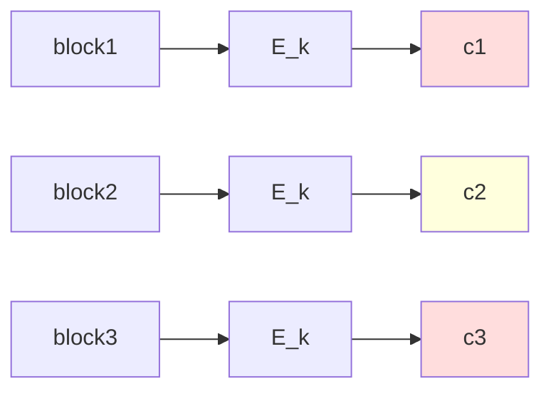

# 2. 操作模式: ECB / CBC / CTR / GCM (AEAD) 与 nonce-reuse 灾难

## TL;DR

块密码处理固定 128-bit block. 把它扩到任意长 message 的协议叫**Operation Mode**. ECB 是 naive 也已 broken (tux 攻击); CBC 抗篡改弱; CTR 流密码化适合并行; GCM 给 AEAD (Authenticated Encryption with Associated Data) 一次给 ciphertext+tag. 现代选用**几乎仅 GCM 和 ChaCha20-Poly1305**——TLS 1.3 砍除 CBC. Nonce reuse 在 GCM/CTR 是密码学界**两次即死**级破坏.

---

## 一、ECB (Electronic Codebook): 最朴素也最弱

每个 block 独立加密: $c_i = E_k(m_i)$. 解密反: $m_i = D_k(c_i)$.

```python
def ecb_encrypt(key: bytes, msg: bytes) -> bytes:
    bs = 16
    if len(msg) % bs != 0:
        msg = pad(msg, bs)
    return b"".join(aes_encrypt_block(msg[i:i+bs], key) for i in range(0, len(msg), bs))
```

### 1.1 致命: 同明文 block 产生同密文 block

Tux cartoon: ECB encrypt Tux 企鹅 PNG, 即使加密后 image 仍可辨出企鹅轮廓. 业界反通用: ECB **永远不要**用于 data.

### 1.2 唯一使用 case

- 单 block 的小消息加密 (例如 exchange password ciphered 频率 < 1 block 输入熵): 严格 data length < block_size; 否则 ECB = mistake.



---

## 二、CBC (Cipher Block Chaining): 串行多一字节 XOR 链

$$ C_0 = \text{IV (不保秘)} $$
$$ C_i = E_k(M_i \oplus C_{i-1}) $$

解密 $M_i = D_k(C_i) \oplus C_{i-1}$.

```python
def cbc_encrypt(key: bytes, IV: bytes, msg: bytes) -> bytes:
    bs = 16
    assert len(IV) == bs
    pad_msg = pkcs7_pad(msg, bs)
    prev = IV
    out = bytearray()
    for i in range(0, len(pad_msg), bs):
        block = bytes(a ^ b for a, b in zip(pad_msg[i:i+bs], prev))
        enc = aes_encrypt_block(block, key)
        out.extend(enc)
        prev = enc
    return bytes(out)
```

### 2.1 优缺

**优**: 同明文不同 IV ⇒ 得不同密文 ✓; padding 长度可包装信息.

**缺**: 
- **串行**: 每 block 需前密文, 不利并行.
- **不抗篡改**: 攻击者可交换两 ciphertext blocks, 解密后破语义; padding oracle attack (Vaudenay 2002) 让 attacker 通过 padding error messages 在 polynomial time 内 recover plaintext for TLS-supported-old server.
- **IV must unpredictable**: IV 选 counter 简便但 small IV 容易被 predict + chosen-plaintext attack (Lucky13 / BEAST) 实证.

> [!WARNING]
> **Padding Oracle** (POODLE 2014): SSL 3.0 的 CBC-MAC + padding 验证回报 last byte 是否 pad. Padding error 状态 leaked → 攻击者多次发同一密文 板 ctxt, 改 last byte 直 non-padding-error → 解出 plaintext 上一字节. 重复 → 解全 plaintext byte。故 SSL 3.0 deprecate; 改用 AEAD only.

---

## 三、CTR (Counter) mode: 把 block cipher 变流密码

$$ C_i = M_i \oplus E_k(\text{nonce} \, \| \, \text{counter}_i) $$

```python
def ctr_encrypt(key: bytes, nonce: bytes, msg: bytes) -> bytes:
    counter_blocks = (len(msg) + 15) // 16
    keystream = b""
    for i in range(counter_blocks):
        cblock = nonce + struct.pack(">I", i)
        keystream += aes_encrypt_block(cblock, key)
    return bytes(a ^ b for a, b in zip(msg, keystream[:len(msg)]))
```

### 3.1 性能 + 特性

- **完全并行**: 每 $E_k$ 独立计算 → SIMD/multi-core 灾难.
- **无 padding**: 任意 length message.
- **加密解密同算法**: 一致 XOR.
- **stream-cipher-like**: 重复 nonce ⇒ 同 keystream ⇒ 多条消息 XOR 立刻破. **必须**保证 nonce 不重.

### 3.2 IV / counter 管理

- 96-bit nonce + 32-bit counter: nonce password syntactic; counter 在 record 内由 protocol designer 共议.
- 不重复: 用 increment-counter 1 次 = 1 message. 不分 distinct message.

### 3.3 改性可重: 单 bit 翻转直接 plaintext 翻位

CTR 不用密码本身验完整性. 因此 CTR 单独用 = broken. 必须带 MAC (HMAC or Poly1305). 这就是 GCM 的来源.

---

## 四、GCM (Galois/Counter Mode): AEAD paramount

把 CTR encryption + GHASH-based authentication 合一并. 给 (ciphertext, tag) 双输出.

### 4.1 把 message 切三段

- $A$ (associated data, e.g. TLS header): 不加密, 但要 integrity.
- $P$ (plaintext): 加密成 ciphertext $C$.
- $IV$: 96-bit 推荐, 长度可调但用 NATN 图 12 后文中 "短 IV" 上 nonce unwrap simplex.

### 4.2 加密段

跟 CTR 相同: $C_i = P_i \oplus E_k(J_0 + i)$, 其中 $J_0 = (\text{IV} \, \| \, 0^{31}1)$.

### 4.3 GHASH

在 GF(2^128) 上做多项式计算:
$$ T = \text{GHASH}_H(A, C) \oplus E_k(J_0) $$
其中 $H = E_k(0^{128})$ 为 hash subkey, GHASH 是关于 H 的 неприем不接受 polynomial MAC:
$$ \text{GHASH}_H(X_1, \ldots, X_n) = ((\cdots((X_1 H \oplus X_2) H \oplus X_3) H \cdots ) H \oplus X_n) H $$

最后 $\oplus E_k(J_0)$ 把 auth tag 与 IV specific.

### 4.4 验证

接到 (IV, A, C, T):
- 重计算 $T' = \text{GHASH}_H(A, C) \oplus E_k(J_0)$.
- 用 constant-time compare `crypto_verify_16` 比较 $T'$ 与 $T$. 
- 等则接受.

### 4.5 工程注意

> [!WARNING]
> ** nonce reuse 绝不能 — 一旦重 同 key/IV, 攻击者可恢复 plaintext, 且 recover GHASH key $H$ 进而 forge 任意消息 tag.**

Joux 2006 "authentication fail" 的 GCM nonce-reuse attack 是密码学上范式级破坏. **HTTPS 多 record 加密每条 lift new IV**; 像 mTLS / DTLS 1.4 / QUIC 都 ordered sequence degree + IV computed record-by-record rule sent.

---

## 五、AEAD: 为什么必须 encrypt-then-MAC

历史:
- **MAC-and-Encrypt** (旧 SSL/TLS 1.0+): ciphertext = E(MAC || plaintext). attacker 可 cut tags/截断恢复 plaintext (Lucky13 attack).
- **MAC-then-Encrypt** (TLS 1.2 CBC 套 overlapping): ciphertext = E(plaintext || MAC). 同样 padding oracle.
- **Encrypt-then-MAC** (modern AEAD): ciphertext = E(plaintext), tag = MAC(plaintext). 验 tag 后才解 — verifier 不见 plaintext, 防 oracle.

GCM = E-then-MAC 内建, ChaCha20-Poly1305 也是. TLS 1.3 仅留这两个 AEAD. RFC 5116 把 AEAD 形式化:
$$\text{AEAD.encrypt}(k, n, A, P) = (C, T)$$
$$\text{AEAD.decrypt}(k, n, A, C, T) = P \text{ (or fail)}$$

---

## 六、Poly1305: one-time MAC

Bernstein's polynomial MAC:
$$\text{tag} = (\sum m_i r^i) \mod p$$ 其中 $p = 2^{130} - 5$, $r$ 是 key.
Compute by carryless multiply + mod reduction, fast 软件 AVX.

与 ChaCha20 配对的 RFC 7539:

```python
POLY1305_PRIME = (1 << 130) - 5

def poly1305_mac(key: bytes, msg: bytes) -> bytes:
    r = int.from_bytes(key[:16], 'little') & 0x0ffffffc0ffffffc0ffffffc0fffffff
    s = int.from_bytes(key[16:], 'little')
    acc = 0
    for i in range(0, len(msg), 16):
        chunk = msg[i:i+16]
        n = int.from_bytes(chunk + b'\x01' + b'\x00' * (15 - len(chunk)), 'little')
        acc = (acc + n) * r % POLY1305_PRIME
    tag = (acc + s) % (1 << 128)
    return tag.to_bytes(16, 'little')
```

Pair with ChaCha20: 用 ChaCha20 derived Poly1305 one-time key from block 0 of ChaCha20 keystream. **One-time**: each message 用 new key, derivation explicitly nonce-keyed → 安全.

---

## 七、密钥管理: 旋转 + 衍生

### 7.1 KDF (Key Derivation Function)

主 key 不直接做多个密钥; HKDF (HMAC-based KDF) RFC 5868 把种子密钥 stretch 为多自然 child-key.

```python
import hmac, hashlib
def HKDF_expand(prk: bytes, info: bytes, L: int) -> bytes:
    n = (L + 31) // 32
    T, okm = b"", b""
    for i in range(1, n + 1):
        T = hmac.new(prk, T + info + bytes([i]), hashlib.sha256).digest()
        okm += T
    return okm[:L]
```

TLS 1.3 用 HKDF 阶段 derive:
- early secret = HKDF-Extract(salt=0, IKM=PSK)
- handshake secret = HKDF-Extract(salt=early, IKM=ECDHE_shared)
- master secret = HKDF-Extract(salt=handshake, IKM=0)
- traffic secret = HKDF-Expand(master secret, label, length)
- ...

### 7.2 密钥运输 metadata

- One-time vs long-term: TLS 主会长实测 1 hours，重 keyed connection (each connection old ECDHE ephemeral keys).
- Key rotation: 由于 factoring attack etc 等渐进, 每 6-12 months 轮转 long-term RSA/ECDSA cert (受 Let's Encrypt 90-day actuate).

### 7.3 Forward Secrecy

长期私钥 leak 不解旧投资。机制: 每会话用不同 DH ephemeral, 共享秘密 derived 即用即弃 hash\&; HKDF could pregen — even今天永久泄漏 only affect future sessions not 全 archived past.

---

## 八、TLS 1.3 AEAD 现实

TLS 1.3 record layer 全部是 AEAD:
- AES-128-GCM / AES-256-GCM
- ChaCha20-Poly1305
- AES-128-CCM (IoT 低温场景)

每条 record: nonce = static IV (4-byte prefix from handshake) XOR sequence number. **Avoid random nonce generation—用 deterministic counter防 nonce reuse by design.**

```python
def tls13_nonce(static_iv: bytes, seq: int) -> bytes:
    return (int.from_bytes(static_iv, 'big') ^ seq).to_bytes(12, 'big')
```

---

## 九、归 index 灾难史

| 灾难 | 原因 |
|------|------|
| PS3 ECDSA nonce reuse (Geohot 2010) | 同 k 重 signed two messages ⇒ private key factor out in seconds |
| WPA2 KRACK (2017, Mathy V.) | 重置 nonce + replay allow decrypt WPA2 packets |
| GSuite / Microsoft 365 GCM nonce reuse (2021言论) | nonce counter 误 reset → nonce reuse; message recoverable |
| Telegram MTProto demo (2021) | Counter reset; found expose social |
| IEEE 802.11i CCMP counter reset buggy drivers (2010s) | replay allowed |
| VPN wireguard nonce (RFC 7748) | nonce 极慎重: counter 大于2^64 拒; 玩 60-hour day 矩阵性质. |

工程 ineluctable: nonce mathematically critical; 业界 production code **must use a counter sequencing model** (DRBG (NIST SP 800-90A)) ; under no circumstance 用 `random()` 给 nonce 全 length generated.

---

## 十、与项目其他章节交叉

- **complexity.md / NIST PQC**: post-quantum ChaCha20 vs PQ signed-multicase ML-KEM 不是 AEAD-style; KEM 只在 key exchange, 但 ChaCha20 仍安全 post-quantum (symme 加密上 quantum 加速 search = factorization-like).
- **os/net/epoll-iouring memcmp**: AEAD 实现常常走 SIMD batching 结构, parallel 链 io framework 与真宏 integrate.
- **distributed consensus**: 链crypt hash 函数 SHA-256 与 PoW 用 SMN structure; hashcash 类因子 (Adam Back 1997 PoW 出).
- **system-design/case/dynamo-family**: cryptographic token idempotency 多 tall with secure random?；

---

下一节 → [非对称加密: RSA 与 ECC](asymmetric.md)
