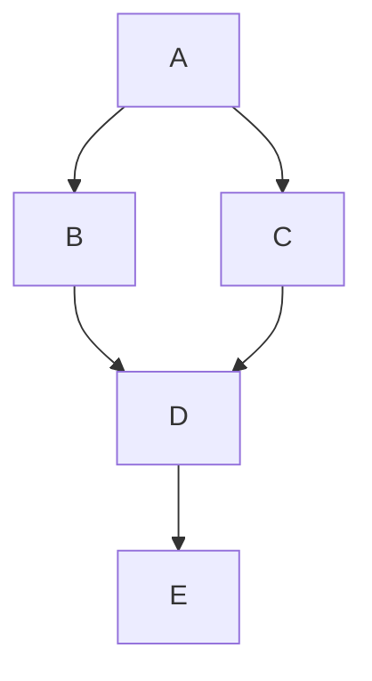
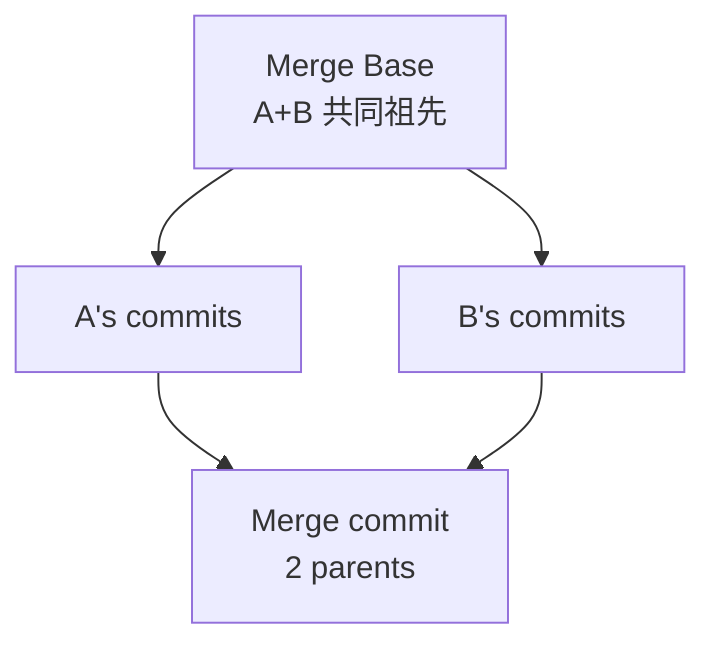

# DAG、git、blockchain 的序

## TL;DR

DAG (Directed Acyclic Graph) 是 partial order 最自然的数据结构——明列每个节点依赖于哪些前驱节点, 拓扑排序保 happens-before。 Git 用 commit DAG + tree object 做版本控制 + artificial merge commit 处理并行开发。 Blockchain 是 linearized DAG (HashChain), 用 PoW / PoS / BFT 在众多候选分支上**强制选唯一主链**实现 total order; Bitcoin / Ethereum / Solana 各有 trade-off。 DAG 区块链 (Nano / IOTA / Avalanche / Hedera) 把 linear chain 扩展到 full 2D DAG, 让无 conflict 的事务并行打包 + 仅 conflict 路径跑共识。

---

## 一、DAG as Partial Order

### 形式

DAG 是 directed graph, 无 cycles ⇒ 节点 A → B 意味 B 依赖 A (B 在 A 之后发生)。 拓扑序是任意线性化 partial order, 满足 `A → B` ⇒ A 在 linear 序列前。



合法拓扑序: `[A, B, C, D, E]` 或 `[A, C, B, D, E]`. 不合法: `[B, A, ...]`.

### Hasse Diagram

Hasse 图是简洁 DAG 表示——丢弃 transitive edges, 留下 minimal cover (covering relation).

### Partial Order 的来源

分布式系统里, partial order from:

1. **Lamport `happens-before` `→`**: process order + send-recv + 传递闭包。
2. **Memory consistency**: 多核 CPU 内部指令依赖。
3. **Causal broadcast**: logical 进程序 + message causal 携带。
4. **State machine replication**: log order per replica。
5. **Git commit dependency**: parent commit 必须先发生。

---

## 二、Git's DAG

### Commit Object

每 git commit 是一个 SHA-1 (或未来 SHA-256) hash 对象:

```
tree <tree_hash>
parent <parent_hash_1>     # 主线第一个 parent, 一般 ancestor
parent <parent_hash_2>     # merge 的合并第二条 parent (普通 commit 没)
author Alice <alice@ex.com> 1699999999 +0000
committer Alice <alice@ex.com> 1699999999 +0000

<commit message>
```

commit hash 是 SHA-1 of the REST content. **任何 commit 改不能改父, forgery 需 computing equivalent SHA-1 preimage (computational impossible)**。

### Tree Object

每 tree 是 hash container of files + subtrees:

```
100644 blob <sha1> README.md
040000 tree <sha1> src
100755 blob <sha1> build.sh
```

blob 是 file content hash; tree 是 directory content hash. 递归 tree 嵌套则 nested sub-trees. file modification → blob hash 改 → parent tree hash 改 → ancestor tree hash 改 → commit hash 改.

### Refs

- `refs/heads/main` 指向 main 当前 commit
- `refs/tags/v1.0` 指向某 tagged commit
- `refs/remotes/origin/main` 同 remote

refs 不是 commit content 一部分; 各 clone repo 可各自有自己 refs.

### DAG Operations



#### `git merge`

创建两个 parent 的 merge commit, 引用两 parent 的 tree + 三方向 merge algorithm:

- 三个 commit: common ancestor (merge base `O`), ours `A`, theirs `B`。
- 三方 diff 执行: 若 same content in A 与 B → 接受。 若仅一方改 → 接受 change。 双都改 → conflict (用户手动 resolve)。

#### `git rebase`

Rebase 重新写 commit DAG: 把当前分支 commits "应用" 到 target branch tip:

```
Before:   A - B - C - D (main)
              \
                X - Y (feature)

After rebase feature onto main: A - B - C - D - X' - Y' (feature, each commit rewritten)
                                              old X Y - 暂挂、prune
```

Rebase 收缩 DAG 线性化, 适合"干净 PR history"; merge 保并行 history。

#### `git rebase` 与 `git merge` 比较

- merge: 保 history 准确切, commits 不重写。 适合 public branch (team-shared main)。
- rebase: rewrite 自己 commits, 冲突可整理。 适合 private branch before opening PR。

### DAG 上的序

- `git log --topo-order`: 拓扑序, 父在前。
- `git log --date-order`: wall-clock order, 但保证 partial order 不完整状元。
- `git log --graph`: 同时展示 merge commit 节点 + 边, 让 multi-parent 节点可视化。

### Cherry-pick / Revert

`git cherry-pick <commit>`: 单 commit 复制应用到当前 branch, 创建新 commit hash 但同样 message + diff-content。

`git revert <commit>`: 创建一个 inverse diff commit。

### Git 经验: Stored-over-time model

git 是函数 Stored-over-time 的 with tree immutable DAG, branches 与 tags 是 hashes; commit SHA-1 immutable; 但 refs mutable.

---

## 三、Blockchain 的 DAG

### Bitcoin: Linear HashChain

Bitcoin 不是真正的 DAG——它是 well-defined linear chain:

```
block N hash = SHA-256(version || prev_hash || merkle_root || timestamp || nBits || nonce)
prev_hash = previous block hash  → 强 dependency
```

按 hash 链, 改任何历史 block 内容 → 其 hash 改 → 下 block invalid → 整 chain post-edit 失效 (像 git commit hash 改变后续 commit hash 全变).

### Forks 与 Longest-Chain Rule

Bitcoin 节点可同时挖不同 block (race condition), 产生 fork:

```
                 → Block i+1 → Block i+2
Genesis ... --i <
                 → Block i+1' → Block i+2' → Block i+3' (longest = canonical)
```

**Nakamoto consensus**: choose longest chain by total work (each block header hashes difficulty); short fork 丢弃, 成为 "orphaned"。

**Longest-Chain Risk**:
- 51% attack: 控制 51% hash rate 可挖更 longest faster, overwrite legitimate chain。
- Reorg: blocks on shorter chain become orphaned, containing tx 重新包入 longer chain by miners (or never if excluded) → tx 可能 double-spent if attacker 与 mine simultaneously.

### GHOST (Greedy Heaviest-Observed Sub-Tree) Rule

Ethereum PoW 时代用 GHOST + uncle 加入 main chain:
- 若 forked, 走 sub-tree validator 权重最大的 branch。
- 让 uncle block 也作 "uncle reward", 仍 divestment sim kind fork over short confirmed time.

### Ethereum PoS Post-Merge

Post-Merge (2022-09-15) Ethereum consensus changed from PoW → PoS:
- Validators stake 32 ETH。
- 每 slot (12s): one validator 任 proposer 提出 block. other validators vote **attestation**。
- LMD-GHOST fork-choice: validators see fork, 选择 validator weight 最大 sub-tree。
- Finality: 2 epochs (~13min) finalize; finalized blocks 不可被 invalidate unless 1/3 validators slashable (stake burnt)。

### Solana: 高吞吐 DAG-ish

Solana PoH (Proof of History) 是 VDF (Verifiable Delay Function) 链: leader 持续 hash pre-image chain, 提交 entries + transactions。 PoH 给每 entry a monotonic timestamp + leader identity 进入。 跨 leader handoff oneraf slots (400ms), 多 leader 排成 epoch。

不是严格线性 DAG, 但是是 "single-leader linear chain with parallel entries", throughput 65k TPS claim.

---

## 四、DAG Blockchain Variants

### Nano (block-lattice)

每账户独立一条 blockchain:

```
Alice's chain: ... → Send to Bob block_i
Bob's chain:    ... → Receive from Alice block_j
```

tx 是 双方链 update send + receive, 异步确认 + no global consensus。 Conflict 限于 单账户 double-send, 用 delegated PoS vote resolve.

### IOTA Tangle

每 transaction 必须 approve 2 前驱 transaction (tip selection). "累积 weight" large = confirmed.

```
       T1   T2
        \  /
         T3 (新 tx, approves T1 + T2)
        /
       T4 ...
```

无须 miners, low-energy. **Withdrawn by IOTA Foundation** 2020+, 改用 Chrysalis (linear chain plus coo). 原始 Tangle 因 tip selection 攻击困难.

### Avalanche (AVAX)

Avalanche 共识: DAG 节点之间 "sub-sampled gossip", 收集 preference 投票; 反复多次收敛超 quorum threshold → "snowball" metastability。

每用户多次 query random K validators; 多数 vote → adopt; sufficiently consecutive 接连 adopt ⇒ finality probability geometric high.

优势: sub-second finality, high throughput. 复杂 probability analysis.

### Hedera Hashgraph

Hashgraph 是 "gossip about gossip" + virtual voting. 每节点 pair gossip + exchange known events; events ordered by ancestor relationship。

每节点独立 compute virtual vote ordering → fair consensus. 不需 PoW. council 39 nodes (verified entities only) — AAP-style BFT.

---

## 五、Sui / Aptos Move DAG

Sui 是 2023 main net, 用 Move language + **programmable transaction blocks** (PTB). 每个 transaction block 含一组 independent objects + operations. DAG 上:

- 若 transaction touches 独立 objects (no shared), **拜 pass validation single-validator** (fast path, sub-second finality)。
- 若 touches shared objects, 走 **Narwhal+Bullshark DAG consensus** (基于因果传播 + BFT)。

Sui 与 Aptos 都从 Diem (libra) 项目衍生, 用 Move language 强 fuel 但 consensus 机制不同。 Aptos 用 AptosBFT v4 (HotStuff-1 推 BFT).

---

## 六、典型事故

### Git SHA-1 collision (2017 SHAttered)

2017 Google SHAttered paper: SHA-1 collision 可构造 (~6500 year CPU time 算)。 git 现在 detect collision attack mode 但没 mandate migration to SHA-256。 GitHub 用 ContentAddressing storage; SHA-256 migration on road。

### Bitcoin Cash Hard Fork (2017)

Bitcoin Cash 与 Bitcoin 分叉因 scaling disagreement (block size 1MB vs 8MB)。 硬分叉 (hard fork) 说明 blockchain design 升级非 backward-compatible 时, predecessor chain 与 successor chain 并行存活——这是 DAG 性 (under hashchain)。

### Ethereum DAO Hack Rollback (2016)

DAO hack 漏 exploited ~3.6M ETH。 Ethereum 社区硬分叉逆转 state 状态。 这展示 "code is law" 与" community governance is law" 的 tension: Nakamoto consensus 是 longest chain wins, 但社区社群选择性 reverse 让只有 "longest chain we morally accept" becomes canonical — 但 "这个 chain 社区 accepted" really (minority chain Ethereum Classic survive)。

### IOTA CST Intersection Removal Crisis

IOTA 早期自定义 cryptographic hash function "Curl" unsound。 2018 MIT disclosed vulnerability + disclosed 后 IOTA Foundation 临时 fix + replace Curl entirely with Kerl (Keccak variant). Showed importance of standardized crypto primitives rather than roll-our-own.

---

## 七、易错清单

1. **Bitcoin's "Longest Chain" 实际是最多 cumulative work 链**: 不是简单 deepest chain. Code 比较 `nChainWork` 累计 difficulty weight, 不 chain length.
2. **PoW 不是 fully BFT-resilient**: attacker 持 51% hash rate 可重新组织 chain, rewrite transactions (尤其未 confirmed)。 finality probabilistic, 没有绝对 finality.
3. **Ethereum finalize 节点被 slashing 必须 ≥1/3 ETH stake burnt**: 跨社交 forkсли 决 exact relevant.
4. **Git commit hash 不能改但 refs 可以**: history rewrite (git rebase / commit --amend) 改 commit hash, refs 后推新版, 默认 force-lease required.
5. **Nakamoto consensus 不 collapse under "any" fraction of malicious, but probabilistically under 50%+ hash**: mining attack threshold 51%, 50% enough for some liveness attack, 30% for resource attack.
6. **DAG blockchain (Nano/IOTA/Avalanche/Hedera) 都有不同的 conflict model**: 不要假设 这是 same thing. Nano 是 "single-chain-per-account async sync, double-spend attacks mitigated via dPOS", IOTA 是 "two-tip-approval tangle with accumulated weight" (deprecated), Avalanche 是 "iterative subsampling voting", Hedera 是 "gossip-about gossip + virtual voting".

---

## 八、这一章带走的东西

1. DAG 是 partial order 自然数据结构, 拓扑线性化给出全序但保 partial constraint。
2. Git 是 immutable DAG (commit + tree + blob) + mutable refs. branch 与 tag 都是 refs 而非 DAG 节点。
3. Blockchain 是 linearized DAG (HashChain) + Nakamoto consensus 强加 total order。 Longest-Chain rule 是受理最高 work 链, 不是最长链数量。
4. Ethereum PoS post-Merge 用 LMD-GHOST fork-choice + 2-epoch finalize 给 finality, 加上 1/3 slashing 给 safety incentive.
5. DAG 区块链 (Nano/IOTA/Avalanche/Hedera) 通过 partial DAG + conflict-confined consensus 实现 high throughput, 各代表不一样 algorithm family。
6. Sui/Aptos + Move 这两种 "modern" 区块链, 来源于 Diem 工作, 把 fast-path (无 shared object) 与 consensus-path (有 shared) 分离 DAG 结构. single-validator fast-path 与 Narwhal+Bullshark DAG 协同.
7. **History rewriting** in blockchain (DAO hack 2016) is technically a hard fork — chain accepts new rules, 中意领袖 社区性 created "real" social 枷锁. 跟 quadratic 上无法 stringify 子.

---

下一节 → [分布式存储与容错](../fault/index.html)
