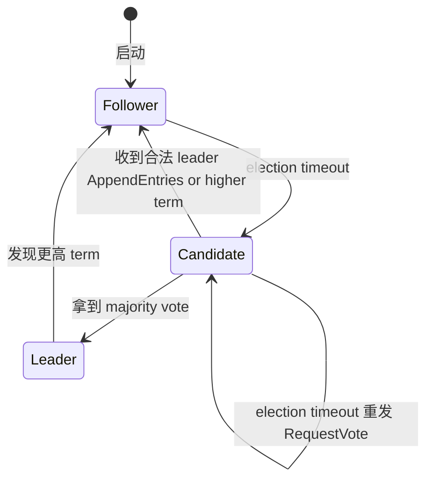

# Raft 详解

## TL;DR

**Raft** (Ongaro & Ousterhout 2014, USENIX ATC) 是 Diego Ongaro 在 Stanford 写博士时设计的"易理解共识算法" —— 目标是"为工业维护团队而写而不是为研究算法的人"。Raft 把共识问题分成三个子问题: **Leader Election**, **Log Replication**, **Safety**, 每个独立设计 + 强约束, 比 Multi-Paxos 直观。 etcd、Consul、TiKV、CockroachDB、RethinkDB、Kafka controller metadata (KRaft mode)、Notion、Apple FoundationDB**、Apache Ratis 都用 Raft。本章梳理算法细节 (term、选举、AppendEntries、log matching、commit index、membership change), 工程实现 (默认配置、性能数字、网络分区行为), typical gotchas (pre-vote、joint consensus、read index、leader lease)。

---

## 一、核心概念

### 1. 服务器状态机

每节点三种状态:

- **Follower**:被动接收 leader 的 AppendEntries + RequestVote。
- **Candidate**:选举期间, 自我 promote、RequestVote 拉票, 等待 majority (N/2+1)。
- **Leader**:唯一接收 client 请求, 主动复制 log 到 followers。



### 2. Term

term 是 monotonic increase integer, **任期编号**。每次选举 term+1, 每次 RPC request/response 携带 term; 收到 term 比自己低的 RPC 拒绝, 收 to higher term 立即 downgrade 自己.

term 是 Raft 的逻辑时钟, 替代 Paxos proposal_number。

### 3. RPC

两种 RPC:

- **RequestVote(term, candidate_id, last_log_index, last_log_term)**: candidate 拉票。
- **AppendEntries(term, leader_id, prev_log_index, prev_log_term, entries[], leader_commit)**: leader 复制 log + heartbeat (空 entries 充当 heartbeat)。

---

## 二、Leader Election

### Election Timeout

随机化 `T_election ∈ [T_min, T_max]` 默认 150-300ms。 当 follower 在此期间未收 leader heartbeat, → 转 candidate:

1. term++, vote self, send **RequestVote** to all peers.
2. 等三种结局:
   - 收 majority "yes" → leader, 立即 send heartbeat 确认权威.
   - 收合法 leader (AppendEntries with current term) → follower.
   - 超时无 majority → 加 tirη.term++;重选.

### 投票约束

投票方仅投给满足以下条件 candidate:
1. 自己当前 term 与 candidate term 相等(=)或 lower (then bump term)
2. 自己未投过 (投票 history 包括 restart 后 persisted term)
3. candidate 的 log **at least as up-to-date**: 比较候选 last_log_index 与自己 last_log_index, 若 last_log_term 更高 → newer. 同 term 时 compare index。

**Up-to-date 比较规则保证被选 leader 含 all committed entries**——这是 Raft 的 safety invariant (Leader Completeness)。

### 防止 split vote

randomized election timeout 让多 followers 不太可能同时转 candidate. 实际工程 (etcd) `ElectionTimeout=100-150ms`, 集群越小冲突小。

### Pre-Vote (Pingao et al. etcd extension)

防止短暂网络分区导致 节点 elevated term 后 "传染" 回原集群触发不必要选举:

1. candidate 在 RequestVote 之前发 **PreVote** 询问 "如果我请求, 我能拿到 majority 吗"。
2. follower 仅在 **leader heartbeat 长时间无收**时回 yes。
3. candidate 拿到 majority PreVote ack 才真 term++ 发 RequestVote.

etcd 3.x preferred, METCommission academic thesis. Pre-Vote 是 Raft 论文未包含的工程 extension, 现  de-facto standard.

---

## 三、Log Replication

### AppendEntries RPC

```
leader.send AppendEntries {
  term, leader_id,
  prev_log_index, prev_log_term,    // 最近一条已复制 entry
  entries[],                        // 新 entries (heartbeat 时空)
  leader_commit                     // 当前 commit_index
}

follower:
  1. if term < current -> reject
  2. if log[prev_log_index].term != prev_log_term -> reject (log inconsistency)
  3. for each entry in entries:
       if local entry conflicts (same index, different term) -> 清掉冲突的与所有后续
       append entry
  4. if leader_commit > commit_index: commit_index = min(leader_commit, last_new_index)
  5. reply (term, success, last_index, match_index)
```

### Log Matching Property

- 若两 log entries 同 index 同 term, 它们 value 必相同 (仙做 safety).
- 若两 log entries 同 index 同 term, 它们之前所有 entries 必相同.

prev_log_index/prev_log_term 强制 backward check, follower 不匹配时 reject, leader decrement nextIndex 重试. 最终一致是 eventual + 失败时回退—update 沿图。

### Commit Rule

leader commit entry 必须满足:

1. 该 entry 在 majority nodes 上 stored (already replicated).
2. 该 entry 是 current term 写的。

**条件 2 是关键**——Raft 论文 Section 5.4.2 Fig 8 的反例: 假若 leader 旧 term 时复制的 entry (但未 commit) 后来由新 leader commit 是 unsafe (因为可能 stale 副本)。 Raft 不直接 commit 旧 term entry;新 leader 必须用自己 term 写一条 entry, commit 自己 term entry 时**间接 commit** 所有 prior entries (因 log matching 保证)。

### State Safety (Leader Completeness)

**已被选出 leader 必含所有 committed entries**——选举时 up-to-date check (last_log_index/last_term) 保证投票只投给同 up-to-date candidate, candidate 的 log 必延展 committed entries (因 majority overlap).

### Snapshot 与 Log Compaction

log 增长会爆磁盘 + 重启慢, 周期性**快照** :

```
1. leader 在 commit index 处 snapshot (state machine 应用前)→ discard log < snapshot_last_index
2. InstallSnapshot RPC 给 lag-behind followers
3. follower 收到 snapshot → 写本地 apply → discard 自己 log < snapshot_last_index
```

etcd 每 10000 entries 触发; TiKV 每 64MB region size。

---

## 四、Membership Change

### Joint Consensus (论文 Section 6)

Raft 论文给出 general solution = **Joint Consensus**:

```
集群配置 C_old → C_new, 中间过渡期 C_old,new 同时活跃:
1. leader propose "C_old,new" entry to log, accepted by majority(C_old) ∩ majority(C_new)
2. entry committed → 节点同时按两 config 各自看待
3. propose "C_new" entry → commit (只要 C_new majority) → 切到 C_new
4. 不在 C_new 的节点退出
```

joint consensus 保证两 majority **总 overlap**, 防 split-brain。 但两 quorum 独立 同时 active 要 majority(C_old) ∩ majority(C_new) ack, 复杂度大。

### Single-Server Change (etcd/Consul 实际常用)

每次只 add/remove **一个** server。 关键 invariant: `|C_old| = |C_new| ± 1`, 通过简单的算术: 对奇偶 N 节点, 两 majority 必 overlap 至少 1 node。 $\left\lceil(N+1)/2\right\rceil + \left\lceil(N+2)/2\right\rceil = N + 1 > N$ ⇒ overlap ≥ 1.

single-server 可简化实现: 直接 propose 一个 special config entry, ACcept 后 stale config 节点退出。 工程上):
- **Add**: leader propose AddNode, follower 收到后开始接受 AppendEntries 与 RequestVote。
- **Remove**: leader propose RemoveNode, target follower 检测到自己不在新 config → stop。
- 一次只一个 change, 然后等下一 change。

etcd `MemberAdd` API 即此; Raft 论文也允许 batch 变更(multi-server removal) 走 joint consensus, 但 etcd/Consul 都选择 single-server + 多次循环。

---

## 五、Read 处理

### Linearizable Read

Direct read on leader 不稳: follower 没 at-newest-leader 起门 leader 隔离时间 client reads old mutation → read 不是 linearizable. 解决方案:

#### 1. Read Index

```
1. leader 记录当前 commit_index
2. 发 heartbeat to majority 确认自己仍是 leader (1 RTT)
3. 等待 local state machine apply 到 commit_index
4. 执行 read, 返回 client
```

#### 2. Lease Read

leader 用 lease (heartbeat-driven, leader elected 后 clock tick 自, 平均 sender 节点 确认为 leader, lease 内 read 不 quorum check.lease 过期必须 renew, 否则 relinquish leadership.

**风险**: lease 期间 leader 长 GC pause → lease timeout 后仍误以为自己是 leader, 同时新 leader 也在另一分区上选出来 —— stale leader 服务读违反 linearizability。

etcd 3.x 的 **CheckQuorum=true** 让 leader 每次 heartbeat 主动确认 majority 仍可 reach, 若 quorum 失联立即 step down; 这是 lease 读 + lease 校验的核心修案。

---

## 六、工业配置与性能

### etcd 默认值

```
heartbeat-interval=100ms                # leader-to-follower heartbeat
election-timeout=1000ms                 # 必须 >> heartbeat (10x)
snapshot-count=10000
quota-backend-bytes=2GB
```

实际 etcd 调用 `election-timeout` 既给 candidate 等 majority 投票超时, 也给 follower 等 leader 心跳超时。推荐 `election-timeout` 是 `heartbeat` 的 10 倍以吸收 GC pause 与网络抖动。

### 跨数据中心典型调参

```
heartbeat=200ms (跨 dc 单 RTT ~20-100ms)
election-timeout=1000-3000ms (5-10× heartbeat)
```

### 性能数字 (etcd 5 nodes 集群, 默认设置)

- Throughput: ~10-20k writes/s (range 200B per write)
- Write latency: P50 ~10ms, P99 ~50ms

### TiKV / CockroachDB 的优化

- **Batch**: 多 entries per AppendEntries (wait_group)
- **Pipeline**: leader 提议后立即 reply client, 与 fan-out 并行
- **Async pre-write**: 提交 batch 不等 follow ack, 同时 fire 下 batch

---

## 七、典型事故

### etcd 3.0 — 跨 DC Election Timeout 过小

某用户跨美东/欧 DC 部署 etcd, 默认 `election-timeout=1000ms`, 但跨洲 RTT 200-300ms 抖动, 多次观察到 leader 误判失去心跳并触发频繁选举——有时 5 分钟内 3 次 leader 切换, 上层 client 大量 retry, service 出现 5-10s 写阻塞。Fix: 调增 `election-timeout=3000ms`, 让 heartbeat 远小于 election timeout, 使跨 DC RTT 抖动不再触发不必要的 re-election.

### Apache Ratis — Snapshot 与 In-Flight Log Race

Apache Ratis (Java Raft lib, 用于 Ozone) 早期版本: leader 给 lagging follower 发 InstallSnapshot 时, follower 同时可能收到旧 AppendEntries, 导致 log entry index 与 snapshot index 冲突, persistent 状态破坏需 manual repair. Fix: Ratis 3.x 加 snapshot receipt barrier, follower 收 InstallSnapshot 时拒收任何 AppendEntries 直到 snapshot apply 完成。

### Kafka KRaft — Controller Migration Snapshot Mismatch

Kafka 3.x 引入 KRaft 替代 ZooKeeper 后, 某次 controller failover 后 new controller snapshot version 与 majority quorum 上 log 状态不一致(因 snapshot 写与 log 写不在同一 fsync), 触发 metadata topic 损坏。Fix KIP-866: log-snapshot atomic fsync group。

### TiKV — 网络分区期间 leader lease 仍服务读

长时间 leader 自认 lease 已过期但 GC pause 长, follower 已选 new leader, 两 leader 同时存在——短暂 stale read. Fix: TiKV 用 hybrid logical clock + max lease 自适应(known lease-peer, max block wait)。

---

## 八、易错清单

1. **Election Timeout 必须 >> Heartbeat Interval**: 推荐 ≥ 10× heartbeat, 防 follower 误判 leader heartbeat 丢失触发 election。
2. **PreVote 必开启**: 防止短期间分区后 isolated node 不断 term++, 回归后传染整个集群 term inflation 触发 unnecessary elections。
3. **旧 term 写的 entry 即使被多数复制, 也必须由 current term entry 间接 commit**: 否则 Fig 8 反例, stale leader rejoin 后可能覆盖。
4. **Snapshot 必须包含 state machine snapshot index 之前所有 apply 状态**: follower 收 InstallSnapshot 必须原子替换 local state, 防 partial snapshot apply 中 crash 状态混乱。
5. **Membership change 单 server 变更**: 避免一次性 add/remove 多 node 时 (C_old majority) 与 (C_new majority) 不再 overlap。
6. **Client writes 必须 idempotent**: command_id 去重, 否则 raft reply lost client retry 时双执行 (e.g., accounts transfer 重复执行)。 
7. **Read Linearizable 一定要 Read-Index 或 Lease (而不裸读)**: 裸读可能读到 stale leader 的 local state, 违反 linearizability。6
8. **Follower 接 InstallSnapshot 期间必须 ignore AppendEntries**: state machine 半 apply snapshot 极易损坏 log consistency invariant。
9. **Pipeline + Batch 优化得记 in-flight entries**: leader reply 前不一定 commit, lost leader 切换时 in-flight entries 已写 log但未 commit, 必须 resend or discard by new leader's log overwrite. 协议正确已经被 Log Matching Property 保 safety, 但 client side 一定要 idempotent。

---

## 九、这一章带走的东西

1. Raft 拆分 Leader Election / Log Replication / Safety 三个独立 subproblem, 比 Paxos 易理解。
2. Term 是 Raft 的逻辑时钟; 强约束 (lower term RPC reject, 看到 higher term 自己 downgrade) 保证 algorithm 不协议错乱。
3. Log Matching Property 强 backward check, follower 拒绝 prev_log 不匹配的 AppendEntries, leader 减 next_index 重试, 最终一致。
4. Commit Rule 必须 **current term entry 间接 commit** 旧 term entries, 防 Fig 8 反例。
5. Raft read path Linearizable 通过 **ReadIndex (heartbeat confirmation)** 或 **Lease Read** 实现, 每次 read 1 RTT 或 0 RTT (lease held).
6. Membership change 推荐 **single-server change** (always maj(C_old) ∩ maj(C_new) 非空), 避免 joint consensus 的双 majority 死锁。
7. Pre-Vote 防 partition-induced term inflation, etcd 默认开启。

---

## 九、这一章带走的东西

1. Raft 拆分 Leader Election / Log Replication / Safety 三个独立 subproblem, 比 Paxos 易理解。
2. Term 是 Raft 的逻辑时钟; 强约束 (lower term RPC reject, 看到 higher term 自己 downgrade) 保证 algorithm 不协议错乱。
3. Log Matching Property 强 backward check, follower 拒绝 prev_log 不匹配的 AppendEntries, leader 减 next_index 重试, 最终一致。
4. Commit Rule 必须 **current term entry 间接 commit** 旧 term entries, 防 Fig 8 反例。
5. Raft read path Linearizable 通过 **ReadIndex (heartbeat qracdelay)** 或 **Lease Read** 实现, 每次 read 1 RTT 或 0 RTT (lease held).
6. Membership change 推荐 **single-server change** (always maj(C_old) ∩ maj(C_new) 非空), 避免 joint consensus 的双 majority 死锁。
7. Pre-Vote 防 partition-induced term inflation, etcd 默认开启。

---

下一节 → [ZooKeeper / etcd / Linearizability](linearizability.md)
