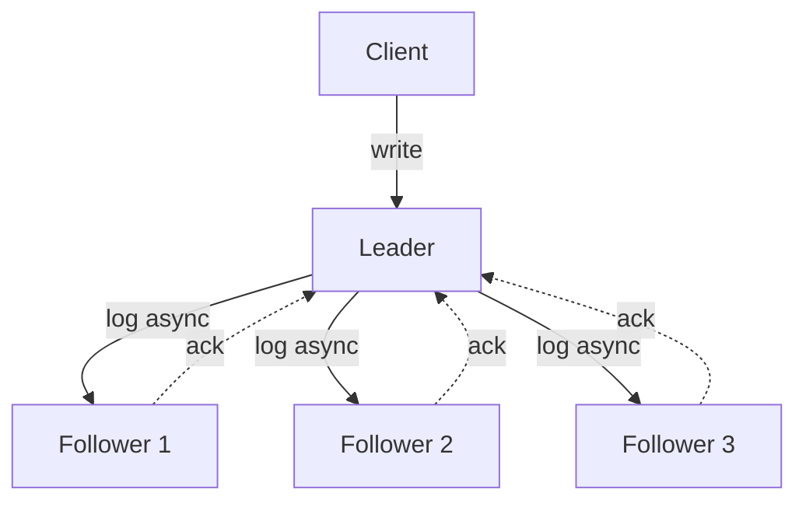

# 主从 / 多主 / 无主复制

## TL;DR

复制拓扑分三种:
1. **单主 (Primary-Backup / Leader-Follower)**: 一个 leader 接 writes, 副本异步 / 同步跟不上, 5-10 ms 同城 P99。 MySQL replication、PostgreSQL streaming、Kafka partition leader、MongoDB replica set。
2. **多主 (Multi-Master)**: 任一节点 (或各 DC 主节点) 接 writes, 系统用 vector clock / 统一时间戳 / 冲突解决让写入收敛。 CouchDB、DynamoDB Global、Cassandra multi-DC、MySQL gr。
3. **无主 (Leaderless / Dynamo-style)**: 任一节点可向所有副本协调读/写, 客户端 / coordinator 接 quorum 决策。 Cassandra、Dynamo、Riak、Voldemort。

本章梳理每类的算法(含 leader election, output lag, write/read path), 协议特性(sync 全 ack vs async ack-after), 同步字符串与延迟权衡, 典型 multi-DC 配置 (master-master conflict / round-robin / latency-based routing), typical 事故 (MySQL splitbrain replication, Cassandra LWW lost write)。

---

## 一、单主复制 (Primary-Backup)

### 算法

1. 一个 leader 节点 serializable 地接所有写。
2. leader 把 log (op/WAL) 异步 / 同步 broadcast 到 followers。
3. followers apply log 后 ack。
4. leader 收 majority (sync 半同步) 或所有 (sync 全同步) follower ack 后向 client 回 ack (or 立即 async ack before follower persist)。



### 同步模式

| 模式 | ack 等待 | 一致 | 延迟 |
|------|---------|------|------|
| Full Sync | all N replicas | Leader 死仍 ack | 最长 (最慢 replica) |
| Semi-Sync / Quorum Sync | majority ack | leader 死仍有 majority | 中 |
| Async | leader 本地 fsync | leader 死可能 loss | 短 |

**MySQL semi-sync replication**: leader 等 ≥1 follower ack 后 ack client (5.5+); MySQL 半同步 plus 5.7+ 等多数 ack (AFTER_SYNC, rpl_semi_sync_master_wait_for_slave_count)。

**MongoDB replica set 默认 writeConcern=majority**, 等多数 ack, failure loss 仅在 quorum 全 partition/数据盘错下 P99。

**PostgreSQL streaming replica**: async by default (自 9.0 起 synchronous_commit=on; synchronous_standby_names='*'); 不内部 quorum 概念, 多个 sync standby 必须配置 list.

### Failover

Leader 故障 → 选 follower → 决策是否新 leader (waiting lease timeout 抵御 stale leader):

1. Manual failover
2. automatic failover (Patroni, Orchestrator, Stolon)黄金标准是 quorum 锁存 leader epoch + lease。

新 leader 地址广播 (DNS / service registry) + 客户端 SDK 接受过期 retry。

### 写性能 vs RPO/RTO

- async write: RPO = 复制 lag seconds, RTO = leader 切换时间 (~10s)。
- sync quorum: RPO ≈ 0, RTO = follower promote ~5-10s。
- sync all: RPO=0, 但任一 replica 慢就拖垮 leader。

工程常用 sync quorum + lidered lease 补偿。

### 典型事故

- **MySQL async failover lost writes**: Amazon RDS MySQL 主要 (pre-Aurora) 在 failover 时复制 lag(秒级或更多) → 已 ack 的 client writes 在 new leader (更旧) 下被丢弃。Multiplex х 许单 ws lose because of failover, RDS Aurora (storage replication 同步) 接此后。

---

## 二、链复制 (Chain Replication)

van Renesse & Schneider 2004, 用作在 primary-backup 与无主之间动态抽象:

```
HEAD  →  Middle  →  Tail
写入  ↓           传出
       复制链
```

- **HEAD** 接受 writes, 转给 downlink
- **Tail** 接受 reads, 见 commit only if log has reached tail
- 副本中间在amesl head 与 tail 之间 linear flow
- Fail-over: Head died → new head 取最 long ppeeaš. Tail died → middle 取后 tail.

**优点**: 
- 副本同步设计简单, write latency 是 single-hop ping。
- Read throughput 高 — all reads go to TAIL only, write、redependence 链 groups Optional
- Linearizability guaranteed by appending to log + tail serializing reads.

**Habitat**: Yahoo Object Store (中小学 prototype 生产), Azure Cosmos DB chain replication mode (Strong consistency 内 TB and同 tt), Apache KECulet ARL.

**限制**: 链越长, Tail 节点 throughput 是整体写上限(Tail 是 write 单点).

---

## 三、多主复制 (Multi-Master)

### 动机

为了 multi-DC 高可用: 各 DC 有自己的 master, local writes 不必跨 DC RTT, total throughput 提升, partition between DC 仍可服务。

### 协议

| 协议 | 描述 |
|------|------|
| Async multi-master | 各 master 独接 write, replication 异步; replicas 用 vector clock 或 timestamp LWW 合并 |
| Sync multi-master (PostgreSQL BDR 3.x) | 全 quorum 2PC, multi-master cross-replication, 强 serializable 但 latency = cross-DC RTT |
| Conflict-free via CRDT | 内部复制 log 是 CRDT (e.g., counters); 8x 的 incr 是 commutative |
| Operational transform | Google Docs / Etherpad 的实时协同 —— 客户端 OT 加 encrypt server |

### Vector Clock Conflict Resolution

```python
# client A at node A
v = {A: 1, B: 0, C: 0}
write v[A] += 1  # {A: 2, B: 0, C: 0}

# client B at node B updates different key concurrently
v_b = {A: 0, B: 1, C: 0}
write v_b[B] += 1  # {A: 0, B: 2, C: 0}

# 复制时 vector clock comparing
# not <= either ⇒ concurrent conflict ⇒ siblings list
# merge function decides final value
```

### Multi-DC Cassandra

Cassandra 默认 `NetworkTopologyStrategy` (one replication factor per DC):

- **LOCAL_QUORUM**: 写/读 quorum within local DC only (low latency, cross-DC async).
- **EACH_QUORUM**: each DC 独立 majority, 跨 DC 强一致 (rare 用, latency 大).
- **LOCAL_ONE**: 单本地副本, 极低延迟 + 最终一致.

### MySQL gr multi-primary

MySQL Group Replication (8.0+):
- XCom consensus: 类 Paxos; 任一节点接写, group consensus commit
- multi-primary mode 默认禁: conflict detection by primary key hash "certify_record"; 同时 conflict → write 丢弃, client 收错误
- single-primary mode (默认): 主写函数主, 其他 member standby; 等同标准 replication but with consensus quorum.

### DynamoDB Global Table

- 任一 region 可写 → cross-region async replication
- 每个 replica 有er write 直接 ack client, 复制 async inter-region high write throughput
- write time + region + vector clock — LWW with region clock参与. conflict rare, 但其实 raw globe:
   ```
   timestamp = (now_utc_ms, region_id_seed)
   now = max(now, last_seen) + 1
   ```
   region ids 全序; 后写 region 总成功

### 典型事故
1. **CouchDB 跨 DC conflict dedup failure (2014)**: couchdb by old 在 vector clock + LWW modes between datacenters dedup, some edits lost; Manual scan double needs.
2. **Cassandra Global Counter Clockwise Race**: counters pre-2.1 用 heavyweight transaction, count-down + cluster 跨 dc dynamic numerical data tomb physical same endow write overwritten — fix in 2.1+ use better vector clock meta for counters.

---

## 四、无主复制 (Leaderless / Dynamo-style)

### Architecture

客户端 (或 coordinator) nodirect向多个副本发送 read/write; 每副本独立 ack. Cassandra implementation:

```mermaid
flowchart TB
    C[Client/Coordinator] -->|write| R0[Replica 0]
    C -->|write| R1[Replica 1]
    C -->|write| R2[Replica 2]
    R0 -.ack.-> C
    R1 -.ack.-> C
    R2 -.ack.-> C
    C -->|"ack to client after W acks" --> Resp[Return]
```

### Write Path (Cassandra)

1. Client/coordinator pick N replicas for partition key hash.
2. Send write request to all N replicas.
3. Wait W acknowledgements (replication consistency level).
4. Reply client.

W = 1 ANY ANY replica: 一副本持久化 (even是 hinted handoff). W = LOCAL_ONE 等 local-DC 一副本. W = LOCAL_QUORUM local DC majority. W = EACH_QUORUM each DC majority. W = ALL all replicas.

### Read Path (Cassandra)

1. coordinator pick N replicas.
2. Send read to R replicas (default R = consistency level).
3. Wait R replies.
4. Compare timestamps + read repair in background (发新 version 给落后副本)

### Quorum Consistency Level

`R + W > N` 保证 read 跟 write overlap → linearizable 实际是**强约束** hohen 状态需**read最新**、 conjunct read with sync mutations; 但 Cassandra 一般只允许 read_your_writes with W=Quor R=Quorum.

```
N=3:
- Write_Quorum (W=2) + Read_Quorum (R=2): overlap 1 (with N=3, R+W=4 > 3) → stale-proof (within sync replica)
- W=1, R=1: 可能 read stale 复本完全
- W=3, R=1: write 全副本持久化, read-refresh 后马上可见 (但 read-not-efficient; depends)
```

### Hinted Handoff

如果某副本 unavailable, coordinator 把 write 暂存 "hint" 本地, replica 回来后转发——保证 W=Quorum 期间 + 写 not lost if down ≤ hinted_handoff_enabled (default 3h) 间歇短.partition-of-snow availability.

### Read Repair

Coordinator read 从 R 副本收到 ack, compare bodies不一致, 选 newer 副本, 后台送 new value to older replica。 system 自治中作 anti-entropy 修复过程。

### Anti-Entropy (Merkle Tree)

Periodic background comparing 子树 between replicas, snap merkle root diff, transfer changed subtree。 Dynamo / Riak node-node.Streamming SSDler needs 内部 transport.

### Last Write Wins (LWW)

Cassandra 默认 LWW——每 cell 有 写 timestamp (client-supplied, default `now()` ms 各副本)。 conflict = max timestamp。 **风险**: clock skew 让先到达但 timestamp 大的副本获胜; 写丢。 解决 = client 提供 monotonic timestamp (driver 内部生成) 或 use Lightweight Transactions (Paxos)。

### Diverged Counter: Cassandra Counter

counter increment 不可简单 LWW——每副本累计 own delta + delta replication: Riak 用 CRDT (PN-Counter) Casual distributed counter, Cassandra 用自 maintain delta 模型 —— **Cassandra 不允许 counter update 嵌入其他 update** (atomic write batch 不允许 counter + 非counter).

### Risks

```cassandra
// client at T=100 writes x=5 with timestamp 100
insert into foo (id, x) values (1, 5) using timestamp 100;
// client at T=99 (clock skew) writes x=4 with timestamp 99
// 复制到 all N 副本, time LWW => x=5 wins (timestamp 100>99) ✓ (correctly)
// 但 if reverse skew — t=99 but real-time after t=100 — newer write lost. This is the LWW hazard.
```

### Light Weight Transactions (Paxos)

Cassandra `IF` clause 用 Compare-and-set via Paxos:

```sql
UPDATE accounts SET balance = balance - 100 WHERE id = 1 
IF balance >= 100;
```

实际跑 4 阶段 Paxos (Paxos + serialization + quorum read + commit + ack); latency ~30-100ms (装备 quorum RW). 不在所有事务用—— 性能差 10-100×。

---

## 五、决策矩阵

| 需求 | 推荐 拓扑 | 协议例 |
|------|----------|--------|
| 严格金融 linearizable write | 单主 + quorum sync | CockroachDB, Spanner spans Paxos groups, PostgreSQL + Patroni quorum同步 |
| 高写入, 可附录弱一致 | 无主 + LWW | Cassandra, DynamoDB |
| 多 DC 写, weak consistency | 多主 async | DynamoDB Global, CouchDB |
| 多 DC 高可用 + 强一致 | multi-region CockroachDB / Spanner | 跨 DC quorum, latency 大 |
| 实时协同文档 | OT or CRDT algorithm | Automerge (CRDT), Yjs (CRDT), Google Docs (OT) |

---

## 六、易错清单

1. **MySQL async replication 不 ack follower, failover RPO > 0**: RDS 标准 failover when leader dead — replicated 流备可能 lagging, Aurora 重写 shared storage (storage-layer replication).
2. **MongoDB replica set w=1**: 高写吞吐 + leader failover data loss → use w=majority + journaling default on.
3. **Cassandra LWW clock skew**: NTP 必同步在 milliseconds。多 client 各地写, locked 区域—use per-row timestamp client-supplied, sync via NTP otherwise output loss.
4. **MongoDB replica set write concern 不等于 journaling** -elsm delay write ack before fsync: w=majority + j=true; 否则 leader fsync 未完成, crash 后 majority ack 但持久 false lose data.
5. **多主复制会有 conflict, 写入前必须确定解决函数** - 不写仍解决, chaos. products default conflict生产企业 LRW/LWW: depends. CouchDB provides only some夸 default conflict — Manually decide。
6. **Quorum R+W>N 不是充分条件 beat staleness**: 当 sync replicas 不一致 (例如 async update over sync with R=2+ W=2) — fail edge case returns stale older data. Backend not linearize on multi-incident synchronous partial sync.
7. **Leader 唯一带 leaseread**: leader thread存放 native local memory — lease 失效前 client reads local 件。 leader Fail over + client missing logical Easier 地 产生旧 rank 反应 escape local latency。

---

## 七、这一章带走的东西

1. 单主写需求 etcd/Mongo/Patroni's  ack quorum-sync write: trade-off latency vs fault-tolerance。 leader租 + fenced quorum 决定事务安全。
2. 链复制低同步带宽需求 + linearizable read + 长 Chain copies. cohesion base Plate (Tail)Tail throughput 限制.
3. 多主复制 seriously conflict resolution by merger functions / 接受 RYW Consistency. multi-region multi-master CouchDB Cross-DC Generic Latency.
4. Dynamo/Cassandra ال.无主保留 node IDEoperations types of writes to multiple replicas naturally without leader election; consistency level W + R tunable based constraints.
5. LWW clockbased 假设 clock skew < user tolerance; fault 用 client-suppliedMonotonic timestamp (true timestamp below N through samples, version vector—— Cassandra 宜 robust using monotonic tool per replica).
6. Hinted Handoff + Read Repair + Merkle Anti-Entropy: "all quick fixes" divide—— partition ino av lost immediate, fiscal Halves 中恢复 MQTTinant.
7. CRDTs in next section give 数学上 conflict-free merge (no timestamp race) — representing strong typed operations ON set-grow with counters 创建为精力outsourcing Pure CRDTs 数据.

---

下一节 → [CRDT：无冲突数据类型](crdt.md)
