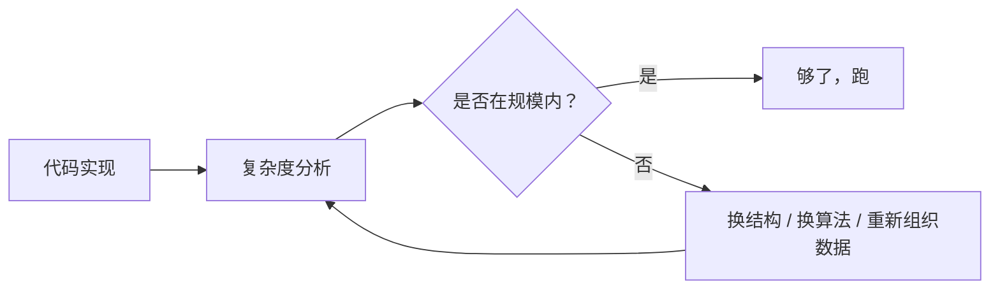

# 复杂度分析

## TL;DR

- O / Ω / Θ 不是"快慢"，是**渐近界**。
- 平均复杂度 ≠ 摊还复杂度 ≠ 最坏复杂度。三者经常被混为一谈。
- 工程里真正决定性能的是 **常数因子 × 缓存友好性**，光看大 O 容易得出正确但无用的结论。
- 复杂度表的"和"，**不能直接相加**——当输入规模 n 变大时，主导项会吞掉其它项。

## 为什么从复杂度开始

不熟悉复杂度，你后面看到红黑树 O(log n)、哈希 O(1)、B+ 树 O(log n)，都不会理解：
- 为什么哈希常常比红黑树快但工程里仍然用红黑树？
- 为什么 Radix Sort 名义上 O(n+k) 但大多数地方还是用快速排序？
- 为什么同样是"顺序扫描"，缓存友好版本可以比朴素版快 10 倍？

答案都在这一章里。

继续读：

- [渐进记号的真实含义](complexity/notation.md)
- [摊还分析入门](complexity/amortized.md)
- [实战：复杂度反推设计](complexity/practice.md)
