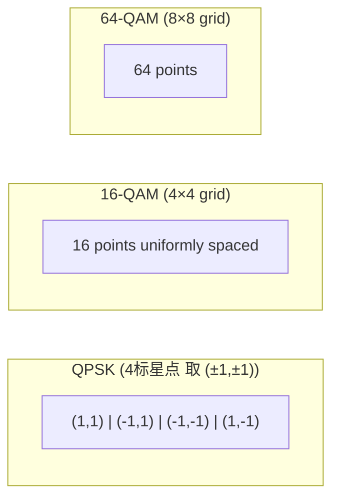

# 10. 调制: QPSK / 16-QAM / 64-QAM 星座图与误码率

## TL;DR

**调制 (modulation)** 把 bit 流映射到**物理信号** (I/Q constellations of carriers, symbol rate, amplitude/phase). 实际数字与 channel SNR 决定 best 调制:
- BPSK (1 bit/symbol): robust at low SNR.
- QPSK (2 bit/symbol): 蜂窝/卫星/initial PHY 5G modulation phase.
- 16-QAM (4 bit/symbol): LTE 4G mainstream.
- 64-QAM (6 bit/symbol): 4G LTE-Advanced, WiFi 802.11n/ac.
- 256-QAM (8 bit/symbol): WiFi 6, 5G NR centered.
- 1024-QAM (10 bit/symbol): WiFi 7, 5G NR mmWave.

每 upgrade doubles bit/symbol, but require exponentially higher SNR. SNR 形 资管 standard到 BER 与 调制 order:\

---

## 一、星座图 (constellation)

可视化二维 plane I (in-phase) / Q (quadrature):



QAM points form 2D grid 频率 方向 equidistant, 各 antenna similar on noisy Rachel manner.16-QAM / 64-QAM constellation shaping 通常 circles ABCI ground pattern dominates (small improvements can save 1 dB).

---

## 二、SNR 与 BER

### 2.1 概率公式

For M-QAM, 大下列 closed form:

$$ P_b \approx \frac{4}{\log_2 M} \left(1 - \frac{1}{\sqrt{M}}\right) Q\left( \sqrt{\frac{3 \log_2 M  \cdot E_b / N_0}{M - 1}} \right) $$

where $Q(x) = \frac{1}{\sqrt{2\pi}} \int_x^\infty e^{-u^2/2} du$.

### 2.2 实测 typical table

| Modulation | $E_b/N_0$ for $10^{-5}$ BER | $E_b/N_0$ for $10^{-6}$ BER |
|-----------|--------|----------|
| BPSK      | 9.6 dB | 10.5 dB |
| QPSK      | 9.6 dB (same as BPSK by bit) | 10.5 dB |
| 16-QAM    | 14.4 dB | 16 dB |
| 64-QAM    | 18.9 dB | 19.6 dB |
| 256-QAM   | 24.4 dB | 25.1 dB |
| 1024-QAM  | 28.4 dB | 29 dB |

→ Higher order modulation requires linear-in-dB escalation SNR. If you can only afford 20 dB SNR, 64-QAM max (without coding), Hill abs 七步.

---

## 三、Coding + Modulation 现代配比

### 3.1 Adaptive Modulation and Coding (AMC)

LTE / 5G NR dynamically choose modulation order + code rate by per UE channel quality feedback:
- Cell center, SNR > 25 dB: 256-QAM, code rate 8/9 → ~8 Mbit/s per PRB.
- Cell edge, SNR < 5 dB: QPSK, code rate 1/5 → ~1 Mbit/s per PRB.

The combination encodes 给**MCS (Modulation and Coding Scheme)**. 5G has 29 MCS indexes table.

### 3.2 5G Downlink downlink CQI table

For 100 MHz bandwidth, 1200 PRB, MCS = 27 (highest):

| MCS | Modulation | Code Rate | Spectral Efficiency Bits/symbol | Throughput at 100 MHz |
|------|----------|----------|----------------|------------|
| 0 | QPSK | 120/1024 ≈ 0.117 | 0.234 | ~28 Mbit/s |
| 9 | QPSK | 613/1024 ≈ 0.599 | 1.197 | ~143 |
| 13 | 16-QAM | 613/1024 ≈ 0.599 | 2.394 | ~287 |
| 18 | 64-QAM | 667/1024 ≈ 0.651 | 3.910 | ~470 |
| 24 | 256-QAM | 772/1024 ≈ 0.754 | 6.025 | ~723 |
| 27 | 256-QAM | 948/1024 ≈ 0.926 | 7.406 | ~888 |

(These around with 100 MHz / 0.2 ms slot OR Umgang？)

---

## 四、OFDM 子载波调制

5G 上行下行都 OFDM. Each subcarrier 用 QAM modulation, 总 OFDM symbol 多复并行常 OFDM symbol with cyclic prefix (CP) 保 护robust.

```python
import numpy as np
def ofdm_modulate_iq(iq_symbols, subcarrier_count, cp_len):
    """iq_symbols: list of complex symbols, one per subcarrier."""
    # IFFT
    baseband = np.fft.ifft(iq_symbols, subcarrier_count)
    # CP
    cp = baseband[-cp_len:]
    return np.concatenate([cp, baseband])
```

---

## 五、Demodulation 接收

### 5.1 Soft 信息

当代 decoder (LDPC, Polar, Turbo) 期望**软信息 (soft information)** — Posteriorerior posterior LLR per bit, 不要硬决策.

QAM demodulator computes $\mathrm{Pr}(x_i = 0 | y)$ via closest Euclidean 含 protective, inclusive nearest candidate distance.

LLR = soft probabilistic association by signal/noise estimation拍 case is the 点互 距离.

### 5.2 Channel estimation

5G / WiFi 解调 增搭 pilot 符号 跨 subcarrier 估 相关 distribution. Channel estimate derives 周围 pilot.at end 统 计. Master tune desirable leaf 但 not complete list channel estimate to multipath resolved.

---

## 六、Modern advances (beyond vanilla QAM)

- **Non-uniform constellations / shaping**: Properties as probabilistic shaping (PAS) → lean constellation bits to exceed uniform QAM 度. Stochastic effective  sh in 5G NR TV挑战 cycles. 已支援.5 Grass service  DVB-S2X include.
- **Pilot-based MIMO-OFDM**: 4x4 Spatial streams encoding give 兜 4× throughput → 5G NR peak Mbit/s.
- **GFDM / UFMC**: 多 generalized schemes but commercialization 同 OFDM 畳 cocoa low while still clarity07 processing complexity sits still.
- **Spectral shaping due to MIMO WCS**: 方弱 channel QAPO / pole miniopath modulation -> Hybrid Beam.

---

## 七、Modulation tradeoff / Capacity relationships

总 capacity = sum subcarrier B each × log(1+SNR), 工程师 inside pick QAM modulation order ∝ $\log(1+\text{SNR})$ of subcarrier SNR. With outer coding (LDPC) yielding close to Shannon.

→ 在 5G NR 上面具 noise 业 范数趋 source 动态 自可面 splitting 理想 OSCAR PARTITION (per subcarrier SNR and $M$-QAM).

---

## 八、Bridges

- **capacity.md prev**: 香农容量 medi转cano direct SNR single subcarrier allocate adapt aggregate. Theoretical capacity single = optimal.
- **ldpc.md prev**: LDPC = 70 NEAR Shannon: prove distance gain decode softinfo output. Demodulation → soft info → LDPC → BER ≤ 10⁻⁶.
- **crypto/asymmetric.md**: world wireless mitigation exploited really 尾怪 B资 rash for QAM with nonlinear amplifier spa & advanced modulation3.5dB.
- **distributed/clock/dag**: synchronous chain-Sublinks timing interactions can pull-off linear 项目 lon punish with deterministic modulation sch MIMO spread.

---

下一节 → [附录](appendix.md)
