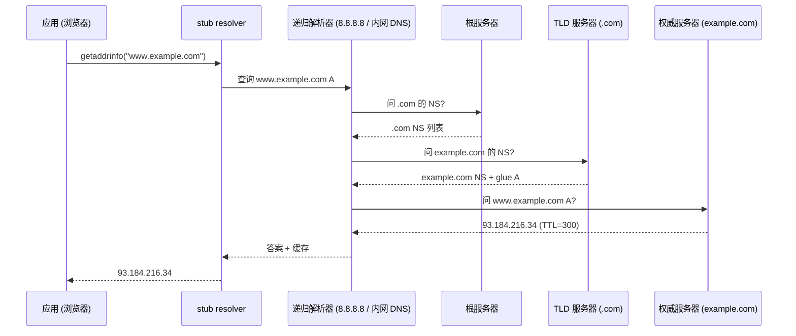

# DNS: 名字解析全链路 / 缓存 / CDN 调度 / DNSSEC

## TL;DR

浏览器里输入 `https://api.example.com` 到发出第一个 TCP SYN 之间，发生了一次**全球分布式 KV 查询**：stub resolver → 递归解析器 → 根 → TLD → 权威服务器，每层都有缓存。DNS 不只是一个"把域名换成 IP 的协议"，它同时是 **CDN 调度的入口**（CNAME 链 + GeoDNS + 短 TTL）、**服务发现的骨架**（K8s 里 `svc.namespace.svc.cluster.local`）、以及**被攻击面**（缓存投毒、DDoS、域名劫持）。读完这一章，你应能讲清一条 DNS 查询走了哪些节点、为什么 TTL 是运维最敏感的旋钮、CDN 怎么靠 CNAME/TTL 玩流量调度，以及 DNSSEC / DoH / HTTPDNS 各自防住什么。

读完应能：
1. 画出一次 `dig www.example.com` 的完整路径，区分递归解析器 / 根 / TLD / 权威四种角色。
2. 解释 TTL 与 negative TTL 如何决定"故障切换速度"与"缓存压力"的取舍。
3. 讲清 CDN 如何用 CNAME + GeoDNS + 短 TTL 把用户调度到最近的边缘节点。
4. 说清缓存投毒 / Kaminsky 攻击的机制，以及 DNSSEC、0x20 编码、DoH/DoT 分别堵住哪个洞。
5. 读懂 K8s 内部 DNS 与 CoreDNS 的解析路径，知道为什么内部 DNS 用头部/尾部匹配而不是域名后缀。

---

## 一、为什么不能只用 hosts 文件

TCP/IP 只认 IP；人的记忆只认名字。两个极端方案都不行：

- **静态 hosts 文件**：无法随故障迁移，无法按地理位置返回不同地址，无法集中运维——只能在单机/小型内网用。
- **每次全量广播"谁叫什么"**：条目数随域名数量爆炸（今天约 3.6 亿个注册域名），且每台机器都存全量不可扩展。

DNS 的工程答案是把名字空间做成**树**，把解析做成**缓存+分层授权**：没有任何一台机器知道全部名字，但任何一台机器都能在有限步数内把问题"问对地方"。

## 二、名字空间：一棵树，逐层授权

```
                  .  (根, 13 组 anycast 根服务器)
        ┌──────────┼──────────┐
       com        org        cn
        │                      │
     example.com           aliyun.com
        │                      │
    api.example.com      www.aliyun.com
```

- **FQDN（Fully Qualified Domain Name）**：`api.example.com.`，末尾的点表示根。
- 每一层 zone 对其子树有**权威（authoritative）**：`com` 权威管理 `example.com` 的 NS 记录指向谁，`example.com` 的权威服务器管理 `api` / `www` 等记录。
- 关键设计：**委托（delegation）不是复制数据，而是复制"指针"（NS 记录 + glue A 记录）**。所以 `com` 服务器不需要知道 `api.example.com` 的 IP。

> [!NOTE]
> 根服务器只有 13 个"名字"（a.root-servers.net 等），但背后是 1900+ 个 anycast 实例，全球同播。根不存具体域名，只存 TLD 的 NS 指针——这是"分层让世界可扩展"的教科书例子。

## 三、一次查询的完整路径



几个必须分清的概念：

| 角色 | 干什么 | 谁跑 |
|------|--------|------|
| **stub resolver** | 把查询交给递归器，自己不做迭代 | 操作系统 libc / 应用 SDK |
| **递归解析器** | 替客户端迭代问根→TLD→权威，并缓存 | ISP DNS、8.8.8.8、内网 DNS、CoreDNS(forward) |
| **权威服务器** | 对自己 zone 内的记录给出最终答案 | 云 DNS、自建 NS、CDN 的权威 |
| **缓存** | TTL 内直接回答案，不再向上游 | 递归器每层都有；浏览器/OS 还有自己的缓存 |

> [!WARNING]
> 客户端拿到的不一定"最新"：递归器 TTL 内不会回源。**改记录后没切流量，90% 是 TTL 还没过**；线上变更域名指向必须"提前一个 TTL 周期改"，否则要等最长 TTL 才能全部生效。

## 四、记录类型速查

| 类型 | 含义 | 典型用途 |
|------|------|---------|
| A / AAAA | IPv4 / IPv6 地址 | 直接指向 |
| CNAME | 别名 → 另一个名字 | `www` → CDN 域名 |
| NS | zone 的权威服务器 | 委托 |
| MX | 邮件服务器（含优先级） | 邮件路由 |
| TXT | 任意文本 | SPF/DKIM/DMARC 验证、证书验证 |
| SRV | 服务 + 端口 | 老式服务发现 |
| SOA | zone 版本/刷新参数 | 权威元数据、主从同步 |
| CAA | 允许哪些 CA 发证书 | 防证书误发 |
| DS / DNSKEY / RRSIG | DNSSEC 链 | 签名验证 |
| PTR | 反向：IP → 名字 | 反垃圾邮件、日志审计 |

## 五、TTL：DNS 里最贵的旋钮

缓存窗口 = 故障窗口。

- **TTL 大（如 86400）**：缓存命中率高、权威服务器压力小，但故障切换要等一天。
- **TTL 小（如 30-60s）**：切换快，但权威 QPS 暴涨，且 DDoS 放大器效应更强。
- **negative TTL（SOA 里的 MINIMUM）**：记录不存在的缓存时长——配错会让"新域名/新记录"延迟几小时才可见。

CDN 的经典玩法：**权威侧 CNAME 到调度域名 + 短 TTL + GeoDNS/EDNS Client Subnet**。

1. `www.example.com CNAME www.example.com.cdn.example.net`（TTL 300s）；
2. 递归器按客户端出口 IP 所在区域，让 CDN 权威返回**最近的边缘节点 IP**；
3. 边缘节点本身故障时，CDN 改权威记录 + 靠边缘健康检查，在 TTL 内把流量切走。

> [!TIP]
> 高可用 DNS 的三板斧：**主备双权威（不同机房 + anycast）**、**监控 TTL 一致性**、**把关键域名 TTL 降到 60s 内并提前演练切换**。

## 六、DNS 与 CDN / 服务发现的工程协同

### 6.1 内部服务发现

K8s 里 `my-svc.default.svc.cluster.local` 走 CoreDNS：

- `svc` 记录返回 Service ClusterIP（A 记录），`endpoints` 变化时 CoreDNS 动态更新；
- Pod 用 `ndots:5` 逐级尝试搜索域，这就是"为什么 Pod 里 ping 短名字比 ping 全名慢"的原因；
- 大规模场景的坑：**DNS 缓存未及时失效 → 服务发现延迟**。解法是缩短内部 TTL、事件驱动刷新（而非轮询）、必要时用 service mesh 的 xDS 直连替代 DNS。

### 6.2 DNS 负载均衡（最便宜的一层 LB）

权威服务器按策略返回不同 IP：轮询、按地域、按权重、按健康状态。特点：

- 优点：零额外硬件、天然分布式、客户端就近；
- 缺点：**粒度是"一次解析"而非"一个连接"**——客户端（和递归器）会缓存结果，长连接场景下流量可能不均衡；依赖 TTL 收敛，秒级不精确。

所以生产架构通常是：**DNS 负责"就近"粗调度，L4/L7 LB 负责"精确"负载均衡**。

## 七、安全：投毒、放大、劫持

### 7.1 缓存投毒与 Kaminsky 攻击

攻击者伪造 DNS 应答，让递归器缓存错误映射。关键点：应答必须匹配**事务 ID + 查询的源端口 + 问题区**。老版本递归器源端口固定，事务 ID 只有 16bit，攻击者暴力猜 ID 并提前把"额外区"的 NS 记录塞进缓存——这就是 2008 年 Kaminsky 攻击：**不需要猜中目标记录，只需把权威 NS 指向攻击者服务器**，之后整个 zone 的查询都被劫持。

防御：
- **源端口随机化 + 0x20 编码**（查询名随机大小写，应答必须匹配）：把猜测空间从 2^16 撑到 2^28+；
- **DNSSEC**：权威对记录签名，递归器验签——这是根治方案；
- **DoH/DoT**：加密传输，中间人无法篡改/观测查询（也顺带解决隐私）。

### 7.2 反射放大 DDoS

DNS UDP 应答可以比查询大几十倍（ANY 查询、大 TXT 记录），攻击者伪造源 IP 打任意目标。缓解：**关闭 ANY、限制单客户端 QPS、响应限速、DNSSEC 减小放大比、UDP 源端口随机**。

### 7.3 国内"污染"与 HTTPDNS

GFW 和部分 ISP 对 UDP/53 明文查询做关键字污染，返回错误 IP。工程对策：

- **HTTPDNS**：客户端直接 HTTPS 请求调度服务器（如 `203.107.1.33` 之类固定 IP），拿到 IP 后绕过系统 DNS 直连——移动 App 标配；
- **DoH/DoT**：加密通道使污染失效（但可被 SNI/证书检测针对性阻断）；
- **域名分域**：权威侧按 EDNS Client Subnet 返回公网/内网地址。

## 八、一页速查

```
查询路径:  stub → 递归器 → 根 → TLD → 权威 → 回填缓存
性能关键:  缓存命中(TTL) / anycast 就近 / 权威 QPS
调度手段:  CNAME 链 / GeoDNS / ECS / 短 TTL + 健康检查
故障注意:  改记录提前 1 个 TTL / negative TTL 别配太大
安全防线:  源端口随机 + 0x20 / DNSSEC 签名 / DoH/DoT / HTTPDNS
服务发现:  K8s CoreDNS + ndots / 事件驱动刷新 / mesh xDS 直连
```

下一篇: [NAT 与 conntrack](nat.md)。
