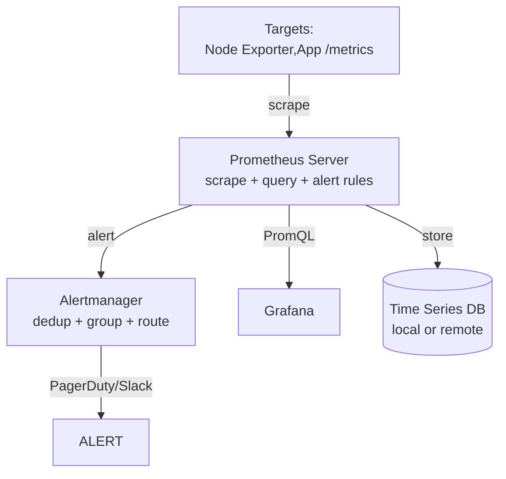

# 监控 Stack

## TL;DR

现代化监控 stack 常由 Prometheus (metric scrape/query/alert) + OpenTelemetry (SDK instrumentation) + Grafana (unified dashboards) + Alertmanager (alert routing) + Loki/Tempo (logs/traces) 构成。 历史上 ELK (Elasticsearch + Logstash + Kibana) 承担日志, Zabbix / Nagios 承担主机监控, 但 cloud-native 推动统一可观测性平台。本章梳理各组件, alerting pipeline, Grafana dashboarding, incident response 的自动 escalation, 典型 stack 调参, 常见事故 (Prometheus metric flood, Grafana anti-pattern multi-clouding).

---

## 一、Prometheus 架构核心



### Scrape 模型

Prometheus pull model: 每周期 (default 15s) scrape 每个 target 的 HTTP `/metrics` 端点。 push gateway 在 短期 job 场景也可。

### PromQL 核心

```
rate(http_requests_total[5m])  # 每秒 rate, 平滑
histogram_quantile(0.99, rate(request_latency_bucket[5m]))
sum by (route) (rate(http_requests_total{status=~"5.."}[5m]))
increase(queue_length[10m])
```

### Recording Rules

Precompute aggregated results (`record.rules`) for dashboards. Reduce read.

```yaml
groups:
- name: apiserver
  rules:
  - record: job:http_requests_total:rate5m
    expr: rate(http_requests_total[5m])
```

### Retention + Storage

Local Prometheus retention default 15 days; 远程写 to central long-term: **Thanos / Cortex / Mimir / VictoriaMetrics**.

---

## 二、Alertmanager

### 功能

- **Dedup**: 相同 alert 接多个 Prometheus instance 只 fire once.
- **Group**: 按 time window batch 多个 alerts 成一 个 notification.
- **Route**: by severity/type send to on-call pager + Slack channel.
- **Inhibition**: 若 X cluster 完全 down, 不 生成 无限 alerts  of each metric; 仅 单 顶 "X cluster down" 静音 others.

### 配置

```yaml
route:
  group_by: ['alertname', 'severity']
  group_wait: 10s
  group_interval: 30s
  repeat_interval: 4h
  receiver: 'slack-default'
  routes:
    - match:
        severity: critical
      receiver: 'pagerduty-critical'
    - match:
        severity: warning
      receiver: 'slack-warning'
```

### On-call escalations

- 1st: owner on-call
- if no ack 10min: escalate to team lead
- if no ack 20min: escalate to manager

---

## 三、Grafana 最佳实践

### Dashboard as Code (DC)

Grafana dashboard JSON in Git, deployed via Grafana provisioning API / Terraform.

### Key panels for every service

1. **RED metrics** (Rate, Errors, Duration): request rate, error%, P99 latency.
2. **USE metrics** (Utilization, Saturation, Errors): CPU / Memory / Disk IO + queue depth.
3. **Business SLA**: successful checkout rate, current cart value etc.
4. **Latency heatmap**: percentile distribution panel in time frame.

### Stat Panels vs Graph Panels

- **Singlestat**: show latest value (error rate 0.5%)
- **Time series**: 折线 看 trend
- **Heatmap**: latency distribution P50/P95/P99 across time
- **Table**: top slow endpoints

### Template Variables

```
datasource: Prometheus
variable: "$namespace"  # select 容器环境
PromQL: label_values(kube_namespace)
```

### Alert Annotation

```
Annotation from Prometheus alerts: "Service CheckooutDown time 15:08-15:09".
```

### Avoid "Grafana Overload"

Large dashboard with 100+ panels → renders every `refresh=10s` → card query.  Recommend cap 25 panels per dashboard; multi tabs.

---

## 四、Loki (Grafana Logs)

### 为什么不用 Elasticsearch

Loki 用 **label-based indexes** (low cost, no full-text all fields). Only stream labels indexed, log content not tokenized; search query by labels + full-content grep.

### 架构

```
Promtail / Vector / Fluent Bit  →  Loki distributor  →  ingester →  object store (S3/GCS)
                                query → querier reads back.
```

### LogQL

```
{app="checkout", env="prod"} |= "ERROR"
{app="checkout"} | json | path="trace_id" | line_format "trace: {{.trace_id}}"
```

### 性能 + 费用

- Around 10× cheaper per GB than Elasticsearch.
- Label cardion 不能太高 (≤100 非 indexed cardinality).

---

## 五、OpenTelemetry Collector

### Pipeline

```
Application (OpenTelemetry SDK)
  ↓ OTLP protocol
[OTel Collector (deployment mode agent / workload / gateway)]
  ↓ forked
Prometheus (metrics) | Loki (logs) | Tempo (traces)
```

### Collector receivers

```yaml
receivers:
  otlp:
    protocols:
      grpc:
        endpoint: 0.0.0.0:4317
      http:
        endpoint: 0.0.0.0:4318
  prometheus:
    config:
      scrape_configs: [...]
```

### Collector processors

```yaml
processors:
  batch:             # 批量 → 减少后端 load
    timeout: 5s
    send_batch_size: 8192
  memory_limiter:
    check_interval: 1s
    limit_mib: 512
  sampling:          # 尾部采样
    policies:
      - name: error_sampling
        type: status_code
        status_code: { status_codes: ["ERROR"] }
        sampling_percentage: 100
      - name: tail_sampling
        type: probabilistic
        sampling_percentage: 1
```

### Collector exporters

```yaml
exporters:
  otlp:
    endpoint: tempo:4317
    tls:
      insecure: true
  prometheusremotewrite:
    endpoint: http://prometheus:9090/api/v1/write
  loki:
    endpoint: http://loki:3100/loki/api/v1/push
```

---

## 六、CNCF Observability Landscape

| Layer | 工具 |
|-------|------|
| SDK | OpenTelemetry (SDK), Prometheus client libs |
| Collector | OpenTelemetry Collector, Vector, Fluent Bit |
| Metrics | Prometheus, VictoriaMetrics, Cortex, Mimir, Thanos, Datadog |
| Logs | Loki, Elasticsearch, OpenSearch (AWS fork), Datadog |
| Traces | Jaeger, Zipkin, Tempo, Datadog, Honeycomb |
| Dashboards | Grafana, Kibana, Datadog, Chronosphere |
| Alerting | Alertmanager, Datadog, PagerDuty, Opsgenie |
| Incident mgmt | Incident.io, FireHydrant, PagerDuty |

---

## 七、Scale Considerations

### Prometheus HA

Run 2 identical Prometheus instances + remote write; Grafana queries either equal read. Alerts dedup by Alertmanager.

For 10K+ target, use **Thanos** or **Cortex**:
- Thanos sidecar: 读 object-store historical data, 加 global view through Thanos Query.
- Cortex: fully horizontal scale micro-service arch.

### Grafana data source scalability

- Each panel query must terminate in < 10s; embed `step` intervals.
- 200 users concurrently dashboards → proxies for load balancing queries (nginx / lb).

---

## 八、典型事故

### Prometheus Card Cause Out of Memory

某 tag cardinality 高 (Label `user_id` exposed as metric), 存入 1M series per scrape. 2 天 Prometheus OOM -- crash. Fix: aggregate label "user_group" 10 groups instead user_id.

### Alert Fatigue

某 company 50+ critical alerts per week; team ignored alerts; on eventual real failure missed. Fix: pager's critical page only 90% SLI breach + < 5 pages / week; others routed to Slack.

### Grafana Panel Refresh Storm

K8s cluster 有200+ Grafana dashboards 每 5s 刷新 100 panels 各, Prometheus backend QPS 10K+; Prometheus overloaded. Fix: specify refresh=1m default + cap 20 panels dash.

### Loki Full-text Search Spike Overdrive

Develop multi-line JSON queries error loaded in Loki; search within massive queries resulting Loki ingester cost. Fix: log query skip 用 structured index only.

### Tracing excessive Sampling To Bill

某公司 Jaeger all success/failure 100% trace produce ∼ 200M spans/hour, backend OOM + Datadog $20K/month cost. Fix: 1% tail sampling for success, keep 100% error status sampling.

---

## 九、易错清单

1. **不要每 label 高 cardinality**: `user_id`, `trace_id` 绝不能 Prometheus metric label.
2. **Alert 过 多 → alert fatigue**: redefine only critical SLI-based alerts (burn rate).
3. **Grafana dashboards 过多 + refresh 快 容易 overload Prometheus**: cap 25 panels + refresh every 1min.
4. **PromQL 误用 `rate(metric[range])` vs `irate`**: `rate` smooth + long range; `irate` approximate per-second change but spiky.
5. **Logs 不要全 索引 每 field**: 在 Loki 只 indexed label, 优化 search以 full-text scanning minimal.
6. **OTel Collector 没 batch → backend overload**: batch processor 对 Prom remote write 必须.
7. Incorrect retention policy: set compute retention for each data type; periodic arch to cheap storage (S3/Coldline).

---

## 十、这一章带走的东西

1. Classic stack: Prometheus (metrics)+ Alertmanager + Grafana + Loki (logs) + Tempo/Jaeger (traces) + OpenTelemetry Collector (ingestion).
2. Prometheus scrapes /metrics pull; PromQL `rate`, `histogram_quantile`, `sum by` 是核心熟练度.
3. Alertmanager `group + dedup + route inhibition` 防止 alert 洪.
4. Grafana dashboards 少 panels, 大 cap,  templates 可参数 化.
5. Loki label-based 日志 索引 ~10× fewer cache than Elasticsearch, 适配 大规模.
6. OpenTelemetry Collector unified ingestion; `batch + memory_limiter + sampling` 控制成本.
7. SRE alert practice: only alert on user-facing SLI violation (burn rate); not infrastructure noise.

---

下一节 → [扩展与可用性](../scale/README.md)
