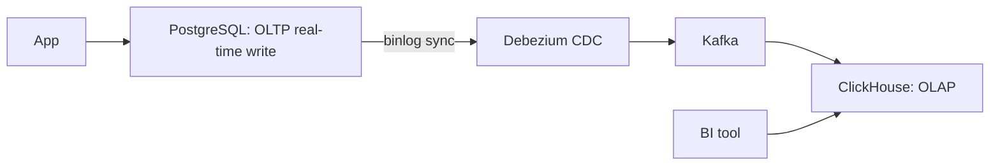

# 选什么存储

## TL;DR

"选什么数据库" 是系统设计的最频繁问题。答案不简单是 "MySQL", "MongoDB", "Redis"——而是当下业务特性 (latency / throughput / consistency / query pattern / budget) 决定数据存储最佳默认。本章梳理 10 类**典型**存储类型 + 各自适用场景与坑:

1. **Key-Value store (Redis, Memcached)**: 快 cache, sub-millisecond get/set, 不持久化默认, 不支持查询。
2. **Wide-column store (Cassandra, HBase, DynamoDB)**: 极高写入, multi-row wide data, eventual consistency, 跨 DC 复制。
3. **Document store (MongoDB, Couchbase)**: JSON/BSON nested structure, 多索引, 中等 scale。
4. **Relational (PostgreSQL, MySQL, Oracle)**: ACID, SQL, rich 索引 + 复杂 join. fast小 writes, slow 大 join。
5. **列存 (ClickHouse, Druid, BigQuery)**: OLAP, group 聚合快 (压缩 + vectorized), 不擅长点查。
6. **时序 (InfluxDB, TimescaleDB, VictoriaMetrics)**: 高写入数量 order of magnitude 高 throughput, 历史 retention rollup。
7. **图 (Neo4j, Dgraph, TigerGraph, JanusGraph)**: 深度关系查询, social network graph, fraud detection.
8. **对象存储 (S3, GCS, OSS)**: 大 file 不变量, blob unlimited.
9. **搜索 (Elasticsearch, Solr, Meilisearch, Typesense)**: full-text search + relevance scoring.
10. **向量 (pgvector, Milvus, Qdrant, Pinecone)**: embedding 近邻检索, RAG / 推荐召回的底座。

---

## 一、Key-Value Store: Redis / Memcached

### 使用场景

- Session store (低延迟, TTL)
- Hot path cache (DB query cache, function cache)
- Distributed lock (Redlock, etcd, ZK)
- Rate limiter (单进程 / distributed counter)
- Real-time排行榜 (Sorted Set)

### 性能

- **Redis: 单实例 100K QPS**, sub-ms P50, ~1-2ms P99
- 持久化: RDB snapshot (fork) + AOF (full log) 可选 + Master-slave async replication
- HA: Redis Sentinel (Raft-like failover), Redis Cluster (auto-sharded)

### Redis 数据结构

| 类型 | 用途 |
|------|------|
| String | cache (k→v), counter |
| Hash | object field cache |
| List | queue, recent activity |
| Set | 去重, 标签 |
| Sorted Set | 排行榜, leader board, rate limiter |
| HyperLogLog | 基数估计 (unique visitors) |
| Bitmap | user state (active days) |
| Stream | log append-only Kafka compete |
| GeoHash | location index |

### Memcached vs Redis

- **Memcached**: 多线程, 内存 Make, 仅 KV, 无持久化, fail-over restart 失 全部数据. 优点 throughput 高于单 Redis。
- **Redis**: 单线程 (6.0 前单, 6.0 后 IO threads) 主 process, 丰富 data structure, AOF persistence, redis cluster。

### 弱点

- 不适合 OLTP transactional consistency。
- 单实例 string max 512MB, list 单元最多 4B 元素,  不适合严重持久化 critical data。
- 缓存击穿/雪崩风险 ([cache/failure-modes.md](../cache/failure-modes.md))。

---

## 二、Wide-column Store: Cassandra / HBase / DynamoDB

### 适用场景

- 超高写入 throughput (Cassandra 100K+ writes/s per node)
- Cross-region replication + eventual consistency
- 写多读少, 多地域高可用
- 通过 partition key 高效 row range 查询

### 数据模型

```
PRIMARY KEY (partition_key, clustering_key)
```

Wide-column store 把 keys 划分到 partition, partition 内多 row + column 大:
- Cassandra row = (partition_key, clustering_key) + columns set
- DynamoDB row = (hash_key, range_key) + attributes
- HBase row = (row key) + (column family : column qualifier) + cells timestamps

### 为什么写入快

LSM-tree backend (LevelDB, RocksDB base), 顺序写 + 后台 compaction。 ([storage/wal-lsm-btree.md](wal-lsm-btree.md))

### 弱点

- Cross-partition JOIN 慢 / 不推荐。
- Eventual consistency; 要 linearizable must increase write latency。
- Schema 灵活性差 (Cassandra 强 schema, DynamoDB 无 schema)。
- 没有 transactional multi-row ACID (Cassandra LWT low throughput)。

---

## 三、Document Store: MongoDB / Couchbase

### 适用场景

- JSON nested data, nested indexing
- 中等 scale (1K 写/秒 up to 50K+ with sharding)
- Aggregation framework (类似 SQL GROUP BY)
- Replica Set 高可用 (Raft-like election)

### 弱点

- Atomic transaction 单 document only (4.0+ multi-doc transactions 慢 + 受 cluster内 quorum 限制)
- JOIN 不如 SQL strong
- 默认 read 是 stale; 用户必须 w=majority + R=majority 拿强一致

### MongoDB Sharding

- 默认 sharding key 决定 data 存 range
- hot shard 险 — hashed sharding 分配均匀但没 range 查询效率
- 4.4 给 "refinable sharding" 让 sharding key 动态改

---

## 四、Relational: PostgreSQL / MySQL

### 适用场景

- ACID transactions, complex joins, multi-row updates
- 严格 schema
- SQL rich query language (CTE, window functions, JSONB)
- Report ad-hoc queries
- 中等写 throughput (~30K TPS 16-core)

### 性能

- B-tree index on key, random access O(log N + limit)
- 16-core instance 写 ~30K TPS (主 key update + index update + fsync)
- Read scale via streaming replica
- Sharding 由 Citus / pg_shard / Vitess (MySQL) /vem (Manage大树)

### PostgreSQL vs MySQL

| 维度 | PostgreSQL | MySQL |
|------|------------|-------|
| 默认 storage | heap + B-tree | InnoDB clustered B-tree |
| JSON | JSONB (binary, indexed) | JSON (text) |
| 物化视图 | - (用 manual refresh or pg_kvext) | - |
| Window functions | full support | 8.0+ |
| Logical replication | 10+ native | bin log + GT-M |
| Geographic indexing | PostGIS first -class | spatial but limited |
| Group replication | logical replication + extensions + Patroni | Group Replication (8.0+), PostgreSQL 同 Circa |

### Shared-nothing extension

PostgreSQL + Citus → columnar + sharded OLTP/OLAP hybrid。
MySQL + Vitess → YouTube scale-out MySQL。
Aurora PostgreSQL / MySQL → cloud storage-tier replication (Paxos-style multiple AZ).

### 弱点

- 单机 VM 上线程多事务 scheduling 难; large cluster 需 sharding。
- Cross-shard join 难优化; usually pre-shard数据 hot cache。
- Schema migration 重, 业务平时变更 schema failure costs (e.g., alter table 加 index locks).

### Typical 物化视图 (Materialized views)

```sql
CREATE MATERIALIZED VIEW daily_summary AS
  SELECT date_trunc('day', ts) AS day, user_id, COUNT(*)
  FROM events
  GROUP BY day, user_id;
-- refresh cotrigger:
REFRESH MATERIALIZED VIEW daily_summary;
```

PostgreSQL MV 不 auto refresh, 应用触发 cron。其他引擎 (Oracle, Snowflake, ClickHouse) 有 native auto-refresh.

---

## 五、Columnar OLAP: ClickHouse / BigQuery / Snowflake

### 适用场景

- 聚合查询 SUM/COUNT/AVG over millions of rows → MUST use columnar
- 大规模包括 batched ETL 装载 → 100M+ rows/sec insert
- 复杂 OLAP SQL 包括 window function, drill-down
- BI dashboard on top

### 为什么列存快

1. **压缩高**: 每 column 类型一致, run-length encoding + delta encoding for symbol/numeric columns → 10-50x compression 平均。
2. **Cache 利用率 高**: 同 column 数据连续存储; 同一 column 多 row 在同 cache line 上。
3. **Vectorized execution**: 现代 OLAP engine (ClickHouse vectorized) 处理 8192 行 in 一 batch SIMD 指令。
4. **Skip 不需要 column**: SELECT 只读 SELECT 中 column 文件, 其他列不碰。

### ClickHouse 引擎

```sql
CREATE TABLE events (
    timestamp DateTime,
    user_id   UInt64,
    event     LowCardinality(String),
    ...
) ENGINE = MergeTree()
PARTITION BY toYYYYMMDD(timestamp)
ORDER BY (user_id, timestamp);
```

- **MergeTree**: 主引擎, 数据 partition 顺序写, 后台 compaction。
- **ReplacingMergeTree**: 后台 collapse 重复 PK (eventual dedup).
- **SummingMergeTree**: 同 PK sum 累积, 用于 pre-aggregate.
- **AggregatingMergeTree**: 跨 merge 累 AggregateFunction state.

### BigQuery / Snowflake

- Cloud-native, 跨 storage + compute 解耦
- 高吞吐 BI workload, 按 query 数据量付费
- SQL 标准 + JSON 半结构 SQL 支持
- 物化视图自动维护, 自适应

### 弱点

- 点查询慢 (单 row get by PK): 大量 row 必须扫满足 predicates. ClickHouse 用户 PK lookup 不友好。
- 实时 ingest 在 100K+ 行/sec 需 batched insert; 单 row 高 QPS insert 慢。
- UPDATE/DELETE 慢 (重写整个 part). 强烈 不建议. re-INSERT pattern.

### Common 使用: PostgreSQL OLTP + ClickHouse OLAP



OLTP 持续 real-time, binlog 截 CDC 同步到 ClickHouse 做 OLAP report。

---

## 六、时序存储: InfluxDB / TimescaleDB / VictoriaMetrics

### 适用场景

- IoT telemetry: 1B+ streams ingest
- Monitoring system metrics (Prometheus / Thanos / VictoriaMetrics stack)
- Server performance metrics
- Stock tick data
- Application log with structured metrics

### 数据模型

| 维度 | 说明 |
|------|------|
| timestamp | implicit primary sort key (here 加微秒 together) |
| tags (labels) | string key/value, indexed, low cardinality |
| fields (metrics) | numeric readings, may be (e.g., cpu.usage = 0.7) |
| **high compression** | delta-of-delta timestamp encoding + Gorilla float compression |

### TimescaleDB

PostgreSQL extension, PostgreSQL native SQL + replication + ACID 保留, hypertable 自动 partition by 时间.
- 适合 PG 用户 + 时间序列 query
- 索引 / JOIN 用 PG

### InfluxDB v2

InfluxQL Flux language, 不 SQL standard, 但 ingestion throughput 高, 建 retention policy 灵活。

### VictoriaMetrics

写性能 ~10x Prometheus, 索引高压缩; cluster mode rows mucho limit support. good for long retention.

### 弱点

- High-cardinality tag 像 user_id 会 摧毁 (索引膨胀) — must aggregate + tag low cardinality.
- Tags cardinality 上百万 实际 kill index; 必须预聚合 或 改用 columnar OLAP。

---

## 七、Graph DB: Neo4j / Dgraph / JanusGraph

### 适用场景

- 深度关系 (社交好友 / 欺诈检测 / 推荐系统)
- 3+ 层级关系 traversal
- Routing / map data (有交通 graph)
- 风险组件  in finance

### 数据模型 (property graph)

```
Node(labels) -[edge(type)]-> Node(labels)
```
- Node labels: Person, Account, Transaction
- Edge types: FRIEND_OF, OWNS, TRANSFERRED_TO

### Cypher (Neo4j)

```cypher
MATCH (alice:Person {name:"Alice"})-[:FRIEND_OF*1..3]-(mutual)
WHERE mutual.age > 21
RETURN mutual.name
```

### 弱点

- 跨 cluster scaling 难, 多数 graph DB 提供 single-tenant + sharding 是 challenge.
- Connected query 可以 O(N!) 时间复杂度

### 主要范例

- Neo4j: 大型开源 graph DB
- Dgraph: GraphQL + 更 cloud-native
- JanusGraph: 在 Cassandra + HBase 上构建 graph indexing
- Microsoft CosmosDB: GraphQL-like with Gremlin API。
- AWS Neptune: managed graph service。

---

## 八、对象存储: S3 / GCS / Azure Blob

### 适用场景

- User file upload (images, videos, pdf)
- 备份归档
- ML model snapshots
- CDN static (web fonts, large static data)

### 性能 / 用法

- 不限容量 (theoretically infinite)
- Put/Get 按 object 名 (key); throughput 高 ~10MB/s/part but support multipart upload 并行
- Latency P50 30-50ms; 大 file get throughput saturate 25Gbps link
- Storage $0.023/GB/month standard tier
- Lifecycle policy: 30d → S3-IA, 90d → Glacier, 1y → Glacier Deep Archive

### 弱点

- 非 transactional
- eventual consistency for overwrite (虽然 S3 standard now strong read-after-write since 2020-12)
- DELETE 不是 immediately visible (强 一致的 list since 2020)
- 5GB max single PUT (multipart upload 支持达 5TB)
- 不适合 random access; ideal for streaming whole large file

### 用法 Patterns

- CDN origin (CloudFront / Fastly)
- Static site hosting
- Archival storage
- Data lake foundation (S3 + Athena / EMR)
- S3 + DynamoDB "manifesto style" pattern (key map + file metadata)

---

## 九、搜索: Elasticsearch / Solr / Typesense

### 适用场景

- Full-text search on user content
- Log aggregation (Elastic + Logstash + Kibana)
- Recommendation system backends (BM25 scorer)
- Geospatial search

### Elasticsearch Data Model

Index = 表; 文档 = 行; mapping = schema. Lucene-based inverted index.

- Lucene = full-text-inverted index with analyzers
- Shard = Lucene index. Replica shard = 1+ copies for HA
- Cluster: e.g., 30 data nodes × 3 shards each (~10GB per shard)
- Cross-shard query fans out scatter/gather

### 性能

- 索引延迟 100ms (refresh interval 1s default)
- 查询 throughput 与 index size, shard count 有关
- 规模 bump shard 数, 单 shard < 50GB

### 弱点

- 不适合 OLTP transactional, no ACID guarantee outside doc
- Heap 内存大 with many shards (~30GB+ heap 推荐)
- Index rebuilding is expensive; mapping 变化 reindex 需 full reindex

### Alternative

- Meilisearch / Typesense: 小型 + fast search
- OpenSearch: Amazon AWS fork of ES (2021)
- Vespa (Yahoo): 推荐 + search + ad platform heavy

---

## 十、向量数据库: pgvector / Milvus / Qdrant / Pinecone

### 适用场景

- 语义检索 / RAG: 文本 embedding 后按"意思相近"而非关键词匹配召回 (与第九节的 BM25 词法检索互补)
- 推荐召回 / 相似图片 / 去重: 一切"把对象编码成向量再找邻居"的场景
- 典型规模: 千万到十亿级向量, 维度 384–3072 (BERT 系 ~768, 大 embed 模型可达 3072)

### 数据模型与索引

存的是 `(id, vector, metadata)`, 核心是**近似最近邻 (ANN) 索引**——精确暴力搜索 O(N·d) 在亿级不可行:

| 索引 | 思想 | 取舍 |
|------|------|------|
| HNSW | 多层跳表式近邻图, 贪心下行 | 召回率/延迟最优, 内存大, 构建慢 |
| IVF-PQ | 先聚类分桶 (IVF), 桶内乘积量化压缩 (PQ) | 内存省 10×+, 有召回损失 |
| DiskANN | PQ 压缩放 SSD, 图导航 | 十亿级单机, 延迟换磁盘 IO |
| Flat | 暴力扫描 | 小数据 (<100 万) 反而最快最准 |

过滤条件 (metadata filter) 与 ANN 的组合是工程难点——先过滤后搜还是先搜后过滤, 各数据库实现差异很大。

### 选型

- **pgvector**: 已有 PostgreSQL 就加个扩展; HNSW 支持; 亿级内最省事的默认项
- **Milvus / Qdrant**: 专用引擎, 存算分离、多副本、标量过滤成熟, 亿级以上
- **Pinecone**: 全托管, 不想运维选它; 数据出域是代价
- Redis / Elasticsearch 也都加了 KNN——**如果 QPS 和规模不大, 用现有存储的向量插件往往优于引入新组件**

### 弱点

- 召回率是近似值, 必须用业务查询集实测 recall@k, 不能信厂商默认参数
- 向量维度高 → 内存即成本: 10 亿 × 768 维 float32 ≈ 3 TB, 量化/降维是必选项
- 元数据更新与向量重建耦合: 模型升级换 embedding 后全库需重灌
- 单独的向量库解决不了"检索质量"问题——rerank、混合检索 (BM25+向量)、chunking 策略往往影响更大

> [!NOTE]
> 向量库与 [倒排索引](../../databases/indexing/inverted-index.md) 是互补而非替代: 关键词精确匹配 BM25 仍强, 语义泛化靠 ANN。生产 RAG 普遍做 hybrid 检索再融合排序。

---

## 十一、混合策略实际系统

多数生产真实系统 mix 多 store:

```
- 主 OLTP: PostgreSQL / MySQL
- Cache: Redis
- Queue: Kafka / Pulsar
- OLAP: ClickHouse / BigQuery / Snowflake / Redshift
- Search: Elasticsearch
- File: S3 / GCS
- Graph (if social/route): Neo4j / Dgraph
- Time-series: Prometheus / VictoriaMetrics
```

### 选 store flowchart

```
需求: cache? → Redis
需求: 高写入与 AP? → Cassandra / DynamoDB
需求: 严格事务一致性? → PostgreSQL / MySQL / Spanner
需求: OLAP 多聚合? → ClickHouse / BigQuery
需求: JSON nested? → Mongo / Couchbase / PostgreSQL JSONB
需求: 时序监测? → InfluxDB / TimescaleDB / VictoriaMetrics
需求: 搜索? → Elasticsearch / Meilisearch
需求: 文件? → S3 / GCS
需求: 图关系? → Neo4j / Dgraph
```

---

## 十二、典型事故

### MongoDB "事务"误解 (2017一堆)

某公司用 MongoDB replica set 高 throughput + 默认 w=1 + R=1, 在 failover 时丢失已 ACK 的写。 Fix: `w=majority, j=true, R=majority`. Trade-off 写 throughput 下降 50%.

### Cassandra LWW 写丢失 (2018)

某 IoT 平台 Cassandra 默认 LWW driver client.clock.now() as timestamp, 各地 IoT 设备 NTP skew 5-10s。 后写  user 发 compaction time skew  data  loss potential. Fix: client_supplied monotonic timestamp.

### Redis OOM 绕过 maxmemory-policy

某用户 Redis 设置了 maxmemory=4GB + LRU 淘汰, 但配置了 `maxmemory-policy=allkeys-lru` 与 `appendonly=yes` 同时启用, AOF 文件已写 8GB disk, RAM 已超 maxmemory + 风险 OOM. Fix: AOF 关闭 + RAM dedicated.

---

## 十三、易错清单

1. **Cache 与持久化混用**: Redis 不应作 primary store, destroy 不能 recoverable。
2. **MongoDB transaction 4.0+ 必须选 REPEATABLE_READ on driver**: 否则 cross-shard transaction broken.
3. **Cassandra 限制 counter + 普通 write 在 batch 写**, any cross-table batch with counter 拒绝。
4. **PostgreSQL max_connections > 100 → performance cost high**, 推荐 pool 大小 ~10-50, 绝不是 1000。
5. **ClickHouse ALTER TABLE UPDATE 是 full part rewrite, 慢**, 不应常态更新。 Re-INSERT 后 drop old.
6. **Elasticsearch refresh_interval=1s**: search latency 1s delay。 用 refresh_interval=-1 + 手动 controlled refresh for bulk indexing.
7. **S3 lifecycle policy必设**: 不设 storage tier 切换, archive files 堆集 monthly cap.
8. **InfluxDB high-cardinality tag 太重**: user_id 不要直接做 tag, aggregate at 5min rollup.

---

## 十四、这一章带走的东西

1. 不同存储引擎有**明确擅长的领域**, 没有 "one-size-fits-all" 数据库。
2. Cache → Redis; OLTP → PostgreSQL / MySQL; OLAP → ClickHouse / BigQuery; AP → Cassandra / DynamoDB; 时序 → TimescaleDB / VictoriaMetrics。
3. Postgres ≥ MySQL 一并行场景: 选择主因是 PG ecosystem / MySQL ecosystem.
4. 多数生产系统 mix 7 stores, 任何 monolithic "选择 个就够" 都过时。
5. 性能黑话你必须知道: LSM 写快 + 读需 compaction + B-tree 读快 + 写 amplification. OLTP ACID + OLAP vectorized scan。
6. S3 是 "infinite" object store + Cache + recent "strong read-after-write" 让"as filesystem"模式可行, 但 仍不 transactional。

---

下一节 → [WAL / LSM / B-tree 内部](wal-lsm-btree.md)
