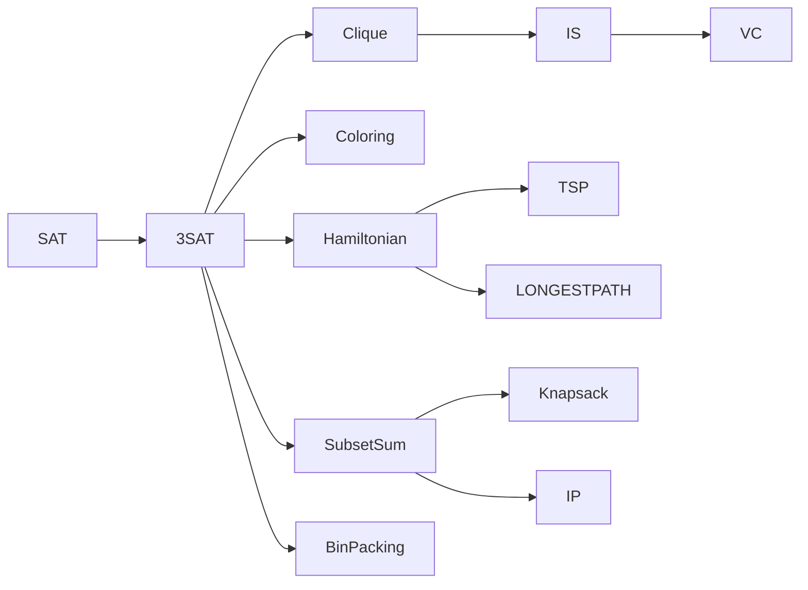

# 7. Polynomial-time Reductions: 3-SAT → Clique → Vertex Cover → Hamiltonian → TSP

## TL;DR

归约链是 NPC 理论的"瑞士军刀". 学会一条归约, 你把"我新问题 A 是否 NPC" 化为"能否找到已知 NPC 的 $B$ 并多项式把 $B$ 实例编码成 $A$ 实例". 1972 年 Karp 给出 21 个经典 NPC 问题的归约网; 1978 Garey-Johnson 红宝书系统化. 本章给你 5 条最实用归约, 让你看新问题立刻判断难度.

---

## 一、归约的形式化

$A \leq_p B$ iff 存在多项式可计算 $f$ 使 $x \in A \Leftrightarrow f(x) \in B$. 性质:
- 传递: $A \leq_p B \& B \leq_p C \Rightarrow A \leq_p C$.
- 反: 若 $B \in P$, $A \in P$.
- 用法识别 "A 是否 NPC": 已知 NPC $C \leq_p A \Rightarrow A$ NP-hard.

 Bridge with `complexity.md`: 经典 NP-complete 证明骨架, 可以把 Cook-Levin SAT — 找出一条 poly reduction chain.

---

## 二、3-SAT $\to$ Clique

### 2.1 双方定义

- **3-SAT**: 给 CNF 公式 $\phi = \bigwedge_{i=1}^m C_i$, 每 $C_i$ 是 $\geq 3$ literals OR; 问是否有指派使 $\phi$ true.
- **Clique**: 给图 $G, k$; 问 $G$ 是否含 size $\geq k$ 的全连子图.

### 2.2 归约

把 3-SAT 公式转 graph:
- 每个 clause $C_i$ 引入 3 vertex, 一一对应一个 literal.
- 加入边 $(u, v)$ for all $u, v$ 不同 clause 且 $u, v$ **不矛盾** (不是 $x, \neg x$ 命 Semantic 同).

问: G 有 $k=m$ 的 clique?

**正确性**:
- 若 $\phi$ 满足: 每 clause 至少一 true literal; 每 clause 取一选满足 vertex 入 clique; 因选入两两不矛盾 (因 $\neg x$ 与 $x$ 不能同时 true), 两两都连边.
- 反, 若 $G$ 含 size $m$ clique: 因每 clause 内部顶点全不连 (clauses 内不连 any 边), 必每 clause 出一个 vertex 入 clique; 该 vertex 对应 true literal ⇒ 指派; 故 $\phi$ 满足.

多项式构造, size $O(m \cdot 3) = O(m)$ vertex, $O(m^2)$ edge ⇒ poly.

---

## 三、Clique $\to$ Vertex Cover

设 $G, k$ 实例为 clique. 取补图 $\bar G = (V, \bar E)$, 即所有在 $G$ 中没有的边都在 $\bar G$ 中.

- $G$ 有 $k$-clique $\Leftrightarrow$ $\bar G$ 在 $\bar E$ 上"对所有边两两不相邻 $→$ 选 $n - k$ 顶点 cover"

更准确, 用**独立集 (Independent Set)** 中间桥. IS 不相邻顶点集. IS(G, k) ⇔ Clique(补图 G, k). 又 IS $\Leftrightarrow$ VC: $G$ 有 $k$-IS ⇔ $G$ 有 $n-k$-VC (顶点 cover; 任非 VC → 其经的边没 cover → 是边就 toggle off vc 端 = independent).

工程 shorthand: **clique / IS / VC** 三连环, 构造相同.

---

## 四、3-SAT $\to$ Hamiltonian Cycle (direct)

构造 graph $G$ 含"variable gadgets" $+$ "clause gadgets". 每个 variable 产生图链"取 true 路径 vs 取 false 路径"; 每个 clause "给 jam ride-through 顶点" 必须有某 variable 选自洽所反. classic Garey-Johnson §3.1.3, 实现复杂. (size O(mn) 量级)

工程经验: Hamiltonian Cycle NPC 证明 → 顺推 TSP NPC.

---

## 五、Hamiltonian Cycle $\to$ TSP (decision)

给图 $G$, 是 hamiltonian? 构造完全图 $K_n$, 给 weight 1 if $(u,v) \in E$, else 2. 设 upper bound $k = n$. 有 hamiltonian $\Leftrightarrow$ 有 cost $n$ 的 TSP tour.

这个**简单到 bake** 但清楚 TSP 也 lock-into NPC.

---

## 六、Hamiltonian $\to$ Subset Sum $\to$ 0/1 Knapsack

复杂归约链, 子和集 - 用"数字 carry" 把 vertex 看成"数字位重量" T-spaces 中合并 - 把"顺序走 vertex" 变"指数集" encoding. 详细见 CLRS 第 34 章.

弱 vs 强: 0/1 Knapsack 是 **weak NPC**: 由于数值在 unary input 下 $O(nW)$ FPTAS, 在 binary input 下 NPC.

---

## 七、Subset Sum $\to$ INTEGER PROGRAMMING

整数规划: $\{x \in \mathbb{Z}^n \mid Ax = b, x \geq 0\}$ 存在? 数字 a_i 行直接变 A 行 identity; $b$ = target. 代码:

```python
def subset_sum_to_IP(nums: list[int], target: int):
    n = len(nums)
    A = [[0]*n for _ in range(1+n)]   # one row per num-bound, one = sum-target row
    
    # constraint: 0 ≤ x_i ≤ 1  AND  sum(nums[i] * x_i) = target
    A = [[0]*n for _ in range(n)]   # binary constraint row each
    for i in range(n):
        A[i][i] = 1
    b = [1]*n  # 0 ≤ x_i ≤ 1; x_i is bounded + non—neg
    
    # plus target equation
    A.append(list(nums))
    b.append(target)
    
    return A, b
```

→ 0/1 IP NPC. linear relaxation (allow real) ∈ P. 靠 LP 侧面 tactic — 紧致 / 分支定界 / cutting plane / IP solver (Gurobi) 在工程上有时秒杀百万维.

---

## 八、3-SAT $\to$ Coloring $\to$ Timetable

3-coloring: 给 graph G 找 3 着色使每邻边异色? NPC. 4-coloring planar graph 但有 Avis-Hujter-Müller 解决; 实际地图 4 色定理, planar 4-col polynomial (any planar graph ≤ 4 colourable, polynomial).

→ timetabling/scheduling 经常化成 coloring 变种 (cheduling) 直接 NPC, 大型院校长期用启发式.

---

## 九、归约链总结表

| 起点 | 终点 | 用途 |
|------|------|------|
| 3-SAT | Clique | NP 最 primitive |
| Clique | IS | trivial (补图) |
| IS | VC | trivial (size 翻) |
| 3-SAT | Hamiltonian Chain | gadget 设计 |
| Hamiltonian Chain | TSP | 完全图 weight trick |
| 3-SAT | Coloring | gadget 设计 |
| Coloring | Timetabling | label 设算法下界 |
| 3-SAT | Subset Sum | 编码 to 整数 |
| Subset Sum | Knapsack | 二进制整数 programming |
| Subset Sum | Integer Programming | 矩阵 encoding |

---

## 十、实战: 第一次见新问题

第三步检查 (Karp's methodology, classic checklist):

1. **是 P?** 先想多项式算法.
2. **是 NPC?** 找 NPC $B$ 归约到 $A$; 给 certificate 和 verify (证明 A ∈ NP).
3. **是真 P 的子?** 弱 NPC (Knapsack with FP), 才考虑 pseudo-poly.

```python
def verify_certificate_format(prob: str, answer, inst):
    if prob == 'clique':
        return len(answer) == inst.k or all(
            (a, b) in inst.G.edges or (b, a) in inst.G.edges
            for a in answer for b in answer if a != b
        )
```

工程脑 showsomer. 没有时间愁 L. Just pad 验证一下, 上 IPC prefers direct; 用 tactic.

---

## 十一、问题流速图



— 即使是新问题, 一个编码$\langle M, w \rangle$ 之直接 fit to (e.g.) SAT, 仔细  evidence.

---

下一节 → [Approximation Algorithms](approximation.md)
