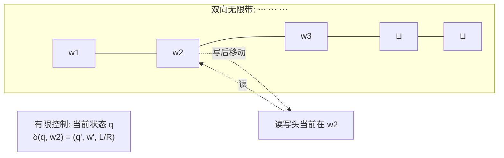

# 4. 图灵机: deterministic / non-deterministic / Church-Turing

## TL;DR

PDA 用栈做工作内存——但仍受单点读写限制。图灵机 (Turing Machine, TM) 把工作内存换成**双向无限 tape + 可左右移动的读写头**, 一下子获得了完整可计算性。本章把 TM 形式化, 解释 DTM vs NTM 等价 (在"算得动什么"层面), 并展示**Church-Turing Thesis**为何被认作"算法"的本质定义。Chruch-Turing 提供的"完全可计算"上界把后续章节 (不可判定, 复杂度) 的所有结论兜底——任何"算法" 函数必可由 TM 实现。

---

## 一、TM 形式定义 (7-tuple)

$$ M = (Q, \Sigma, \Gamma, \delta, q_0, q_{\text{accept}}, q_{\text{reject}}) $$

- $Q$: 有限状态集.
- $\Sigma$: 输入字母表, $\Sigma \subsetneq \Gamma$.
- $\Gamma$: tape 字母表 (含空格符 $\sqcup$).
- $\delta: Q \times \Gamma \to Q \times \Gamma \times \{L, R\}$: 转移函数 (DTM; NTM 用到 $2^{Q \times \Gamma \times \{L,R\}}$).
- $q_0$: 起始状态.
- $q_{\text{accept}}$ / $q_{\text{reject}}$: halting 状态, 不再走一步.

**接受**: 进入 $q_{\text{accept}}$ 即接受该输入。**拒绝**: 进入 $q_{\text{reject}}$ 或永远运行不停 (后者即"循环").

> [!NOTE]
> TM 与 DFA/PDA 最大不同: TM 可以**循环**——PDA 读完输入就有定论 (理应停), TM 不强制停下。这就是停机问题之根。 SVM 横高。



---

## 二、Instantaneous Description 与一步

ID 标记: $u\,q\,v$ 表示带内为 $uv$ (其余默认是 $\sqcup$), 状态 $q$, 读写头指向 $v$ 的首字符.

转移 $\delta(q, a) = (r, b, R)$ 表示:
$$ u\,q\,a\,v \;\vdash\; u\,b\,r\,v $$
(把当前格写 b, 状态变 r, 头右移一格).

同理 $\delta(q, a) = (r, b, L)$:
$$ u\,x\,q\,a\,v \;\vdash\; u\,r\,x\,b\,v $$

接受 $\Leftrightarrow$ $u_0 q_0 w \vdash^* u q_{\text{accept}} v$ for some $u, v$.

---

## 三、例子: 接受 $a^n b^n c^n$

构造如下:

```
1. 进入状态 q_loop: 不断在输入上扫
   - 看一个 a, 改写为 X, 走到第一个 b, 改 Y, 走到第一个 c, 改 Z, 回头
2. 重复直到全部 a 改 X (无 a 残留), 检查是否所有 b 都已改 Y, 所有 c 都已改 Z
3. 检查通过 → accept; 否则 → reject
```

伪代码 (typical TM 转移表):

| 当前态 | 读到 | 新态 | 写 | 移 |
|--------|------|------|----|----|
| q1 (找 a) | a | q2 | X | R |
| q1 | Y | q1 | Y | R |
| q1 | Z | q1 | Z | R |
| q1 | ⊔ | q_accept | ⊔ | R |
| q2 (找 b) | a | q2 | a | R |
| q2 | Y | q2 | Y | R |
| q2 | b | q3 | Y | R |
| q2 | ⊔ | q_reject | ⊔ | R |
| q3 (找 c) | a | q3 | a | R |
| q3 | Y | q3 | Y | R |
| q3 | b | q3 | b | R |
| q3 | Z | q3 | Z | R |
| q3 | c | q4 | Z | L |
| q3 | ⊔ | q_reject | ⊔ | R |
| q4 (回 a) | a/Y/Z | q4 | (保持) | L |
| q4 | X | q1 | X | R |

跨步回 X 就开始下一次扫描. 最后所有 a 都被 X 标记, 所有 b 都被 Y, 所有 c 都被 Z, 才按数匹配; 否则 reject.

---

## 四、TM 模拟器 (Python)

```python
from typing import Dict, Tuple, Set, Optional
from collections import defaultdict

class TM:
    def __init__(self, Q, Gamma, delta, q0, q_accept, q_reject):
        self.Q, self.Gamma = Q, Gamma
        self.delta = delta   # dict[(state, symbol)] -> (next_state, write, 'L' or 'R')
        self.q0 = q0
        self.q_accept, self.q_reject = q_accept, q_reject

    def run(self, w: str, max_steps: int = 100_000) -> Optional[bool]:
        tape = list(w) or ['_']    # 至少一格以便读写
        head = 0
        q = self.q0
        steps = 0
        while q not in (self.q_accept, self.q_reject):
            if steps > max_steps:
                return None
            ch = tape[head] if 0 <= head < len(tape) else '_'
            if head < 0:
                tape.insert(0, '_'); head = 0
            if head >= len(tape):
                tape.append('_')
            r = self.delta.get((q, ch))
            if r is None: return False
            nq, write, mv = r
            tape[head] = write
            head += -1 if mv == 'L' else 1
            q = nq
            steps += 1
        return q == self.q_accept
```

注意 tape 双向无限是 lazy 实现: 越界时动态 prepend/append 空格.

### 4.1 TypeScript 实现

```ts
export type TM = {
  delta: Map<string, { q: string; w: string; mv: 'L' | 'R' }>;
  q0: string;
  qAccept: string;
  qReject: string;
};

export function runTM(m: TM, w: string, maxSteps = 100_000): boolean | null {
  const tape: string[] = w.length ? [...w] : ['_'];
  let head = 0;
  let q = m.q0;
  for (let step = 0; step < maxSteps; step++) {
    if (q === m.qAccept) return true;
    if (q === m.qReject) return false;
    if (head < 0) { tape.unshift('_'); head = 0; }
    if (head >= tape.length) tape.push('_');
    const t = m.delta.get(`${q}|${tape[head]}`);
    if (!t) return false;
    tape[head] = t.w;
    head += t.mv === 'L' ? -1 : 1;
    q = t.q;
  }
  return null;
}
```

---

## 五、DTM vs NTM 等价

非确定性 TM: $\delta: Q \times \Gamma \to 2^{Q \times \Gamma \times \{L,R\}}$. 接受 iff 存在一条 computation branch 到 $q_{\text{accept}}$.

**定理**: NTM $N$ 接受语言 $L$  iff  存在 DTM $M$ 接受 $L$. 证明思路: 不必模拟具体选择分支——用 BFS 探索 computation tree, **dovetail** (交错运行所有分支, 一边推进一边 elimination), 终会发现某接受态. 但模拟代价: 选 k 路 / 步, 深度 t → DTM 状态 $O(b^t)$, **指数级 slowdown**.

关键意义: 在"算得了什么"层面二者等价; 在"算得多快"层面 NTM 有指数加速. 这就是 NP 的定义底座 (NTM 多项式时间 ⇒ DTM 可验证).

> [!WARNING]
> 二者在 $\mathcal{R}$ (递归) 与 $\mathcal{RE}$ (RE) 这一层等价; 在 P 与 NP 这层至今开放——P=NP? 这是七大千禧难题之一, 与 2002 年 Sipser 教材中 "P vs NP" 公开题对应. 

---

## 六、TM 变体与等价

| 变体 | 表达力 |
|------|--------|
| 单带 DTM | 标准 |
| 多带 DTM | 等价 (k 带模拟单带 O(t²) 复杂度) |
| 双向无限带 | 等价单向无限带 |
| 2-stack PDA | 等价 TM |
| 2-counter Minsky machine | 等价 TM (强反直觉) |
| Cellular automaton (1D) | 等价 TM |
| Tag system | 等价 TM |
| Quantum TM | 与 TM 在"可识别"层面等价; 复杂度差异由 BQP |

**Minsky 2-counter**: 仅两个整数寄存器 + 加减一 + 零测试, 已是 Turing-complete. 这对 brainfuck / assembly 这类极简语言证明 Turing-complete 提供"模板".

---

## 七、语言层级

- $\mathcal{R}$ (recursive / decidable): 存在 DTM 必停且正确判定的语言.
- $\mathcal{RE}$ (recursively enumerable): 存在 DTM 接受所有 ∈ L 的输入, 但不在 L 上可能**永不停**.
- co-$\mathcal{RE}$: $\mathcal{RE}$ 的补; 接受所有 not in $L$ 的输入.
- $\mathcal{RE} \cap \text{co-}\mathcal{RE}$ = $\{L \mid L \text{ and } \overline{L} \text{ both RE}\}$ = $\mathcal{R}$. (经典定理)

关系: $\mathcal{R} \subsetneq \mathcal{RE}$. 停机问题 $H$ 在 $\mathcal{RE}$ 但不在 $\mathcal{R}$, 其补 $\overline{H}$ 不在 $\mathcal{RE}$. 这把语义 cap 给下一章.

---

## 八、Church-Turing Thesis

形式命题 (非定理, 是"论题"): "直觉上可计算的 = TM 可计算的". 验证工具:

- **Church** (1936) 用 λ-calculus 给同样"算法"集合.
- **Turing** (1936) 用 Turing Machine.
- **Post** (1936) canonical systems.
- **Gödel** (1934) general recursive functions.
- **Markov** 算法.
- 现代: 固定型编程语言 (Haskell/Python/C/A concrete Turing-equivalent).

之后所有自然计算模型都最终被证明等价于 TM. 但严格说**只对"经典串计算"成立**——量子计算机算 BQP ⊆ 不可解超越超多项差异, 但教会论题仍兼容这些模型 (BQP 仍可由 TM 模拟, 只是超多项慢).

### 8.1 对工程而言

任何图灵完备的编程语言 (C / Java / Python / Rust / Lua / Lisp / Brainfuck) 都能模拟任何其他图灵完备语言. 不能模拟的不可计算函数 (停机判定, virus detection) 在**任何**语言都不能模拟. 这给"程序分析不可能 100% 准确"纯粹形式化背书.

---

## 九、Universal TM (UTM)

存在可编码任意 TM 的 UTM: 输入 $\langle M \rangle w$ (TM 编码 + 输入), 模拟 $M$ 在 $w$ 上跑.

构造: 把 $\langle M \rangle$ 当 tape 上数据, UTM 用三层 loop 模拟:
- 当前状态 + 当前置 读写头位置.
- 查表 (用 $\langle M \rangle$ 解决) 找对应转移.
- 改写 tape + 移头 + 改态.

意义: 计算硬件可"程序即数据"——这条原理 1945 直接孕育了 Von Neumann 架构. 至今 CPU 编译产物存指令在内存里跑, 同形存储, 直接源自 UTM.

---

## 十、Busy Beaver (忙碌海狸)

记 $\Sigma(k)$ = k 状态 TM 跑出的最大 1 个数后停; $S(k)$ = 最大 steps 后停.

Rado 1962 提出, 是"小但不可计算"序列典型代表:

| k | $\Sigma(k)$ | $S(k)$ |
|---|------|----|
| 1 | 1 | 1 |
| 2 | 4 | 6 |
| 3 | 6 | 21 |
| 4 | 13 | 107 |
| 5 | ≥4098 (2022 推到 ≥47M) | ≥47M (iterates Graham) |
| 6 | >10↑↑15 | (实不可推算) |

$\Sigma(k)$ 增长 **超过任何**可计算函数 $f$ (无论多快). 证明: 反证, 设可计算, 则构造 TM $M$: 找到 $k$ 使 $\Sigma(k) > n \cdot \log_2 f(m)$, 把 $f$ 公式嵌入循环——可自我产生矛盾.

工程意义: 与 Ackermann 函数 (DSA 数论章给出) 同级反直觉"非可计算"实例; 任何自诩"确定上限"的代码静态分析都面临 Busy Beaver 镜面——你不可能证明任意 100 行 C 程序在合理时间内停.

---

## 十一、与其他章节的桥

- **下一节 [不可判定]**: 把"$H$ 不在 $\mathcal{R}$"展开. Rice 定理把"判定程序任意非平凡语义性质" universalize fail.
- **第五部分 [compilers]**: 解析器是 PDA, 但除了 CFG 之外, 类型推断 (Hindley-Milner) 是有限阶语法——用 TM 派生不会爆炸. 实验证: 全 ML 类型系统等价一种有限阶 Polymorphic λ-calculus, 而后者图灵完全.
- **第八部分 [computer-arch]**: 物理 CPU + 内存 = TM 实体化; quantum GPU = BQP 实体化.

---

下一节 → [不可判定性](undecidability.md)
